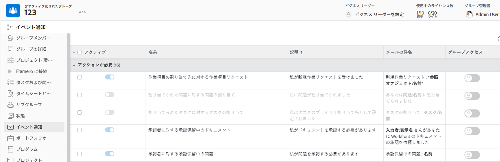

# グループのイベント通知を表示および設定

グループ管理者は、管理対象のグループに対してアクティブ化されているイベント通知を表示できます。

また、Adobe Workfront 管理者がイベント通知のロックを解除した場合は、管理対象の最上位グループに対してイベント通知を設定できます。イベント通知の設定は、その設定の有効化と無効化で構成されます。

Workfront 管理者は、任意のグループに対してこの操作を行うこともできます。

グループのイベント通知を設定すると、そのグループまたはそのサブグループの 1 つをホームグループとするユーザーに影響します。ユーザープロファイルには、システム全体でアクティブ化されたイベント通知ではなく、ホームグループに対してアクティブ化されたイベント通知が表示されます。

Workfront 管理者がイベント通知のロックを解除する方法については、[すべてのグループのイベント通知設定のロック解除またはロック](../../../administration-and-setup/manage-workfront/emails/unlock-configuration-of-event-notifications-for-groups.md)を参照してください。

イベントのデフォルトの通知設定について詳しくは、 [イベント通知タイプ](../../../administration-and-setup/manage-workfront/emails/event-notifications-available-in-wf.md).

## アクセス要件

この記事の手順を実行するには、以下を保有している必要があります。

<table style="table-layout:auto"> 
 <col> 
 <col> 
 <tbody> 
  <tr> 
   <td role="rowheader">Workfront プラン*</td> 
   <td> 
任意
 </td> 
  </tr> 
  <tr> 
   <td role="rowheader">Adobe Workfront ライセンス*</td> 
   <td> 
プラン 
 
グループのグループ管理者または Workfront 管理者である必要があります。詳しくは、<a href="../../../administration-and-setup/manage-groups/group-roles/group-administrators.md" class="MCXref xref">グループ管理者</a>および<a href="../../../administration-and-setup/add-users/configure-and-grant-access/grant-a-user-full-administrative-access.md" class="MCXref xref">ユーザーへの完全な管理アクセス権の付与</a>を参照してください。
 </td> 
  </tr> 
 </tbody> 
</table>

&#42;ご利用のプラン、ライセンスの種類を確認するには、Workfront 管理者にお問い合わせください。

## グループのイベント通知の表示と設定

1. （条件付きおよびオプション）自分が Workfront 管理者で、既にメール通知ページ（設定／メール／通知）が表示されている場合は、次の操作を行ったあと、手順 6 までスキップできます。リストの上にあるテキストボックスで&#x200B;**システムイベント通知**&#x200B;を削除し、ボックスにグループの名前を入力していき、グループ名が表示されたらクリックします。
1. Adobe Workfront の右上隅にある&#x200B;**メインメニュー**&#x200B;アイコン  をクリックして、**設定**  をクリックします。

1. 左側のパネルで、**グループ**  をクリックします。

1. 最上位グループの名前をクリックします。
1. 左側のメニューで、「**イベント通知**」をクリックします。

   表示されるリストの左側の&#x200B;**アクティブ**&#x200B;列に、グループに対してアクティブな（青色）通知であるか、非アクティブな（灰色）通知であるかが示されます。

1. ロック解除されたイベント通知をアクティブ化または非アクティブ化するには、<strong>アクティブ</strong>列でボタンをクリックして、アクティブ化（ ）／非アクティブ化（ ）を切り替えます。

   >[!INFO]
   >
   >**例：**&#x200B;以下に示すような、グループに対してロック解除された、上位 2 つのマーケティンググループイベント通知を設定するとします。
 
 
   >* <strong>アクティブ</strong>列のボタンが灰色で淡色表示されている（ ）場合、イベント通知はすべてのユーザーに対して非アクティブ化されており、グループ管理者はこの通知をアクティブ化したり、メールの件名行を編集したりできません。
   >* <strong>アクティブ</strong>列のボタンが灰色で淡色表示ではない（ ）場合、イベント通知は<strong>すべてのユーザーに対して非アクティブ化されており</strong>、グループ管理者は自分のグループに対して通知をアクティブ化できます。
   >* <strong>アクティブ</strong>列のボタンが青色で淡色表示されている（ ）場合、イベント通知はすべてのユーザーに対してアクティブ化されており、グループ管理者は通知を非アクティブ化したり、自分のグループのメールの件名行を編集したりできません。
   >* <strong>アクティブ</strong>列のボタンが青色で淡色表示ではない（ ）場合、イベント通知は<strong>すべてのユーザーに対してアクティブ化されており</strong>、グループ管理者は自分のグループに対して通知を非アクティブ化できます。

<!--
This step (with substeps) is for functionality from a Sprint 3 2021 story that got put on hold. Also see the PDF on the story for some text earlier in the article that needs to be added. 

1. To customize the email subject line of an event notification,
  1. Click the name of the event notification.
  1. In the <strong>Event Notification</strong> box that displays, in the <strong>Email Subject Line</strong> box, change the text and fields, including custom fields, then click <strong>Update</strong> to save the new subject lines for your emails.
  IMPORTANT: The names of the fields added must match the camel case syntax of our database structure. For more information about how our objects and their fields are named in the Workfront database, see the <a href="../../../wf-api/workfront-api.md" class="MCXref xref">Adobe Workfront API</a>.
  For more information about customizing the email subject line of an event notification, see <a href="../../../administration-and-setup/manage-workfront/emails/custom-email-subjects-event-notification.md" class="MCXref xref">Customize email subjects for event notifications</a>. 
-->

