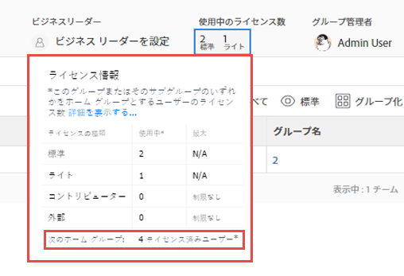

# グループで割り当てられて使用されているライセンス数を表示

Adobe Workfront 管理者は、現在グループおよびそのサブグループで使用されている個々のタイプのライセンスの数を表示できます。これは、ライセンスを再配布すべきかどうかを評価する必要がある場合に役立ちます。

管理するグループ上にグループがある場合は、その管理者がグループに対してこの操作を行うこともできます。Workfront 管理者（すべてのグループ）も同様です。

>[!IMPORTANT]
>
>ユーザーのライセンスは、そのグループがユーザーのホームグループである場合にのみ、特定のグループでカウントされます。

## アクセス要件

この記事の手順を実行するには、以下を保有している必要があります。

<table style="table-layout:auto"> 
 <col> 
 <col> 
 <tbody> 
  <tr> 
   <td role="rowheader">Workfront プラン*</td> 
   <td> 
任意
 </td> 
  </tr> 
  <tr> 
   <td role="rowheader">Adobe Workfront ライセンス*</td> 
   <td> 
プラン 
 
グループのグループ管理者または Workfront 管理者である必要があります。詳しくは、<a href="../../../administration-and-setup/manage-groups/group-roles/group-administrators.md" class="MCXref xref">グループ管理者</a>および<a href="../../../administration-and-setup/add-users/configure-and-grant-access/grant-a-user-full-administrative-access.md" class="MCXref xref">ユーザーへの完全な管理アクセス権の付与</a>を参照してください。
 </td> 
  </tr> 
 </tbody> 
</table>

&#42;ご利用のプランまたはライセンスタイプを確認する必要がある場合は、Workfront 管理者にお問い合わせください。

## グループで使用されているライセンス数を表示

1. Adobe Workfront の右上隅にある&#x200B;**メインメニュー**&#x200B;アイコン  をクリックして、**設定**  をクリックします。

1. 左側のパネルで、**グループ**  をクリックします。

1. グループの名前をクリックします。
1. 表示されるページの右上隅付近のヘッダー領域で、**使用中のライセンス**&#x200B;エリアの、現在使用中の&#x200B;**プラン**&#x200B;および&#x200B;**作業**&#x200B;ライセンスの数を見ます。

   最上位のグループが表示されていて、Workfront 管理者がグループの各ライセンスタイプの最大数を定義した場合は、その数も表示されます。例えば、以下のグループでは、プランライセンスを取得できるユーザーは最大 10 人で、作業ライセンスを取得できるユーザーは最大 15 人です。

   

   Workfront 管理者がグループに割り当てるライセンスの最大数を定義する方法について詳しくは、記事[システムで使用可能なライセンスを管理](../../../administration-and-setup/get-started-wf-administration/manage-available-licenses-in-your-system.md)の[ホームグループに最大ライセンス数を設定](../../../administration-and-setup/get-started-wf-administration/manage-available-licenses-in-your-system.md#set)を参照してください。

   >[!NOTE]
   >
   >対象のグループがサブグループの場合は、使用中のライセンスの数のみが表示され、グループに割り当てられたライセンスの最大数は表示されません。これは、Workfront 管理者がサブグループに対しては最大ライセンス数を定義していないためです。
   >
   >
   >

1. グループで現在使用されているライセンスのタイプ（レビューやリクエストなど）別の数を表示するには、**使用中のライセンス**&#x200B;のすぐ下のテキスト領域をクリックします。

   

   表示されるボックスには、プラン、作業、レビュー、リクエストの 4 つの Workfront ライセンスタイプすべてに対して同じ情報が表示されます。ボックスの下部には、このグループまたはそのサブグループの 1 つのメンバーが使用しているライセンスの総数が表示されます。

   

   レビューライセンスおよびリクエストライセンスについては、最大値列には常に無制限と表示されます。
