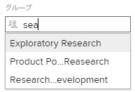

# サブグループの作成

管理対象のグループの下にサブグループを作成して、ユーザーやプロジェクトを整理し、Adobe Workfront 内でアクセス権を割り当てることができます。

管理するグループ上にグループがある場合は、その管理者がグループに対してこの操作を行うこともできます。Workfront 管理者（すべてのグループ）も同様です。

ただし、通常、グループ管理者はグループとサブグループを管理します。グループページを使用して、グループとサブグループを一元的に管理できます。グループとサブグループが Workfront 内でどのように機能するかについては、[グループの概要](../../../administration-and-setup/manage-groups/groups-overview/groups.md)と[サブグループの概要](../../../administration-and-setup/manage-groups/groups-overview/subgroups.md)を参照してください。

## アクセス要件

この記事の手順を実行するには、以下を保有している必要があります。

<table style="table-layout:auto"> 
 <col> 
 <col> 
 <tbody> 
  <tr> 
   <td role="rowheader">Workfront プラン*</td> 
   <td>任意</td> 
  </tr> 
  <tr> 
   <td role="rowheader">Adobe Workfront ライセンス*</td> 
   <td> 
プラン 
 
グループのグループ管理者または Workfront 管理者である必要があります。詳しくは、<a href="../../../administration-and-setup/manage-groups/group-roles/group-administrators.md" class="MCXref xref">グループ管理者</a>と<a href="../../../administration-and-setup/add-users/configure-and-grant-access/grant-a-user-full-administrative-access.md" class="MCXref xref">ユーザーへの完全な管理アクセス権の付与</a>を参照してください。
 </td> 
  </tr> 
 </tbody> 
</table>

&#42;ご利用のプラン、ライセンスの種類を確認するには、Workfront 管理者にお問い合わせください。

## サブグループを追加

1. Adobe Workfront の右上隅にある&#x200B;**メインメニュー**&#x200B;アイコン をクリックし、「**設定**」 をクリックします。

1. 「**グループ**」をクリックします。

   表示されるリストで、管理しているグループと、その中のサブグループを確認できます。Adobe Workfront 管理者は、すべてのグループを表示できます。

1. 新しいサブグループを追加する既存のグループまたはサブグループを選択します。
1. 「**新規サブグループ**」をクリックします。
1. 表示される&#x200B;**新規サブグループ**&#x200B;ボックスに、サブグループの「**グループ名**」を入力します。
1. （オプション）次のいずれかの情報を指定します。

   <table style="table-layout:auto"> 
    <col> 
    <col> 
    <tbody> 
     <tr> 
      <td role="rowheader">グループ名</td> 
      <td>グループの名前を変更します。</td> 
     </tr> 
     <tr> 
      <td role="rowheader">説明</td> 
      <td>サブグループの説明を入力します。512 文字まで入力できます。</td> 
     </tr> 
     <tr> 
      <td role="rowheader">アクティブ</td> 
      <td> 
（デフォルトで有効）Workfront インスタンスでグループをアクティブ化します。
 
下図のような先行入力フィールドでは、オブジェクトの関連付けやオブジェクトの共有のために、標準ユーザーがグループを検索しようとすると、アクティブなグループのみがリストに表示されます。
 
  
 
これをユーザーが効率的に利用できるようにするには、現在使用していないグループの「アクティブ」オプションを無効にします。
 
このフィールドを使用すると、ステータスがアクティブか非アクティブかに基づいて、グループリストを簡単に表示、フィルタリング、グループ化できます。リストでのビュー、フィルターおよびグループ化の使用については、<a href="../../../reports-and-dashboards/reports/reporting-elements/reporting-elements-filters-views-groupings.md" class="MCXref xref" data-mc-variable-override="">レポート要素：フィルター、ビューおよびグループ化</a>を参照してください。
  </td> 
     </tr> 
     <tr> 
      <td role="rowheader">このグループとそのサブグループを公開</td> 
      <td> 
（サブグループではなく、トップレベルグループの詳細を表示している場合にのみ使用可能です）。このオプションを有効にすると、編集ユーザーアクセス権を持つサブグループ内のユーザー（グループ管理者ではないユーザー）が、このグループとそのサブグループを他のユーザーのユーザープロファイルに追加できるようになります。
 
パブリックグループの場合、編集ユーザー権限のあるユーザー（グループの内外を問わない）は、他のユーザーのプロファイルにグループを追加できます。これは、プライベートグループに対しては実行できません。
 
このオプションは、複数のレベルを持つグループの最上位階層の親グループでのみ編集できます。すべてのサブグループは親グループの設定を継承します。
 
<b>メモ</b>:  
        <ul> 
         <li>サブグループを単独での公開はできませんが、トップレベルの親グループを公開することは可能で、これにより親のサブグループもすべて公開できます。</li> 
         <li>パブリックグループに属するサブグループは、デフォルトで公開になっているので、編集ユーザーアクセス権を持つユーザーは、そのサブグループを他のユーザーにも追加できます。</li> 
        </ul> 
 
ユーザーの編集に必要なアクセスに関する情報が必要な場合は、<a href="../../../administration-and-setup/add-users/configure-and-grant-access/grant-access-other-users.md" class="MCXref xref" data-mc-variable-override="">ユーザーへのアクセス権の付与</a>を参照してください。ユーザーの編集について詳しくは、<a href="../../../administration-and-setup/add-users/create-and-manage-users/edit-a-users-profile.md" class="MCXref xref" data-mc-variable-override="">ユーザーのプロファイルの編集</a>を参照してください。
 </td> 
     </tr> 
     <tr> 
      <td role="rowheader">ビジネスリーダー </td> 
      <td> 
管理するサブグループに対して、1 人のユーザーをビジネスリーダーに割り当てることができます。ビジネスリーダーとは、サブグループのビジネス上の決定を行う人のことです。詳しくは、<a href="../../../administration-and-setup/manage-groups/group-roles/business-leader-overview.md" class="MCXref xref" data-mc-variable-override="">ビジネスリーダーの概要</a>を参照してください。
 
ユーザーがまだサブグループのメンバーでない場合は、このフィールドに名前を追加すると、そのユーザーもサブグループに追加されます。
 
<b>メモ</b>：  
        <ul> 
         <li>サブグループからビジネスリーダーを削除する前に、「ビジネスリーダー」フィールドから名前を削除する必要があります。</li> 
         <li>ビジネスリーダーフィールドから名前を削除した場合、そのユーザーはサブグループから削除されない限り、サブグループのメンバーのままでいます。グループからユーザーを削除する手順については、<a href="../../../administration-and-setup/manage-groups/create-and-manage-groups/manage-a-group.md" class="MCXref xref" data-mc-variable-override="">グループの管理</a>の記事にある<a href="../../../administration-and-setup/manage-groups/create-and-manage-groups/manage-a-group.md#manage" class="MCXref xref" data-mc-variable-override="">グループのメンバーシップの管理</a>の節を参照してください。</li> 
        </ul> 
 
詳しくは、<a href="../../../administration-and-setup/manage-groups/group-roles/business-leader-overview.md" class="MCXref xref" data-mc-variable-override="">ビジネスリーダーの概要</a>を参照してください。
 </td> 
     </tr> 
     <tr> 
      <td role="rowheader">グループのメンバーおよびグループ管理者</td> 
      <td> 
       <ul> 
        <li> 
グループメンバー：サブグループにユーザーとグループを追加するには、追加する既存のユーザーまたはグループの名前を入力し、表示されたら名前を選択します。
 
追加したユーザーとグループは、そのグループと共有されるすべてのオブジェクトにアクセスできます。
 </li> 
        <li> 
グループ管理者：サブグループは、その上のグループのグループ管理者を継承します。オプションとして、サブグループのグループ管理者としてユーザーを指定できます。ユーザー名の右にあるドロップダウンメニューを使用して、グループメンバーをグループの管理者として割り当てることができます。
 </li> 
       </ul> </td> 
     </tr> 
     <tr> 
      <td role="rowheader">リスト内でユーザーとグループを検索する</td> 
      <td> 既にこのサブグループに割り当てられているユーザーまたはグループを検索する必要がある場合は、ここに名前を入力し、表示されたときに選択できます。</td> 
     </tr> 
    </tbody> 
   </table>

1. 「**保存**」をクリックします。
