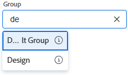

# サブグループの作成

管理対象のグループの下にサブグループを作成して、ユーザーやプロジェクトを整理し、Adobe Workfront 内でアクセス権を割り当てることができます。

管理するグループ上にグループがある場合は、その管理者がグループに対してこの操作を行うこともできます。 Workfront 管理者（すべてのグループ）も同様です。

ただし、通常、グループ管理者はグループとサブグループを管理します。 グループページを使用して、グループとサブグループを一元的に管理できます。 グループとサブグループが Workfront 内でどのように機能するかについては、[グループの概要](../../../administration-and-setup/manage-groups/groups-overview/groups.md)と[サブグループの概要](../../../administration-and-setup/manage-groups/groups-overview/subgroups.md)を参照してください。

## アクセス要件

+++ 展開すると、この記事の機能のアクセス要件が表示されます。

<table style="table-layout:auto"> 
 <col> 
 <col> 
 <tbody> 
  <tr> 
   <td>Adobe Workfront パッケージ</td> 
   <td>
任意
</td> 
  </tr> 
  <tr> 
   <td>Adobe Workfront プラン</td> 
   <td>
標準

       
プラン
</td>
  </tr>
  <tr> 
   <td>アクセスレベル設定</td> 
   <td>グループのグループ管理者またはシステム管理者でなければなりません。</td>
  </tr>
 </tbody> 
</table>

詳しくは、[Workfront ドキュメントのアクセス要件](/help/quicksilver/administration-and-setup/add-users/access-levels-and-object-permissions/access-level-requirements-in-documentation.md)を参照してください。

+++

## サブグループを追加

{{step-1-to-setup}}

1. 「**グループ**」をクリックします。

   表示されるリストで、管理しているグループと、その中のサブグループを確認できます。 Adobe Workfront 管理者は、すべてのグループを表示できます。

1. 新しいサブグループを追加する既存のグループまたはサブグループを選択します。
1. 「**新規サブグループ**」をクリックします。
1. 表示される&#x200B;**新しいサブグループ** ボックスに、サブグループの&#x200B;**グループ名**&#x200B;を入力します。
1. （オプション）次のいずれかの情報を入力します。

   * **説明**: サブグループの説明を入力します。 512 文字まで入力できます。
   * **はアクティブです**：このオプションはデフォルトで有効になっており、グループをWorkfront インスタンスでアクティブにします。

     次に示すように、先行入力フィールドでは、一般ユーザーがグループを検索してオブジェクトに添付したり、オブジェクトを共有したりすると、アクティブなグループのみがリストに表示されます。

     グループの

     ユーザーに対してこれを合理化するには、現在使用されていないグループに対して&#x200B;**はアクティブです** オプションを無効にすることができます。

     このフィールドを使用すると、ステータスがアクティブか非アクティブかに基づいて、グループリストを簡単に表示、フィルタリング、グループ化できます。 リストでのビュー、フィルターおよびグループ化の使用については、[レポート要素：フィルター、ビューおよびグループ化](/help/quicksilver/reports-and-dashboards/reports/reporting-elements/reporting-elements-filters-views-groupings.md)を参照してください。

   * **ビジネスリーダー**：管理するサブグループに1人のユーザーをビジネスリーダーとして割り当てることができます。 ビジネスリーダーとは、サブグループのビジネス上の決定を行う人のことです。 詳しくは、[ビジネスリーダーの概要](/help/quicksilver/administration-and-setup/manage-groups/group-roles/business-leader-overview.md)を参照してください。

     ユーザーがまだサブグループのメンバーでない場合は、このフィールドに名前を追加すると、そのユーザーもサブグループに追加されます。

     >[!NOTE]
     >
     >* サブグループからビジネスリーダーを削除する前に、「ビジネスリーダー」フィールドから名前を削除する必要があります。
     >* ビジネスリーダーフィールドから名前を削除した場合、そのユーザーはサブグループから削除されない限り、サブグループのメンバーのままでいます。 グループからユーザーを削除する方法については、[&#x200B; グループのメンバーシップの表示と管理](/help/quicksilver/administration-and-setup/manage-groups/create-and-manage-groups/view-and-manage-a-groups-memberships.md)を参照してください。

   * **グループメンバーとグループ管理者**: サブグループのメンバーとしてユーザーとグループを追加するには、追加する既存のユーザーまたはグループの名前を入力し始め、表示されたら名前を選択します。

     追加したユーザーとグループは、そのグループと共有されるすべてのオブジェクトにアクセスできます。

     サブグループは、その上のグループのグループ管理者を継承するので、サブグループのグループ管理者としてユーザーを指定することはオプションです。 ユーザー名の右にあるドロップダウンメニューを使用して、グループメンバーをグループの管理者として割り当てることができます。

   * **リスト内の人物とグループを検索**：このサブグループに既に割り当てられているユーザーまたはグループを見つける必要がある場合は、ここに名前を入力し、表示されたら選択します。

1. 「**保存**」をクリックします。
