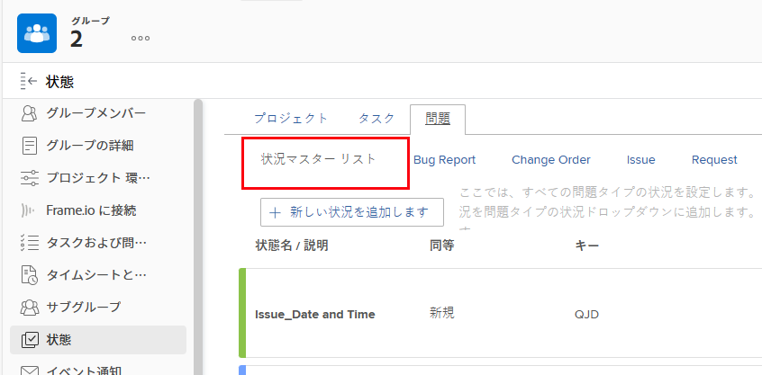
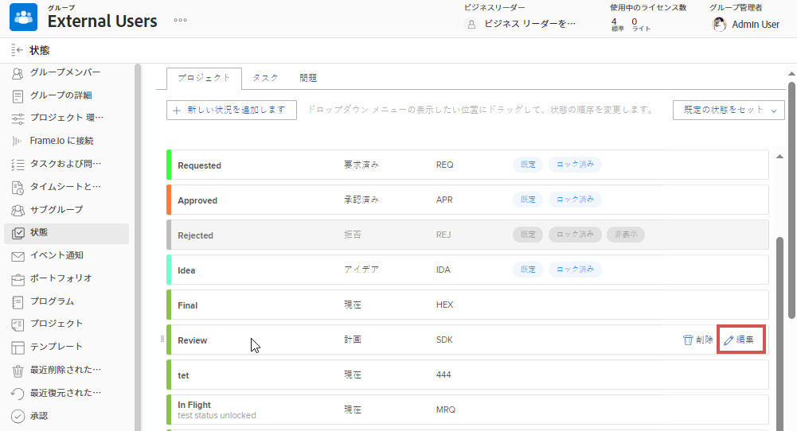
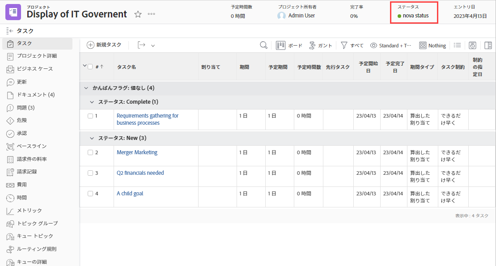
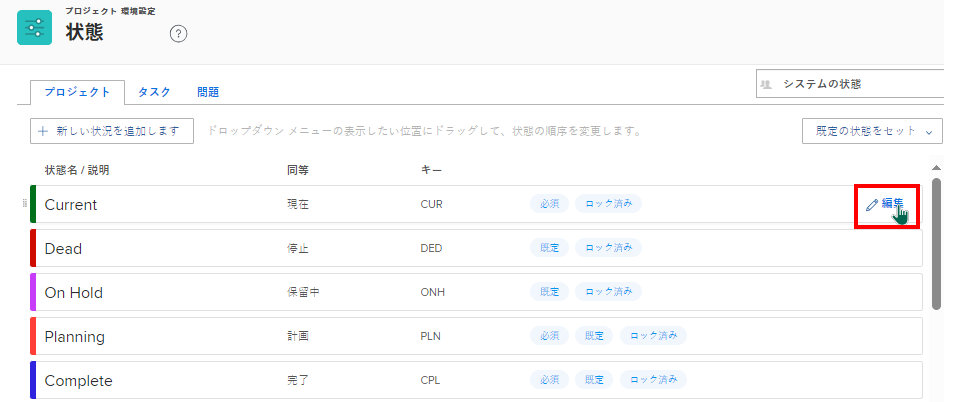

# グループステータスの作成または編集

グループ管理者は、管理するグループに対してカスタムステータスを作成できます。これにより、会社全体の多くのカスタムステータスを不要にし、グループの階層でより自律性を高めることができます。

Workfront 管理者がステータスのロックを解除した場合、管理対象のグループのシステムレベルのステータスを編集できます。詳しくは、[システムレベルのステータスのロックとロック解除](../../../administration-and-setup/customize-workfront/creating-custom-status-and-priority-labels/lock-or-unlock-a-custom-system-level-status.md)を参照してください。

グループの上にグループがある場合は、その管理者がグループに対してこれらの操作を実行することもできます。Workfront 管理者（すべてのグループ）も同様です。

>[!NOTE]
>
>プロジェクトをアジャイルビューで表示している場合、カスタムグループステータスはプロジェクトに表示できません。プロジェクトをアジャイルビューで表示している場合、デフォルトおよびカスタムのロックされたステータスのみが表示されます。プロジェクトのアジャイルビューのカスタマイズについて詳しくは、[Adobe Workfront のビューの概要](../../../reports-and-dashboards/reports/reporting-elements/views-overview.md)の記事にある[アジャイルビューの作成またはカスタマイズ](../../../reports-and-dashboards/reports/reporting-elements/views-overview.md#customizing-an-agile-view)の節を参照してください。

ステータスに関する一般的な情報について詳しくは、[ステータスの概要](../../../administration-and-setup/customize-workfront/creating-custom-status-and-priority-labels/statuses-overview.md)を参照してください。

## アクセス要件

この記事の手順を実行するには、以下を保有している必要があります。

<table style="table-layout:auto"> 
 <col> 
 <col> 
 <tbody> 
  <tr> 
   <td role="rowheader">Workfront プラン*</td> 
   <td>任意</td> 
  </tr> 
  <tr> 
   <td role="rowheader">Adobe Workfront ライセンス*</td> 
   <td> 
プラン 
 
グループのグループ管理者または Workfront 管理者である必要があります。詳しくは、<a href="../../../administration-and-setup/manage-groups/group-roles/group-administrators.md" class="MCXref xref">グループ管理者</a>および<a href="../../../administration-and-setup/add-users/configure-and-grant-access/grant-a-user-full-administrative-access.md" class="MCXref xref">ユーザーへの完全な管理アクセス権の付与</a>を参照してください。
 </td> 
  </tr> 
 </tbody> 
</table>

&#42;ご利用のプランまたはライセンスタイプを確認する必要がある場合は、Workfront 管理者にお問い合わせください。

## グループのステータスを作成または編集

1. Adobe Workfront の右上隅にある&#x200B;**メインメニュー**&#x200B;アイコン  をクリックして、**設定**  をクリックします。

1. 左側のパネルで、「**グループ**」をクリックします。

1. ステータスを作成またはカスタマイズするグループの名前をクリックします。
1. 左側のパネルで、「**ステータス**」をクリックします。

   表示しているグループが最上位のグループの場合、表示されるリストには次が含まれます。

   * システムレベルのロックされたステータス。
   * グループに対して既に作成されたカスタムステータス。

   さらに、表示しているグループがサブグループの場合、リストには次も含まれます。

   * サブグループの上のグループに属するロックされたステータス。
   * サブグループの作成時にサブグループの上のグループに属していた、ロック解除されたステータス。

     サブグループを作成した後は、その上のグループで作成されたロック解除されたステータスは、サブグループのステータスリストに含まれません。ただし、誰かがそのうちの 1 つを後でロックした場合、それはサブグループのステータスリストに含まれます。詳しくは、[グループのステータス継承方法](../../../administration-and-setup/manage-groups/manage-group-statuses/how-groups-inherit-statuses.md)を参照してください。

1. ステータスに関連付けるオブジェクトタイプ（**プロジェクト**、**タスク**&#x200B;または&#x200B;**イシュー**）のタブを選択します。

1. （条件付き）ステータスがイシューステータスの場合、**メインリスト**&#x200B;が選択されていることを確認します。

   

   その他のイシュータイプ（バグレポート、変更依頼、イシュー、リクエスト）のカスタマイズについて詳しくは、[デフォルトのイシュータイプのカスタマイズ](../../../administration-and-setup/set-up-workfront/configure-system-defaults/customize-default-issue-types.md)を参照してください。

1. （条件付き）新しいステータスを作成するには、「**新規ステータスを追加**」をクリックします。

   または

   既存のステータスを編集するには、編集するステータスの上にポインタを合わせ、右端に表示される「**編集**」をクリックします。

   

   >[!NOTE]
   >次の条件が該当する場合にのみ、グループのステータスを編集できます。
   >      
   >* ステータスが作成されたグループを管理している
   >* Workfrontの 管理者が、システムレベルでステータスのロックを解除している
   >* 所属するグループの上のグループのグループ管理者がステータスのロックを解除している
   >      
   >      
   >既存のステータスを編集する場合、名前、説明および色のみを変更できます。
   >
   >ロックされたステータスを編集する場合、変更は、所属するグループからステータスを継承したすべてのサブグループに影響を与えます。
   >   
   >逆に、ロックが解除されたステータスを編集しても、所属するグループからそのステータスを継承したサブグループには影響しません。

1. 次の情報を指定します。

   ステータスを編集する場合、変更できるのは最初の 3 つの設定のみです。

   <table style="table-layout:auto"> 
    <col> 
    <col> 
    <tbody> 
     <tr> 
      <td role="rowheader">状態名</td> 
      <td> 
ステータス名を入力します。必須フィールドです。
 
ステータス名を作成するときは、システム内の他の人が同じ名前のステータスを作成できることに注意してください。Workfront でステータスを選択する際に混乱が生じないように、一意の名前を使用することをお勧めします。
 </td> 
     </tr> 
     <tr> 
      <td role="rowheader">説明</td> 
      <td>（オプション）ステータスの説明を入力します。このステータスを使用する人たちに、その目的を伝えるためのものです。</td> 
     </tr> 
     <tr> 
      <td role="rowheader">色</td> 
      <td> 
ステータスの色をカスタマイズするには、カラーフィールドをクリックし、スウォッチパネルから色を選択します。色のフィールドに 16 進数を入力することもできます。
 
ステータスの色は、ユーザーがオブジェクトを表示したときに、Workfront の右上隅に表示されます。
 
  
 </td> 
     </tr> 
     <tr> 
      <td role="rowheader">同等</td> 
      <td> 
ステータスの機能に最も適したオプションをリストから 1 つ選択します。例えば、ステータス名が「終わり」の場合、それに相当するオプションは「完了」である必要があります。
 
ステータスがどのように機能するかを決定するので、各ステータスは、これらのオプションのいずれかと同じにする必要があります。
 
ステータスを作成した後は、このオプションを変更できません。
 </td> 
     </tr> 
     <tr> 
      <td role="rowheader">キー</td> 
      <td> 
新しいステータスを作成する場合は、ステータスのコードまたは略称を入力するか、生成されたステータスを使用します。このキーは、レポート目的で使用できるので、Workfront 内で一意である必要があります。システムで既に使用されているキーを指定しようとすると、フィールドが赤に変わります。
 
使用する人たちが認識できる略称を使用すると便利です。
 
ステータスを作成した後は、このオプションを変更できません。
 
計画中、進行中、完了の各ステータスのキーコードは変更できません。これは、テキストモードでレポートを作成する場合に重要です。
 </td> 
     </tr> 
     <tr> 
      <td role="rowheader">ステータスを非表示にする</td> 
      <td> 
（プロジェクトおよびタスクのステータスのみ）
 
ユーザーにステータスを表示しない場合は、このオプションを有効にします。無効になっている場合（デフォルト設定）、グループの下のすべてのサブグループが、そのステータスを使用できます。
 
ヒント：4 つのイシュータイプ（バグレポート、変更依頼、イシュー、リクエスト）をすべて無効にすると、イシューのステータスを非表示にできます。
 </td> 
     </tr> 
     <tr> 
      <td role="rowheader">すべてのグループについてロック</td> 
      <td> 
       
このオプションを有効のままにすると、グループとそのサブグループ内のユーザーはステータスを表示して使用でき、グループ管理者は下位のサブグループ用にステータスをカスタマイズできなくなります。
 
       
このオプションを無効にすると、グループ管理者は下位のサブグループ用にステータスをカスタマイズできます。
 
       
<b>メモ</b>：グループ承認プロセスでは、ロックとロック解除の両方のステータスを使用できます。ロックが解除されたグループステータスでグループ承認プロセスを作成すると、ユーザーはグループに関連付けられている任意のプロジェクト、タスク、またはイシューに承認プロセスを添付できます。
 
       
ステータスのロックについて詳しくは、<a href="../../../administration-and-setup/manage-groups/manage-group-statuses/lock-or-unlock-a-custom-group-status.md" class="MCXref xref">ロックおよびロック解除されたグループステータス</a>を参照してください。
 
       </td> 
     </tr>
    </tbody> 
   </table>

1. 「**保存**」をクリックします。

   これで、グループまたはサブグループに関連付けられたすべてのプロジェクトでステータスが使用できるようになりました。ロックした場合は、下位のサブグループで使用できます。

   ステータスをグループのデフォルトのステータスに設定できます。詳しくは、[カスタムステータスをグループのデフォルトのステータスとして使用](../../../administration-and-setup/manage-groups/manage-group-statuses/use-custom-statuses-as-default-statuses-group.md)を参照してください。

## 複数のグループのカスタムステータスを作成

Workfront 管理者は、システム全体のステータスを作成し、それを必要としないグループにそのステータスが表示されないようにすることにより、複数のグループのカスタムステータスを作成できます。

グループ管理者（または Workfront 管理者）は、上位のグループのステータスを作成し、それを必要としない下位のサブグループにそのステータスが表示されないようにすることにより、管理するグループ階層内の複数のサブグループのカスタムステータスを作成できます。

1. Workfront 管理者の場合は、[ステータスの作成または編集](../../../administration-and-setup/customize-workfront/creating-custom-status-and-priority-labels/create-or-edit-a-status.md)の説明に従って、システム全体のロック解除ステータスを作成します。
1. 右上隅のボックスで、**システムステータス**&#x200B;を削除し、ステータスを非表示にするグループの名前を入力し、表示されたら名前をクリックします。
1. グループに表示しないステータスの上にポインタを合わせて、「**編集**」が表示されたらクリックします。

   

1. 表示される「**ステータスを非表示**」オプションを有効にします。

   

1. 「**保存**」をクリックします。

   ステータスが灰色表示になり、そのグループのすべてのユーザーには表示されなくなります。

1. 手順 3 ～ 5 を繰り返して、カスタムステータスを必要としない他のグループに対して非表示にします。
