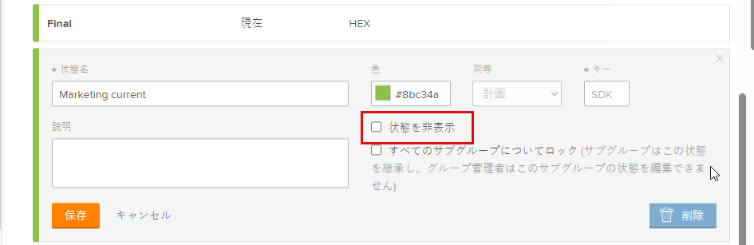

# グループステータスの作成または編集

グループ管理者は、管理するグループに対してカスタムステータスを作成できます。これにより、会社全体の多くのカスタムステータスを不要にし、グループの階層でより自律性を高めることができます。

Workfront 管理者がステータスのロックを解除した場合、管理対象のグループのシステムレベルのステータスを編集できます。詳しくは、[システムレベルのステータスのロックとロック解除](../../../administration-and-setup/customize-workfront/creating-custom-status-and-priority-labels/lock-or-unlock-a-custom-system-level-status.md)を参照してください。

グループの上にグループがある場合は、その管理者がグループに対してこれらの操作を実行することもできます。Workfront 管理者（すべてのグループ）も同様です。

>[!NOTE]
>
>アジャイルビューでプロジェクトを表示する場合、カスタムグループのステータスをプロジェクトに表示することはできません。 アジャイルビューでプロジェクトを表示すると、デフォルトおよびカスタムのロック済みステータスのみが表示されます。 プロジェクトのアジャイル ビューのカスタマイズの詳細については、「[Adobe Workfrontでのビューの作成または編集 &#x200B;](/help/quicksilver/reports-and-dashboards/reports/reporting-elements/create-edit-views.md#create-or-customize-an-agile-view)」の [&#x200B; アジャイル ビューの作成またはカスタマイズ &#x200B;](/help/quicksilver/reports-and-dashboards/reports/reporting-elements/create-edit-views.md) を参照してください。

ステータスに関する一般的な情報について詳しくは、[ステータスの概要](../../../administration-and-setup/customize-workfront/creating-custom-status-and-priority-labels/statuses-overview.md)を参照してください。

## アクセス要件

+++ 展開すると、この記事の機能のアクセス要件が表示されます。

<table style="table-layout:auto"> 
 <col> 
 <col> 
 <tbody> 
  <tr> 
   <td>Adobe Workfront パッケージ</td> 
   <td>
任意
</td> 
  </tr> 
  <tr> 
   <td>Adobe Workfront プラン</td> 
   <td>
標準

       
プラン
</td>
  </tr>
  <tr> 
   <td>アクセスレベル設定</td> 
   <td>グループのグループ管理者またはシステム管理者である必要があります。</td>
  </tr>
 </tbody> 
</table>

詳しくは、[Workfront ドキュメントのアクセス要件](/help/quicksilver/administration-and-setup/add-users/access-levels-and-object-permissions/access-level-requirements-in-documentation.md)を参照してください。

+++

## グループのステータスを作成または編集

{{step-1-to-setup}}

1. 左側のパネルで、「**グループ**」をクリックします。

1. ステータスを作成またはカスタマイズするグループの名前をクリックします。
1. 左側のパネルで、「**ステータス**」をクリックします。

   表示しているグループが最上位のグループの場合、表示されるリストには次が含まれます。

   * システムレベルのロックされたステータス。
   * グループに対して既に作成されたカスタムステータス。

   さらに、表示しているグループがサブグループの場合、リストには次も含まれます。

   * サブグループの上のグループに属するロックされたステータス。
   * サブグループの作成時にサブグループの上のグループに属していた、ロック解除されたステータス。

     サブグループを作成した後は、その上のグループで作成されたロック解除されたステータスは、サブグループのステータスリストに含まれません。ただし、誰かがそのうちの 1 つを後でロックした場合、それはサブグループのステータスリストに含まれます。詳しくは、[グループのステータス継承方法](../../../administration-and-setup/manage-groups/manage-group-statuses/how-groups-inherit-statuses.md)を参照してください。

1. ステータスに関連付けるオブジェクトタイプ（**プロジェクト**、**タスク**&#x200B;または&#x200B;**イシュー**）のタブを選択します。

1. （条件付き）ステータスがイシューステータスの場合、**メインリスト**&#x200B;が選択されていることを確認します。

   

   その他のイシュータイプ（バグレポート、変更依頼、イシュー、リクエスト）のカスタマイズについて詳しくは、[デフォルトのイシュータイプのカスタマイズ](../../../administration-and-setup/set-up-workfront/configure-system-defaults/customize-default-issue-types.md)を参照してください。

1. （条件付き）新しいステータスを作成するには、「**新規ステータスを追加**」をクリックします。

   または

   既存のステータスを編集するには、編集するステータスの上にポインタを合わせ、右端に表示される「**編集**」をクリックします。

   

   >[!NOTE]
   >次の条件が該当する場合にのみ、グループのステータスを編集できます。
   >      
   >* ステータスが作成されたグループを管理している
   >* Workfrontの 管理者が、システムレベルでステータスのロックを解除している
   >* 所属するグループの上のグループのグループ管理者がステータスのロックを解除している
   >      
   >      
   >既存のステータスを編集する場合、名前、説明および色のみを変更できます。
   >
   >ロックされたステータスを編集する場合、変更は、所属するグループからステータスを継承したすべてのサブグループに影響を与えます。
   >   
   >逆に、ロックが解除されたステータスを編集しても、所属するグループからそのステータスを継承したサブグループには影響しません。

1. 次の情報を指定します。

   ステータスを編集する場合、変更できるのは最初の 3 つの設定のみです。

   <table style="table-layout:auto"> 
    <col> 
    <col> 
    <tbody> 
     <tr> 
      <td role="rowheader">状態名</td> 
      <td> 
ステータス名を入力します。必須フィールドです。
 
ステータス名を作成するときは、システム内の他の人が同じ名前のステータスを作成できることに注意してください。Workfront でステータスを選択する際に混乱が生じないように、一意の名前を使用することをお勧めします。

重複したステータスが存在する場合、グループ管理者は名前を更新して区別する必要があります。システム内の唯一の一意性インジケーターはステータスキーです。
 </td> 
     </tr> 
     <tr> 
      <td role="rowheader">説明</td> 
      <td>（オプション）ステータスの説明を入力します。このステータスを使用する人たちに、その目的を伝えるためのものです。</td> 
     </tr> 
     <tr> 
      <td role="rowheader">色</td> 
      <td> 
ステータスの色をカスタマイズするには、カラーフィールドをクリックし、スウォッチパネルから色を選択します。色のフィールドに 16 進数を入力することもできます。
 
ステータスの色は、ユーザーがオブジェクトを表示したときに、Workfront の右上隅に表示されます。
 
  
 </td> 
     </tr> 
     <tr> 
      <td role="rowheader">同等</td> 
      <td> 
ステータスの機能に最も適したオプションをリストから 1 つ選択します。例えば、ステータス名が「終わり」の場合、それに相当するオプションは「完了」である必要があります。
 
ステータスがどのように機能するかを決定するので、各ステータスは、これらのオプションのいずれかと同じにする必要があります。
 
ステータスを作成した後は、このオプションを変更できません。
 </td> 
     </tr> 
     <tr> 
      <td role="rowheader">キー</td> 
      <td> 
新しいステータスを作成する場合は、ステータスのコードまたは略称を入力するか、生成されたステータスを使用します。このキーは、レポート目的で使用できるので、Workfront 内で一意である必要があります。システムで既に使用されているキーを指定しようとすると、フィールドが赤に変わります。
 
使用する人たちが認識できる略称を使用すると便利です。
 
ステータスを作成した後は、このオプションを変更できません。
 
計画中、進行中、完了の各ステータスのキーコードは変更できません。これは、テキストモードでレポートを作成する場合に重要です。
 </td> 
     </tr> 
     <tr> 
      <td role="rowheader">ステータスを非表示にする</td> 
      <td> 
（プロジェクトおよびタスクのステータスのみ）
 
ユーザーにステータスを表示しない場合は、このオプションを有効にします。無効になっている場合（デフォルト設定）、グループの下のすべてのサブグループが、そのステータスを使用できます。
 
ヒント：4 つのイシュータイプ（バグレポート、変更依頼、イシュー、リクエスト）をすべて無効にすると、イシューのステータスを非表示にできます。
 </td> 
     </tr> 
     <tr> 
      <td role="rowheader">すべてのグループについてロック</td> 
      <td> 
       
このオプションを有効のままにすると、グループとそのサブグループ内のユーザーはステータスを表示して使用でき、グループ管理者は下位のサブグループ用にステータスをカスタマイズできなくなります。
 
       
このオプションを無効にすると、グループ管理者は下位のサブグループ用にステータスをカスタマイズできます。
 
       
<b>メモ</b>：グループ承認プロセスでは、ロックとロック解除の両方のステータスを使用できます。ロックが解除されたグループステータスでグループ承認プロセスを作成すると、ユーザーはグループに関連付けられている任意のプロジェクト、タスク、またはイシューに承認プロセスを添付できます。
 
       
ステータスのロックについて詳しくは、<a href="../../../administration-and-setup/manage-groups/manage-group-statuses/lock-or-unlock-a-custom-group-status.md" class="MCXref xref">ロックおよびロック解除されたグループステータス</a>を参照してください。
 
       </td> 
     </tr>
    </tbody> 
   </table>

1. 「**保存**」をクリックします。

   これで、グループまたはサブグループに関連付けられたすべてのプロジェクトでステータスが使用できるようになりました。ロックした場合は、下位のサブグループで使用できます。

   ステータスをグループのデフォルトのステータスに設定できます。詳しくは、[カスタムステータスをグループのデフォルトのステータスとして使用](../../../administration-and-setup/manage-groups/manage-group-statuses/use-custom-statuses-as-default-statuses-group.md)を参照してください。

## 複数のグループのカスタムステータスを作成

Workfront 管理者は、システム全体のステータスを作成し、それを必要としないグループにそのステータスが表示されないようにすることにより、複数のグループのカスタムステータスを作成できます。

グループ管理者（または Workfront 管理者）は、上位のグループのステータスを作成し、それを必要としない下位のサブグループにそのステータスが表示されないようにすることにより、管理するグループ階層内の複数のサブグループのカスタムステータスを作成できます。

1. Workfront 管理者の場合は、[ステータスの作成または編集](../../../administration-and-setup/customize-workfront/creating-custom-status-and-priority-labels/create-or-edit-a-status.md)の説明に従って、システム全体のロック解除ステータスを作成します。
1. 右上隅のボックスで、**システムステータス**&#x200B;を削除し、ステータスを非表示にするグループの名前を入力し、表示されたら名前をクリックします。
1. グループに表示しないステータスの上にポインタを合わせて、「**編集**」が表示されたらクリックします。

   

1. 表示される「**ステータスを非表示**」オプションを有効にします。

   

1. 「**保存**」をクリックします。

   ステータスが灰色表示になり、そのグループのすべてのユーザーには表示されなくなります。

1. 手順 3 ～ 5 を繰り返して、カスタムステータスを必要としない他のグループに対して非表示にします。

