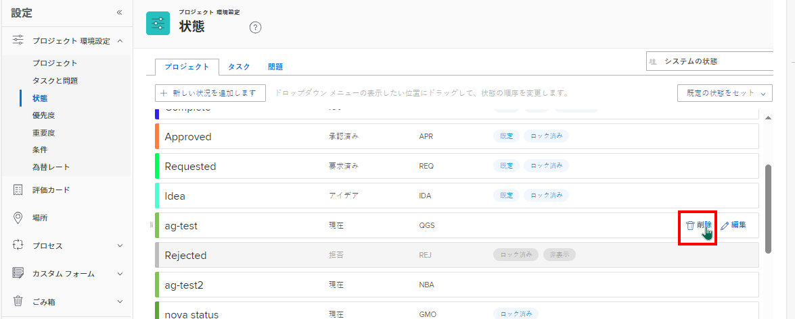

# グループステータスの削除

グループ管理者は、管理するグループのステータスを削除できます（システム・レベルで必須またはロック済のステータスとして構成されていない場合）。または、階層内の上位のグループに対しては削除できます。

管理するグループの上にグループがある場合は、その管理者がグループに対してこの操作を行うこともできます。 Workfront管理者（すべてのグループ）も同様です。

>[!NOTE]
>
>次の項目は削除できません。
>
>* 組み込みステータスの「計画」、「現在」、「完了」。 名前の更新、色の編集、ロックまたはロック解除は可能ですが、削除することはできません。
>* グループに関連付けられた 1 つ以上のオブジェクトまたはそのサブグループの 1 つに対して承認待ち状態のステータス。

## アクセス要件

この記事の手順を実行するには、次の手順を実行する必要があります。

<table style="table-layout:auto"> 
 <col> 
 <col> 
 <tbody> 
  <tr> 
   <td role="rowheader">Workfront plan*</td> 
   <td>任意</td> 
  </tr> 
  <tr> 
   <td role="rowheader">Adobe Workfront license*</td> 
   <td> 
計画 
 
グループのグループ管理者またはWorkfront管理者である必要があります。 詳しくは、 <a href="../../../administration-and-setup/manage-groups/group-roles/group-administrators.md" class="MCXref xref">グループ管理者</a> および <a href="../../../administration-and-setup/add-users/configure-and-grant-access/grant-a-user-full-administrative-access.md" class="MCXref xref">ユーザーに完全な管理アクセス権を付与する</a>.
 </td> 
  </tr> 
 </tbody> 
</table>

&#42;保有するプランまたはライセンスの種類を確認する必要がある場合は、Workfront管理者にお問い合わせください。

## グループステータスの削除

1. 次をクリック： **メインメニュー** アイコン  Adobe Workfrontの右上隅で、 **設定** .

1. 左側のパネルで、 **グループ**.
1. 最上位グループの名前をクリックします。
1. 左側のパネルで、 **ステータス**.
1. 表示されるステータスのリストで、削除するステータスの上にマウスポインターを置いて、「 **削除** 最も右側に見える時

   

1. 表示されるボックスで、ステータスを選択して、削除するステータスを使用していたオブジェクト（プロジェクト、タスク、問題、承認プロセス）の置き換えステータスを指定します。

   削除しようとしているステータスに等しいステータスのみを使用できます。 例えば、現在のステータスを削除すると、現在のステータスに等しいステータスのみが表示されます。

   また、表示されるステータスは、削除するステータスのロックが解除されているかロックされているかによって異なります。

   * **ロックが解除されている場合**:非表示のロック済みステータスとロック解除済みステータスを使用できます。

      サブグループに対して作成されたステータスと共に、システムレベルと上位レベルのグループから継承されたステータスも含まれます。

   * **ロックされている場合**:次のいずれかが該当します。

      * 他のロックされた非表示のステータスがある場合は、それらのステータスのみを使用できます。
      * 非表示の非ロックステータスがない場合は、非表示またはロックが解除されていても、デフォルトのWorkfrontステータスが使用可能です。

         デフォルトのWorkfrontのステータスについて詳しくは、 [システムプロジェクトステータスのリストへのアクセス](../../../administration-and-setup/customize-workfront/creating-custom-status-and-priority-labels/project-statuses.md), [システムタスクステータスのリストへのアクセス](../../../administration-and-setup/customize-workfront/creating-custom-status-and-priority-labels/task-statuses.md)、および [システムの問題ステータスのリストへのアクセス](../../../administration-and-setup/customize-workfront/creating-custom-status-and-priority-labels/issue-statuses.md).

1. クリック **ステータスを削除**.

   削除済みステータスがグループ内のそのタイプのデフォルトステータスの場合は、置き換えステータスがその代わりに使用されます。

   削除済みのステータスがプロジェクトプリファレンスでデフォルトのプロジェクトステータスに設定された場合、プリファレンスは置き換えステータスに設定されます。

## グループが削除されたとき

グループを削除して別のグループに置き換えると、そのグループが持っていた一意のステータスが置き換えグループのステータスに追加されます。 詳しくは、 [移動または削除されたグループのカスタムステータス](../../../administration-and-setup/manage-groups/manage-group-statuses/custom-statuses-in-group-moved-or-deleted.md).
