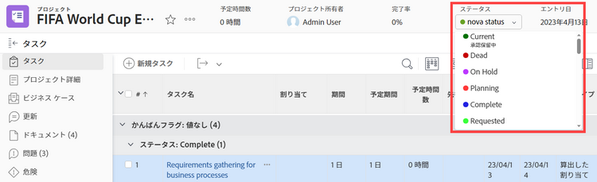

# グループのステータスの並べ替え

グループ管理者は、管理するグループのプロジェクト、タスク、課題ステータスの順序を変更できます。

<!--
The system version of this snippet mentions a single group because a sysadmin call also reorder statuses there. Group admin version of this article is still needed.
-->

管理するグループ上にグループがある場合は、その管理者がグループに対してこの操作を行うこともできます。Workfront 管理者（すべてのグループ）も同様です。

>[!NOTE]
>
>* Workfront 管理者は、システムレベルでステータスを並べ替えることができます。これは、グループ内のステータスの順序には影響しません。
>
>  ただし、新しく作成されたトップレベルグループ内のステータスは、システムレベルのステータスの順序を継承します。（新しいサブグループは、1 レベル上のグループ内のステータスの順序を継承します）。
>
>* ロックされたステータスは並べ替えることができます。ロックされたステータスについて詳しくは、[グループステータスの作成または編集](../../../administration-and-setup/manage-groups/manage-group-statuses/create-or-edit-a-group-status.md)を参照してください。
>

## アクセス要件

この記事の手順を実行するには、以下を保有している必要があります。

<table style="table-layout:auto"> 
 <col> 
 <col> 
 <tbody> 
  <tr> 
   <td role="rowheader">Adobe Workfront プラン* </td> 
   <td>任意</td> 
  </tr> 
  <tr data-mc-conditions="SnippetConditions-wf-groups.groups"> 
   <td role="rowheader">Adobe Workfront ライセンス*</td> 
   <td> 
プラン 
 
グループのグループ管理者または Workfront 管理者である必要があります。詳しくは、<a href="../../../administration-and-setup/manage-groups/group-roles/group-administrators.md" class="MCXref xref">グループ管理者</a>および<a href="../../../administration-and-setup/add-users/configure-and-grant-access/grant-a-user-full-administrative-access.md" class="MCXref xref">ユーザーへの完全な管理アクセス権の付与</a>を参照してください。
 </td> 
  </tr> 
 </tbody> 
</table>

&#42;保有するプランまたはライセンスの種類を確認する必要がある場合は、Workfront 管理者にお問い合わせください。

## デフォルトのステータス順序

デフォルトでは、ステータスは次の順序で表示されます。

<table style="table-layout:auto"> 
 <col> 
 <col> 
 <col> 
 <thead> 
  <tr> 
   <th width="33.33%">プロジェクト</th> 
   <th width="33.33%">タスク</th> 
   <th width="33.33%">イシュー</th> 
  </tr> 
 </thead> 
 <tbody> 
  <tr> 
   <td> 
     
現在
 
     
停止
 
     
 保留中 
 
     
 プラン 
 
     
 完了 
 
     
 リクエスト日 
 
     
 承認済み 
 
     
 却下 
 
     
 アイデア 
 
   </td> 
   <td> 
     
新規
 
     
処理中
 
     
完了
 
   </td> 
   <td> 
     
新規
 
     
処理中
 
     
再オープン
 
     
フィードバック待ち
 
     
保留中
 
     
複製不可
 
     
クローズ
 
     
解決済み
 
     
完了確認
 
     
解決されない
 
   </td> 
  </tr> 
 </tbody> 
</table>

## 管理するグループ内のタスクとプロジェクトのステータスを並べ替える

1. Adobe Workfront の右上隅にある&#x200B;**メインメニュー**&#x200B;アイコン  をクリックして、**設定**  をクリックします。

1. 左側のパネルで、**グループ**&#x200B;をクリックし、グループの名前を選択します。
1. 左側のパネルで、**ステータス**&#x200B;をクリックします。
1. 表示されるステータスリストの「**プロジェクト**」または「**タスク**」タブをクリックします。

1. ステータスを目的の順序でドラッグ＆ドロップします。

   新しいステータスの順序は自動的に保存されます。

1. 新しいステータスの順序を調べるには、グループに関連付けられているタスクまたはプロジェクトに移動し、右上隅にあるステータスをクリックして、表示されるステータスが構成した順序に従っていることを確認します。

## イシューのステータスを並べ替える

1. Adobe Workfront の右上隅にある&#x200B;**メインメニュー**&#x200B;アイコン  をクリックし、「**設定**」 をクリックします。

1. 左側のパネルで、**グループ**&#x200B;をクリックし、グループの名前を選択します。
1. 左側のパネルで、**ステータス**&#x200B;をクリックします。
1. 「**イシュー**」タブをクリックします。
1. （オプション）イシュータイプ（**バグレポート**、**変更依頼**、**イシュー**&#x200B;または **リクエスト**）を選択します。

   >[!NOTE]
   >
   >* メインリストのステータスの順序はカスタマイズできません。
   >* 各イシュータイプについては、同じ方法でステータスの順序を指定することをお勧めします。イシュータイプについて詳しくは、[リクエストタイプの設定](../../../administration-and-setup/set-up-workfront/configure-system-defaults/configure-request-types.md)を参照してください。

1. ステータスを目的の順序でドラッグ＆ドロップします。

   新しいステータスの順序は自動的に保存されます。

1. 新しいステータスの順序を調べるするには、グループに関連付けられているイシューに移動し、右上隅のステータスをクリックして、表示されるステータスが構成した順序に従っていることを確認します。
