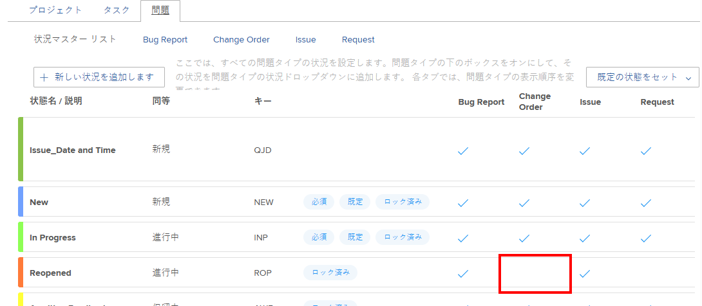
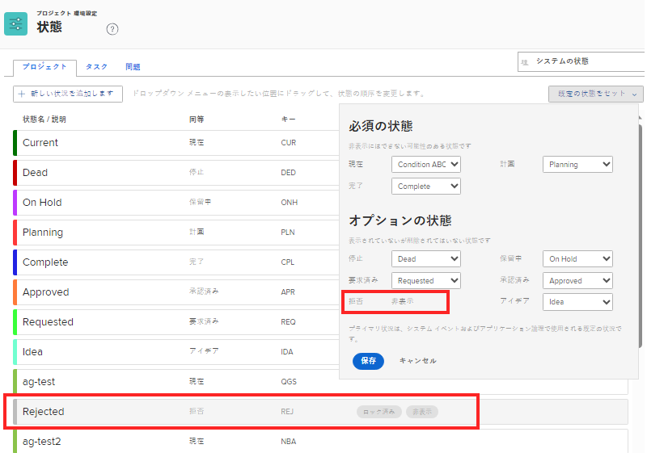

# カスタムステータスをグループのデフォルトのステータスとして使用

グループ管理者は、管理するグループまたはサブグループのデフォルトのステータスとしてカスタムステータスを設定できます。これは、Workfront のステータスをプロジェクト、タスクまたはイシューに自動的に割り当てる必要がある場合に役立ちます。プロジェクト、タスクまたはイシューには、デフォルトのステータスとして設定したカスタムステータスが常に表示されます。それに相当する Workfront のステータスは表示されなくなります。

設定するステータスは、グループに対して作成されたカスタムステータス、グループより上のグループから継承されたカスタムステータス、またはシステムレベルから継承されたカスタムステータスのいずれかです。

管理するグループ上にグループがある場合は、その管理者がグループに対してこの操作を行うこともできます。Workfront 管理者（すべてのグループ）も同様です。

>[!INFO]
>
>**例：**「終了」という名前のカスタムステータスを作成し、Workfront のステータス完了と同じデフォルトのステータスに設定することができます。
>
>タスクが 100％に達したときにタスクが完了ステータスに変わると、ステータスは「完了」ではなく「終了」と表示されます。

## アクセス要件

この記事の手順を実行するには、以下を保有している必要があります。

<table style="table-layout:auto"> 
 <col> 
 <col> 
 <tbody> 
  <tr> 
   <td role="rowheader">Workfront プラン*</td> 
   <td>任意</td> 
  </tr> 
  <tr> 
   <td role="rowheader">Adobe Workfront ライセンス*</td> 
   <td> 
プラン 
 
グループのグループ管理者または Workfront 管理者である必要があります。詳しくは、<a href="../../../administration-and-setup/manage-groups/group-roles/group-administrators.md" class="MCXref xref">グループ管理者</a>および<a href="../../../administration-and-setup/add-users/configure-and-grant-access/grant-a-user-full-administrative-access.md" class="MCXref xref">ユーザーへの完全な管理アクセス権の付与</a>を参照してください。
 </td> 
  </tr> 
 </tbody> 
</table>

&#42;保有するプランまたはライセンスの種類を確認する必要がある場合は、Workfront 管理者にお問い合わせください。

## イシューのステータス

カスタムステータスが「イシュー」ステータスの場合は、4 つのイシュータイプ（バグレポート、変更依頼、イシュー、リクエスト）をすべて有効にする必要があります。例えば、以下に示すイシューステータスでは、「再オープン」には変更依頼のイシュータイプが選択されていないので、デフォルトのステータスとして使用することはきません。

## カスタムステータスをグループのデフォルトのステータスとして設定

1. Adobe Workfront の右上隅にある&#x200B;**メインメニュー**&#x200B;アイコン  をクリックして、**設定**  をクリックします。
1. 左側のパネルで、**グループ**  をクリックし、ステータスを作成またはカスタマイズするグループの名前をクリックします。
1. 左側のパネルで、**ステータス**  をクリックします。
1. デフォルトのステータスとして設定するステータスのタイプに応じて、「**プロジェクト**」、「**タスク**」、または「**イシュー**」タブを開きます。
1. 右上隅付近にある「**メインメニューを設定**」をクリックします。
1. 表示されるドロップダウンエリアで、デフォルトのステータスを設定するステータスの横に表示されるデフォルトのステータスを選択します。
1. 「**保存**」をクリックします。

   これで、このステータスが、グループに関連付けられたプロジェクトで使用するデフォルトのステータスとして使用できるようになりました。

1. カスタムステータスを、使用するプロジェクトに関連付けます。

   ステータスをプロジェクトに関連付けるには、ステータスが存在するグループをプロジェクトに関連付けます。ユーザーは、ステータスが存在するグループがプロジェクトに関連付けられている場合にのみ、カスタムステータスを使用できます。

   >[!NOTE]
   >
   >プロジェクトを別のグループに割り当てた場合、プロジェクトのステータスはリロードされ、変更される可能性があります。

   1. カスタムステータスを使用するプロジェクトに移動します。
   1. その他メニュー 、「**編集**」の順にクリックします。
   1. 表示される&#x200B;**プロジェクトを編集**&#x200B;ボックスの、「**プロジェクトを関連付け**」の&#x200B;**グループ**&#x200B;フィールドで、カスタムステータスを関連付けるグループを選択します。

   1. 「**変更を保存**」をクリックします。

## グループがデフォルトステータスの設定を継承

Workfront 管理者がカスタムステータスをデフォルトのステータスとして設定すると、作成された新しいグループはその設定を継承します。

同様に、グループ管理者がカスタムステータスをデフォルトのステータスに設定すると、グループのすぐ下に作成された新しいサブグループはその設定を継承します。

詳しくは、[グループのステータス継承方法](../../../administration-and-setup/manage-groups/manage-group-statuses/how-groups-inherit-statuses.md)を参照してください。

## デフォルトのステータスが非表示の場合

デフォルトのステータスを非表示にする（「ステータスを非表示」オプションを有効にする）と、システムでは、対応するタイプの別のステータスをデフォルトとして代わりに設定することを試みます。

対応するタイプの使用可能なステータスがない場合、ステータスタイプは&#x200B;**非表示**&#x200B;として表示され、作業アイテムには使用できません。

