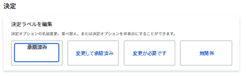
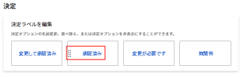
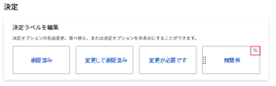

# デフォルトプルーフの設定

これらの設定を使用すると、ユーザーが作成するすべての新しいプルーフに適用されるデフォルト値を設定できます。ただし、プルーフの作成時に、ユーザーがこれらの設定のほとんどを上書きできます。

## 新しいプルーフのデフォルト設定を指定する

1. Adobe Workfront の右上隅にある&#x200B;**メインメニュー**&#x200B;アイコン  をクリックして、「**設定**」をクリックします。
1. 左側のパネルで、**プルーフ**／**プルーフの設定**&#x200B;をクリックします。
1. 「**新しいプルーフのデフォルト**」セクションで、次の設定を行います。

   <table style="table-layout:auto"> 
    <col> 
    <col> 
    <tbody> 
     <tr> 
      <td role="rowheader" colspan="2"><b>受信者</b></td> 
     </tr> 
     <tr> 
      <td role="rowheader">ログインが必要</td> 
      <td> 
レビュアーは、組織のアカウントで作成したプルーフを表示できるようにする前に、メールとパスワードを使用してログインする必要があります。有効にすると、ユーザーはゲストレビュアーとプルーフを共有できなくなります。
 
<b>重要</b>：有効にした場合、新しく作成されたすべてのプルーフにログインが必要です。
 </td> 
     </tr> 
     <tr> 
      <td role="rowheader">新しいバージョンについて元のプルーフから所有者をコピー</td> 
      <td> 
また、プルーフの最初のバージョンの所有者は、誰が作成したかに関係なく、プルーフの連続するすべてのバージョンの所有者にもなります。この設定は、デフォルトで有効になっています。
 </td> 
     </tr> 
     <tr> 
      <td role="rowheader">ユーザーがプルーフのコメントを削除することを許可します</td> 
      <td>ユーザーは自分のコメントを削除できます。この設定は、デフォルトで有効になっています。</td> 
     </tr> 
     <tr> 
      <td role="rowheader">校正判断に電子サインを必須にする </td> 
      <td> 
意思決定者は、プルーフを決定する際に、Workfront のログイン資格情報を入力するよう求められます。
 
<b>重要</b>：有効にすると、ユーザーはログイン資格情報を持たないゲストレビュアーとプルーフを共有できなくなります。
 </td> 
     </tr> 
     <tr> 
      <td role="rowheader" colspan="2"><b>期限</b></td> 
     </tr> 
     <tr> 
      <td role="rowheader">デフォルトの期限を設定する</td> 
      <td> 
システムは、自動ワークフローを持たないアカウント内のすべての新しいプルーフにこの期限を適用します。
 </td> 
     </tr> 
     <tr> 
      <td role="rowheader">プルーフがリスクにさらされる前に受信者に通知する</td> 
      <td>上記で指定された期限に応じて、プルーフが危険にさらされているとみなされる前に、受信者にはメールで通知されます。</td> 
     </tr> 
     <tr> 
      <td role="rowheader" colspan="2"><b>メール通知</b></td> 
     </tr> 
     <tr> 
      <td role="rowheader">受信者がプルーフに追加されたとき受信者に通知する</td> 
      <td>受信者はプルーフに追加されると、メールで通知されます。</td> 
     </tr> 
    </tbody> 
   </table>

1. 「**保存**」をクリックします。

## プルーフの決定を設定する

ユーザーはプルーフの決定を使用して、レビュー後のプルーフのステータスを示すことができます。

>[!NOTE]
>
>様々なレベルの複数の決定がある場合、プルーフワークフローの全体的なステータスを計算するために、プルーフの決定の背後にあるロジックが使用されます。「承認済み」および「変更して承認済み」の決定により、自動ワークフローの次のステージがトリガーされます。

プルーフの決定を設定するには、以下の手順を実行します。

1. Adobe Workfront の右上隅にある&#x200B;**メインメニュー**&#x200B;アイコン  をクリックし、「**設定**」をクリックします。
1. 左側のパネルで、**プルーフ**／**プルーフの設定**&#x200B;をクリックします。
1. 「**決定**」セクションで、以下の操作を実行できます。

   1. **決定の名前を変更**：決定ボックス内のテキストをクリックし、新しい決定ラベルの入力を開始します。

      >[!TIP]
      >
      >名前を変更する際には、決定のロジックは保持します。例えば、デフォルトの決定「却下」を「*新しいバージョンが必要*」に変更することはできますが、「*プリンターへ送信*」には変更しないでください。

      

   1. **決定順序を並べ替える**：決定ボックスを、プルーフビューアに表示する順序にドラッグします。

      

   1. **決定を非表示にする**：決定ボックスにポインタを合わせて、右上隅の非表示アイコンをクリックします。

      

1. （オプション）Workfront のデフォルトに戻るには、「**デフォルトに戻す**」をクリックします。
1. 「**保存**」をクリックします。
