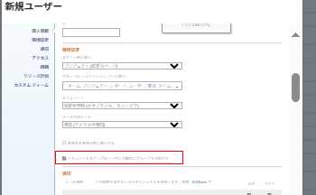
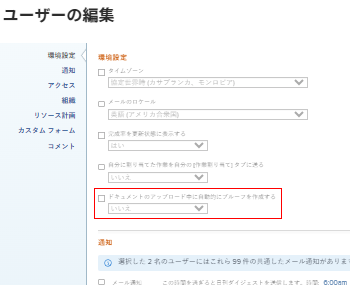

# 配達確認を自動的に生成するかどうかの設定

Workfrontにドキュメントを追加するユーザーを指定した場合に、システムが配達確認を自動的に生成するかどうかを設定できます。 この設定は、デフォルトでは無効です。

## アクセス要件

以下が必要です。

<table style="table-layout:auto"> 
 <col> 
 <col> 
 <tbody> 
  <tr> 
   <td role="rowheader"><a href="https://www.workfront.com/plans" target="_blank">Adobe Workfrontプラン</a> </td> 
   <td>任意</td> 
  </tr> 
  <tr> 
   <td role="rowheader"><a href="../../../administration-and-setup/add-users/access-levels-and-object-permissions/wf-licenses.md" class="MCXref xref">Adobe Workfrontライセンスの概要</a>*</td> 
   <td>計画</td> 
  </tr> 
  <tr> 
   <td role="rowheader">アクセス設定</td> 
   <td> 
Workfront管理者である。 Workfront管理者について詳しくは、 <a href="../../../administration-and-setup/add-users/configure-and-grant-access/grant-a-user-full-administrative-access.md" class="MCXref xref">ユーザーに完全な管理アクセス権を付与する</a>.
 </td> 
  </tr> 
 </tbody> 
</table>

&#42;保有しているプラン、ライセンスの種類、アクセス権を確認するには、Workfront管理者に問い合わせてください。

## 1 人のユーザーに対して配達確認を自動的に生成するかどうかを設定

1. 次をクリック： **メインメニュー** アイコン  Adobe Workfrontの右上隅で、 **ユーザー** .
1. 校正アクセス権を持つユーザーを選択し、「 **編集**.
1. 内 **環境設定** セクション、有効または無効 **ドキュメントのアップロード時に配達確認を自動生成** チェックボックス。

   

1. クリック **変更を保存**.

## 複数のユーザーに対して配達確認を自動的に生成するかどうかを設定

1. 次をクリック： **メインメニュー** アイコン  Adobe Workfrontの右上隅で、 **ユーザー** .
1. 校正アクセス権を持つユーザーを選択し、 **編集**.

   >[!IMPORTANT]
   >
   >すべてのユーザーが校正アクセス権を持っていない場合、「ドキュメントのアップロード時に配達確認を自動生成」オプションは表示されません。

1. 内 **環境設定** セクション、有効 **ドキュメントのアップロード時に配達確認を自動生成** 「 」チェックボックスをオンにして、「 」を選択します。 **はい** または **いいえ**.

   

1. クリック **変更を保存**.

