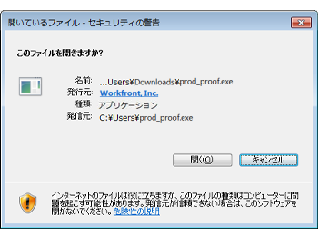

# 組織にデスクトップ校正ビューアをインストールします

デスクトップ校正ビューアは、インタラクティブコンテンツの校正を主目的として設計されています。このビューアは、各ユーザーのローカルマシンにインストールする必要があるアプリケーションです。 Adobe Workfront管理者またはWorkfront Proof 管理者は、このインストールを実行できます。

## アクセス要件

以下が必要です。

<table style="table-layout:auto"> 
 <col> 
 <col> 
 <tbody> 
  <tr> 
   <td role="rowheader">Adobe Workfront plan*</td> 
   <td> 
現在のプラン：Pro 以上
 
または
 
レガシープラン：Premium または Select
 
様々なプランでのアクセスの検証について詳しくは、 <a href="../../../administration-and-setup/manage-workfront/configure-proofing/access-to-proofing-functionality.md" class="MCXref xref">Workfrontの校正機能へのアクセス</a>.
 </td> 
  </tr> 
  <tr> 
   <td role="rowheader">Adobe Workfront license*</td> 
   <td> 
現在のプラン：作業または計画
 
レガシープラン：任意（ユーザーの校正が有効になっている必要があります）
 </td> 
  </tr> 
  <tr> 
   <td role="rowheader">アクセスレベル設定*</td> 
   <td> 
配達確認権限プロファイルで管理者が選択されている必要があります。 詳しくは、 <a href="../../../administration-and-setup/manage-workfront/configure-proofing/configure-a-users-proofing-access.md" class="MCXref xref">ユーザーの校正アクセスを設定する</a>.
 </td> 
  </tr> 
 </tbody> 
</table>

&#42;保有しているプラン、ライセンスの種類、アクセス権を確認するには、Workfront管理者に問い合わせてください。

## 必要システム構成

デスクトップ校正ビューアは次のオペレーティングシステムでサポートされています。

* Windows 7 以降、32 ビットおよび 64 ビット
* Mac OS X 10.9 以降、64 ビット

## 前提条件

ユーザーがデスクトップ校正ビューアを使用できるようにするには、次の手順を実行する必要があります：

* インストール前に、インタラクティブな配達確認の既定の表示としてデスクトップ校正ビューアを起動するようにシステムを設定します。

## インタラクティブな配達確認の既定としてデスクトップ校正ビューアを設定する

組織のデスクトップ校正ビューアをインストールした後、インタラクティブな配達確認の既定のビューアとして設定できます。

1. Workfrontでメインメニューをクリックします。 、「校正」をクリックします。  Workfront Proof にアクセスする

1. クリック **アカウント設定** Workfront Proof の右上隅近くにある **設定**&#x200B;タブをクリックします。

1. の下 **配達確認のデフォルト**( **インタラクティブ校正用デスクトップ校正ビューア** 行、クリック **設定**.

   

1. クリック **有効およびデフォルト**&#x200B;を選択し、「 **保存**.

## ユーザー用のデスクトップ校正ビューアのインストール

* [Macへのデスクトップ校正ビューアのインストール](#installing-the-desktop-proofing-viewer-on-mac)
* [Windows へのデスクトップ校正ビューアのインストール](#installing-the-desktop-proofing-viewer-on-windows)

### Macへのデスクトップ校正ビューアのインストール {#installing-the-desktop-proofing-viewer-on-mac}

1. ユーザーのマシンで、次のいずれかの操作を実行してアプリをダウンロードします。

   * 実稼動環境を使用している場合は、  [Mac Production Download for the Desktop Proofing Viewer.](https://assets.proofhq.com/nativeviewer/desktop_viewer/Workfront+Proof-2.1.19.pkg)
   * プレビュー環境を使用している場合は、  [Mac Preview Desktop Proofing Viewer 用のダウンロード。](https://assets.preview.proofhq.com/nativeviewer/desktop_viewer/Workfront+Proof+Preview-2.1.19.pkg)
)

1. ダウンロードしたファイルを開いて、インストールを開始します。
1. 表示されるインストールボックスで、 **続行**&#x200B;を選択し、「 **インストール**.

   

1. 各ユーザーがWorkfrontの「ドキュメント」領域からインタラクティブな配達確認を開き、インストールを完了していることを確認します。

### Windows へのデスクトップ校正ビューアのインストール {#installing-the-desktop-proofing-viewer-on-windows}

1. ユーザーのマシンで、次のいずれかの操作を実行してアプリをダウンロードします。

   * 実稼動環境で、 [デスクトップ校正ビューア用の Windows Production ダウンロードです。](https://assets.proofhq.com/nativeviewer/desktop_viewer/Workfront+Proof+Setup+2.1.19.exe)
   * プレビュー環境で、 [デスクトップ校正ビューア用の Windows プレビューのダウンロード](https://assets.preview.proofhq.com/nativeviewer/desktop_viewer/Workfront+Proof+Preview+Setup+2.1.19.exe).

1. ダウンロードしたファイルを開いて、インストールを開始します。
1. 表示されるセキュリティ警告ボックスで、 **実行**.

   

   デスクトップ校正ビューアがインストールされ、実行されます。

1. （条件付き）Internet Explorer を使用してアプリケーションをインストールする場合、アプリケーションのインストール後にブラウザーで起動ページを更新します。
1. 各ユーザーがWorkfrontの「ドキュメント」領域からインタラクティブな配達確認を開き、インストールを完了していることを確認します。
