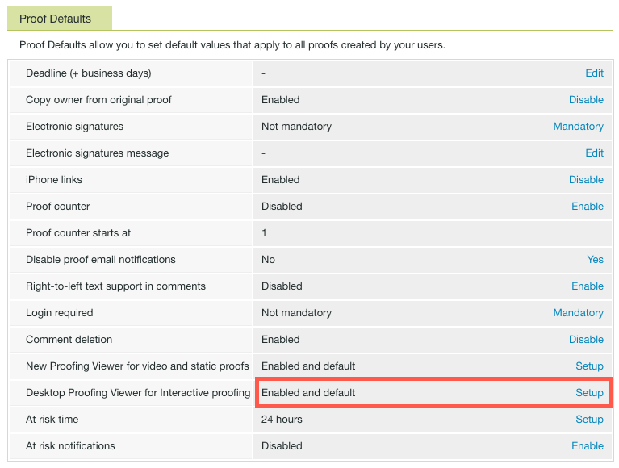
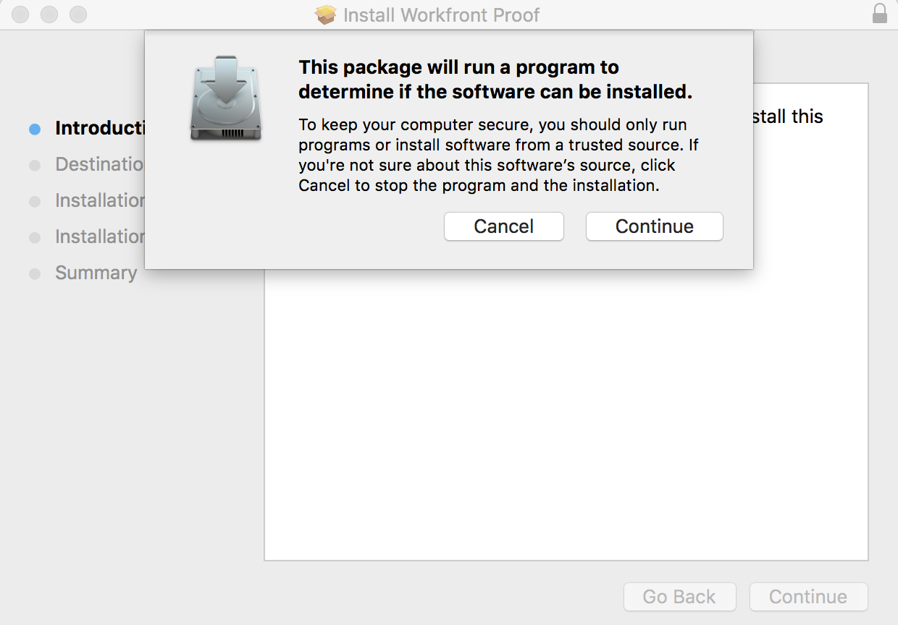

# 組織でデスクトッププルーフビューアをインストール

<!--Audited: 05/2024-->

デスクトッププルーフビューアは、インタラクティブコンテンツのプルーフを主目的として設計されています。このビューアは、各ユーザーのローカルマシンにインストールする必要があるアプリケーションです。 Adobe Workfront 管理者または Workfront Proof 管理者が、このインストールを実行できます。

## アクセス要件

+++ 展開すると、この記事の機能のアクセス要件が表示されます。

この記事の手順を実行するには、次のアクセス権が必要です。

<table style="table-layout:auto">
 <col> 
 <col> 
 <tbody> 
  <tr> 
   <td role="rowheader">Adobe Workfront プラン</td> 
   <td> 
現在のプラン：Pro 以上
 
または
 
従来のプラン：Premium または選択
 
様々なプランでのプルーフ機能へのアクセスについて詳しくは、<a href="../../../administration-and-setup/manage-workfront/configure-proofing/access-to-proofing-functionality.md" class="MCXref xref">Workfront のプルーフ機能へのアクセス</a>を参照してください。
 </td> 
  </tr> 
  <tr> 
   <td role="rowheader">Adobe Workfront ライセンス</td> 
   <td> 
現在のプラン：ワークまたはプラン
 
従来のプラン：任意（ユーザーのプルーフ機能が有効になっている必要があります）
 </td> 
  </tr> 
  <tr> 
   <td role="rowheader">アクセスレベル設定</td> 
   <td> 
プルーフ権限プロファイルで管理者を選択しておく必要があります。 詳細については、<a href="../../../administration-and-setup/manage-workfront/configure-proofing/configure-a-users-proofing-access.md" class="MCXref xref">ユーザーのプルーフアクセスの設定</a>を参照してください。
 </td> 
  </tr> 
 </tbody> 
</table>

この表の情報について詳しくは、[Workfront ドキュメントのアクセス要件](/help/quicksilver/administration-and-setup/add-users/access-levels-and-object-permissions/access-level-requirements-in-documentation.md)を参照してください。

+++

## 必要システム構成

デスクトッププルーフビューアは次のオペレーティングシステムでサポートされています。

* Windows 7 以降（32 ビットおよび 64 ビット）
* Mac OS X 10.9 以降（64 ビット）

## 前提条件

ユーザーがデスクトッププルーフビューアを使用できるようにするには、インストール前に、デスクトッププルーフビューアをインタラクティブプルーフのデフォルトビューとして起動するようにシステムを設定する必要があります。

## インタラクティブなプルーフのデフォルトとしてデスクトッププルーフビューアを設定

組織のデスクトッププルーフビューアをインストールした後、インタラクティブなプルーフのデフォルトのビューアとして設定できます。

{{step1-to-proofing}}

1. Workfront Proof の右上隅にある **アカウント設定**&#x200B;をクリックし、「**設定**」タブを選択します。

1. **プルーフのデフォルト**&#x200B;で、**インタラクティブプルーフ用デスクトッププルーフビューアー**&#x200B;行の最後にある&#x200B;**設定**&#x200B;をクリックします。

   

1. 「**有効にしてデフォルトにする**」をクリックし、次に「**保存**」をクリックします。

## ユーザー用のデスクトッププルーフビューアのインストール

* [Mac へのデスクトッププルーフビューアのインストール](#installing-the-desktop-proofing-viewer-on-mac)
* [Windows へのデスクトッププルーフビューアのインストール](#installing-the-desktop-proofing-viewer-on-windows)

### Mac へのデスクトッププルーフビューアのインストール {#installing-the-desktop-proofing-viewer-on-mac}

1. ユーザーのマシンで、次のいずれかの操作を実行してアプリをダウンロードします。

   * 実稼動環境を使用している場合は、「[Mac実稼動ダウンロード デスクトップ校正ビューア &#x200B;](https://assets.proofhq.com/nativeviewer/desktop_viewer/Workfront+Proof-2.1.19.pkg)」をクリックします。
   * Preview環境を使用している場合は、「[Mac Preview Download for the Desktop Proofing Viewer](https://assets.preview.proofhq.com/nativeviewer/desktop_viewer/Workfront+Proof+Preview-2.1.19.pkg)」をクリックします。

1. ダウンロードしたファイルを開いて、インストールを開始します。
1. 表示されるインストールボックスで、「**続行**」をクリックし、次に「**インストール**」をクリックします。

   

1. 各ユーザーが Workfront のドキュメントエリアからインタラクティブなプルーフを開き、インストールを完了していることを確認します。

### Windows へのデスクトッププルーフビューアのインストール {#installing-the-desktop-proofing-viewer-on-windows}

1. ユーザーのマシンで、次のいずれかの操作を実行してアプリをダウンロードします。

   * 実稼動環境で、デスクトッププルーフビューア [&#128279;](https://assets.proofhq.com/nativeviewer/desktop_viewer/Workfront+Proof+Setup+2.1.19.exe)の「Windows実稼動ダウンロード」をクリックします。
   * プレビュー環境で、「[Windows プレビュー環境にデスクトッププルーフビューアをダウンロード](https://assets.preview.proofhq.com/nativeviewer/desktop_viewer/Workfront+Proof+Preview+Setup+2.1.19.exe)」をクリックします。

1. ダウンロードしたファイルを開いて、インストールを開始します。
1. 表示されるセキュリティ警告ボックスで、「**実行**」をクリックします。

   

   デスクトッププルーフビューアがインストールされ、実行されます。

1. （条件付き）Internet Explorer を使用してアプリケーションをインストールする場合は、アプリケーションのインストール後にブラウザーで起動ページを更新します。
1. 各ユーザーが Workfront のドキュメントエリアからインタラクティブなプルーフを開き、インストールを完了していることを確認します。
