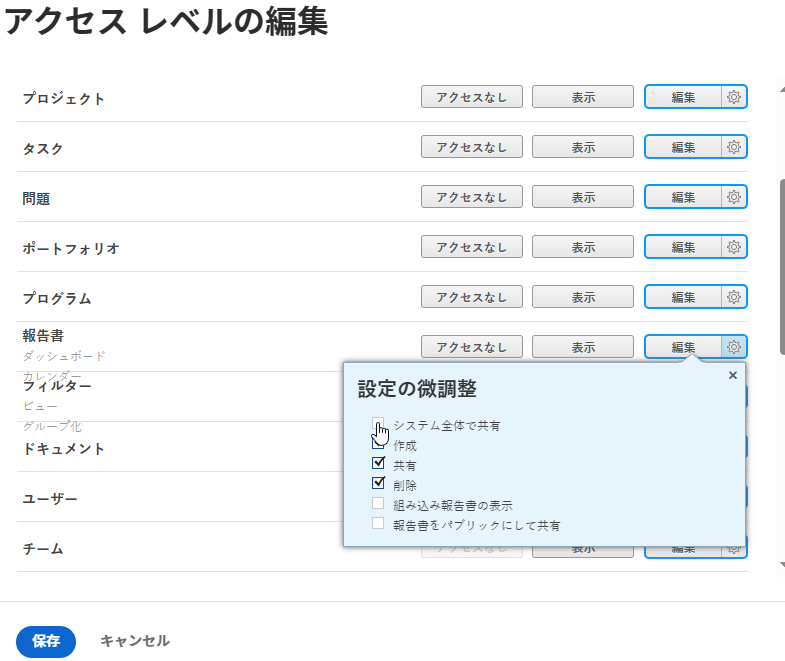

# 組み込みレポートを非表示にする

Adobe Workfront には、ユーザーがアクセスして表示できる、デフォルトの組み込みレポートの広範なリストが用意されています。Workfront 管理者は、ユーザーのアクセスレベルを変更して、組み込みレポートを非表示にし、ユーザーがアクセスできないようにすることが可能です。

## アクセス要件

この記事の手順を実行するには、次のアクセス権が必要です。

<table style="table-layout:auto"> 
 <col> 
 <col> 
 <tbody> 
  <tr> 
   <td role="rowheader">Adobe Workfront プラン</td> 
   <td>任意</td> 
  </tr> 
  <tr> 
   <td role="rowheader">Adobe Workfront ライセンス</td> 
   <td>プラン</td> 
  </tr> 
  <tr> 
   <td role="rowheader">アクセスレベル設定</td> 
   <td> 
Workfront 管理者である必要があります。
 
<b>メモ</b>：まだアクセス権がない場合は、Workfront 管理者に問い合わせて、アクセスレベルに追加の制限が設定されているかどうかを確認してください。Workfront 管理者がアクセスレベルを変更する方法について詳しくは、<a href="../../../administration-and-setup/add-users/configure-and-grant-access/create-modify-access-levels.md" class="MCXref xref">カスタムアクセスレベルの作成または変更</a>を参照してください。
 </td> 
  </tr> 
 </tbody> 
</table>

## 組み込みレポートを非表示にする

1. **メインメニュー**  で「**設定**」をクリックします。
1. 「**アクセスレベル**」をクリックします。
1. 組み込みレポートを非表示にするアクセスレベルを選択し、「**編集**」をクリックします。
1. 「**レポート**」オブジェクトで、使用可能な最上位のアクセスレベルの横にある&#x200B;**設定**&#x200B;アイコンをクリックして、「**組み込みレポートの表示**」の選択を解除します。

   

1. 「**保存**」をクリックします。
