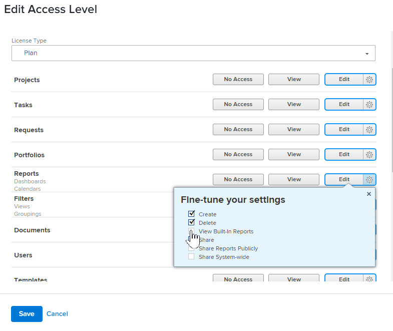

# ビルトインのレポートを非表示にする

Adobe Workfront には、ユーザーがアクセスして表示できる、デフォルトのビルトインのレポートの広範なリストが用意されています。 Workfront 管理者は、ユーザーのアクセスレベルを変更して、ビルトインのレポートを非表示にし、ユーザーがアクセスできないようにすることが可能です。

## アクセス要件

+++ 展開すると、この記事の機能のアクセス要件が表示されます。

<table style="table-layout:auto"> 
 <col> 
 <col> 
 <tbody> 
  <tr> 
   <td role="rowheader">Adobe Workfront パッケージ</td> 
   <td>任意</td> 
  </tr> 
  <tr> 
  <tr> 
   <td role="rowheader">Adobe Workfront プラン</td> 
   <td>
標準

       
プラン
</td>
  </tr> 
  </tr> 
  <tr> 
   <td role="rowheader">アクセスレベル設定</td> 
   <td>システム管理者</td>
  </tr> 
 </tbody> 
</table>

この表の情報について詳しくは、[Workfront ドキュメントのアクセス要件](/help/quicksilver/administration-and-setup/add-users/access-levels-and-object-permissions/access-level-requirements-in-documentation.md)を参照してください。

+++

## ビルトインのレポートを非表示にする

{{step-1-to-setup}}

1. 「**アクセスレベル**」をクリックします。
1. ビルトインのレポートを非表示にするアクセスレベルを選択し、「**編集**」をクリックします。
1. 「**レポート**」オブジェクトで、使用可能な最上位のアクセスレベルの横にある&#x200B;**設定**&#x200B;アイコンをクリックして、「**ビルトインのレポートの表示**」の選択を解除します。

   

1. 「**保存**」をクリックします。
