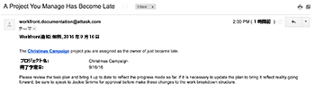

# 電子メールテンプレートの設定

Adobe Workfront管理者は、リマインダー通知をサポートするように電子メールテンプレートを設定できます。

電子メールテンプレートには、リマインダー通知が開始されたときにユーザーに送信されるメッセージが含まれます。\
E メールテンプレートがない場合、リマインダー通知は空のコンテンツとして E メールの本文に配信されます。

電子メールテンプレートは、懸案事項、タスク、プロジェクト、およびタイムシートに関するリマインダー通知に関連付けることができます。 E メールテンプレートを作成する際に、Workfront管理者が E メールのコンテンツと件名を入力できます。

## アクセス要件

この記事の手順を実行するには、次のアクセス権が必要です。

<table style="table-layout:auto"> 
 <col> 
 <col> 
 <tbody> 
  <tr> 
   <td role="rowheader">Adobe Workfrontプラン</td> 
   <td>任意</td> 
  </tr> 
  <tr> 
   <td role="rowheader">Adobe Workfrontライセンス</td> 
   <td>計画</td> 
  </tr> 
  <tr> 
   <td role="rowheader">アクセスレベル設定</td> 
   <td> <p>システム管理者</p> </td> 
  </tr> 
 </tbody> 
</table>

## 新しい電子メールテンプレートを作成します {#create-a-new-email-template}

1. 次をクリック： **メインメニュー** アイコン  Adobe Workfrontの右上隅で、 **設定** .

1. 左側のパネルで、 **電子メール** > **通知**> **メールテンプレート**.


1. クリック **新規メールテンプレート**.

1. Adobe Analytics の **新規メールテンプレート** 表示されるボックスで、次の情報を指定します。

   <table style="table-layout:auto"> 
    <col> 
    <col> 
    <tbody> 
     <tr> 
      <td role="rowheader">名前</td> 
      <td>E メールテンプレートのタイトル（必須）。</td> 
     </tr> 
     <tr> 
      <td role="rowheader">オブジェクトタイプ</td> 
      <td>テンプレートを関連付けるオブジェクトタイプを指定します（必須、デフォルトでは「問題」に設定されます）。</td> 
     </tr>
     <tr> 
      <td role="rowheader">説明</td> 
      <td>テンプレートの説明。</td> 
     </tr>

   <tr> 
      <td role="rowheader">件名 </td> 
      <td>電子メールメッセージの送信時に表示される件名（必須）。</td> 
     </tr> 
     <tr> 
      <td role="rowheader">本文 </td> 
      <td> <p>E メールメッセージの送信時に表示されるコンテンツ。</p> <p>E メールコンテンツにHTMLの書式を使用できます。詳しくは、 <a href="#add-html-formatting-to-an-email-template" class="MCXref xref">E メールHTMLにテンプレートの書式を追加する</a> 」を参照してください。</p> </td> 
     </tr> 
    </tbody> 
   </table>

1. 「**保存**」をクリックします。

## E メールHTMLにテンプレートの書式を追加する {#add-html-formatting-to-an-email-template}

E メールテンプレートにHTMLタグを追加して、カスタム通知を作成できます。\
電子メールテンプレートの作成を開始します。詳しくは、 [新しい電子メールテンプレートを作成します](#create-a-new-email-template).

HTMLのフォーマットを使用すると、次の節で示すように、E メールテンプレートをエンリッチメントできます。

* [Workfrontオブジェクトへのリンク](#link-to-workfront-objects)
* [HTMLを使用したカスタムフィールドへのリンク](#link-to-custom-fields-with-html)
* [HTMLE メールの例](#html-email-examples)

### Workfrontオブジェクトへのリンク {#link-to-workfront-objects}

Workfrontフィールドへのリンクは、 `$$` ワイルドカードを使用して、特定のオブジェクトに関連付けられたデータベースから値を探すように e メールジェネレーターに指示します。

例えば、タスクが開始されるタスクを担当者に警告する通知用の E メールの本文では、次の構造に従うことができます。

```html
<html>
<p>$$assignedTo:firstName$$</p>
<p>You are assigned to work on <b><a href="https://<your domain>.my.workfront.com/task/view?ID=$$ID$$">$$name$$</a></b>, which is due to start on $$plannedStartDate$$.</p>
<table width="350" style="font-size:12px;">
<tr>
<td><b><strong>HEADING</b></td>
<td>$$WILDCARD$$</td>
</tr>
<tr>
<td><b>HEADING</b></td>
<td>$$WILDCARD$$</td>
</tr>
<tr>
<td><b>HEADING</b></td>
<td>$$WILDCARD$$</td></tr>
</table>
</html>
```

オブジェクトの「ワイルドカード」値を取得するには、次のいずれかの操作を行います。

<!-- Refer to the API Explorer and select the names of your objects from the Fields tab of any object. For more information about the API Explorer, see [Adobe Workfront API](../../../wf-api/workfront-api.md).-->

* レポートのテキストモードビュー内にある「valuefield」値を使用します。 テキストモードの値について詳しくは、 [テキストモードの概要](../../../reports-and-dashboards/reports/text-mode/understand-text-mode.md).

  「heading」値は、E メール本文に表示するオブジェクトの名前にすることができます。

### HTMLを使用したカスタムフィールドへのリンク {#link-to-custom-fields-with-html}

ユーザーおよびカスタムフィールドへのリンクを含めるには、 **$$** ワイルドカードを使用して、e メールジェネレーターに対し、オブジェクトに関連付けられたデータベースから値を探すように指示します。 データベース属性参照のどちら側にも存在する必要があります。

例えば、次のテキストをHTMLとして追加すると、割り当てられたユーザーの名がタスクに関連付けられたリマインダー通知に追加されます。

`assignedTo:firstName`

同じ書式を使用してカスタムフィールドを追加するには、電子メール通知に次の内容を追加します。

`DE:Custom Field As It Appears in Workfront`

例えば、これは、「配信日」という名前のカスタムフィールドへの参照を含む電子メールテンプレートで、「配信日」フィールドがタスクに属していると仮定します。

置換 `<your domain>` 会社のWorkfrontドメイン（括弧なし）で囲みます。

```html
<html>
<p>$$assignedTo:firstName$$</p>
<p>You are assigned to work on <b><a href="https://<your domain>.my.workfront.com/task/view?ID=$$ID$$">$$name$$</a></b>, which has a Delivery Date of $$DE:Task:Delivery Date$$.</p>
<table width="350" style="font-size:12px;">
<tr>
<td><b>Project Name:</b></td>
<td>$$project:name$$</td>
</tr>
<tr>
<td><b>Description:</b></td>
<td>$$description$$</td>
<tr>
<td><b>Estimated Effort:</b></td>
<td>$$work$$ hours</td>
</tr>
<tr>
<td><b>Planned Completion Date:</b></td>
<td>$$plannedCompletionDate$$</td>
<td><b>Delivery Date:</b></td>
<td>$$DE:Task:Delivery Date$$</td>
</tr>
</table>
</html>
```

>[!NOTE]
>
>フィールドがプロジェクトに属している場合は、タスクをプロジェクトに置き換えます。
>
>`DE:Project:Delivery Date`

### HTMLE メールの例 {#html-email-examples}

* [遅延プロジェクトのリマインダー通知（例）](#late-project-reminder-notification-example)
* [Task または Issue About to Start リマインダー（例）](#task-or-issue-about-to-start-reminder-example)

#### 遅延プロジェクトのリマインダー通知（例） {#late-project-reminder-notification-example}

遅延プロジェクトのリマインダー用の電子メールテンプレートを編集する場合は、「件名」フィールドと「コンテンツ」フィールドに関して、この情報を考慮してください。

置換 `<your domain>` 会社のWorkfrontドメイン（括弧なし）で置き換えます。

**件名:**

管理するプロジェクトが遅れています

**内容:**

```html
<html>
<p>The <b><a href="https://<your domain>.my.workfront.com/project/view?ID=$$ID$$">$$name$$</a></b> project you are assigned as the owner of just became late.</p>
<table width="350" style="font-size:12px;">
<tr>
<td><b>Project Name:</b></td>
<td>$$project:name$$</td>
</tr>
</tr>
<tr>
<td><b>Planned Completion Date:</b></td>
<td>$$plannedCompletionDate$$</td>
</tr>
</table>
<p>Please review the task plan and bring it up to date to reflect the progress made so far. If it is necessary to update the plan to bring it reflect reality going forward, be sure to speak to $$sponsor:name$$ for approval before make these changes to the work breakdown structure.</p>
</html>
```

これにより、次のような E メールが生成されます。



#### タスクまたは問題のリマインダーを開始する {#task-or-issue-about-to-start-reminder-example}

また、今後のタスクや問題に対するリマインダー通知を作成することもできます。

次のコードを電子メールテンプレートに含めて、タスクやタスクの予定開始日より何日も前に送信される、タスクや問題のリマインダー通知に使用できます。

置換 `<your domain>` 会社のWorkfrontドメイン（括弧なし）で置き換えます。

これを問題の電子メールに使用するには、 `/task/view.` 作業項目のリンク先の値 `/issue/view`.

**件名:**

`$$name$$ to start on $$plannedStartDate$$`

**内容:**

```html
<html>
<p>$$assignedTo:firstName$$</p>
<p>You are assigned to work on <b><ahref=https://<your domain>.my.workfront.com/task/view?ID=$$ID$$">$$name$$</a></b>, which is due to start on $$plannedStartDate$$.</p>
<tablewidth=350"style=font-size:12px;">
<tr>
<td><b>Task Name:</b></td>
<td>$$name$$</td>
</tr>
<td><b>Project Name:</b></td>
<td>$$project:name$$</td>
</tr>
</tr>
<td><b>Created on:</b></td>
<td>$$entryDate$$</td>
</tr>
<tr>
<td><b>Project Manager:</b></td>
<td>$$project:owner:name$$</td>
<tr>
<td><b>Priority:</b></td>
<td>$$priority$$</td>
</tr>
<tr>
<td><b>Who is assigned to:</b></td>
<td>$$assignedTo:name$$</td>
</tr>
<tr>
<td><b>When it's due:</b></td>
<td>$$estCompletionDate$$</td>
</tr>
</table>
</html>
```


電子メールテンプレートを作成した後、ユーザーは、電子メールテンプレートをリマインダー通知に関連付けることができます。詳しくは、 [リマインダー通知の設定](../../../administration-and-setup/manage-workfront/emails/set-up-reminder-notifications.md).
