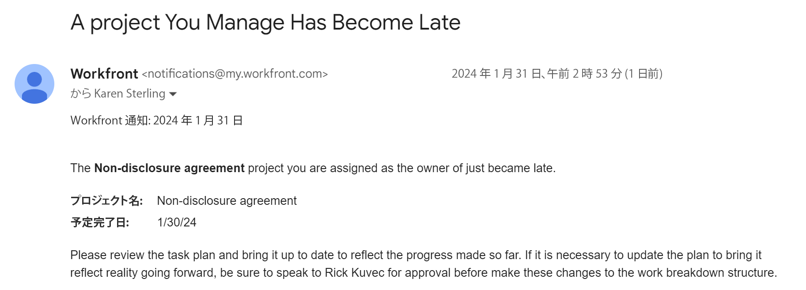

# メールテンプレートの設定

Adobe Workfront 管理者は、リマインダー通知をサポートするようにメールテンプレートを設定できます。

メールテンプレートには、リマインダー通知が実行されたときにユーザーに送信されるメッセージが含まれています。\
メールテンプレートがない場合、リマインダー通知はメールの本文が空のコンテンツとして配信されます。

メールテンプレートは、懸案事項、タスク、プロジェクトおよびタイムシートに関するリマインダー通知に関連付けることができます。メールテンプレートを作成する際に、Workfront 管理者はメールのコンテンツと件名を入力できます。

## アクセス要件

この記事の手順を実行するには、次のアクセス権が必要です。

<table style="table-layout:auto"> 
 <col> 
 <col> 
 <tbody> 
  <tr> 
   <td role="rowheader">Adobe Workfront プラン</td> 
   <td>任意</td> 
  </tr> 
  <tr> 
   <td role="rowheader">Adobe Workfront ライセンス*</td> 
   <td><p>現在：プラン</p>
   または
   <p>新規：標準</p></td> 
  </tr> 
  <tr> 
   <td role="rowheader">アクセスレベルの設定</td> 
   <td> <p>システム管理者</p> </td> 
  </tr> 
 </tbody> 
</table>

*アクセス要件について詳しくは、 [Workfrontドキュメントのアクセス要件](/help/quicksilver/administration-and-setup/add-users/access-levels-and-object-permissions/access-level-requirements-in-documentation.md).

## E メールテンプレートの作成 {#create-an-email-template}

{{step-1-to-setup}}

1. 左側のパネルで、 **電子メール** > **通知**> **メールテンプレート**.

   

1. **新規メールテンプレート**&#x200B;をクリックします。

1. Adobe Analytics の **新規メールテンプレート** ボックスで、次の情報を指定します。

   <table style="table-layout:auto"> 
    <col> 
    <col> 
    <tbody> 
     <tr> 
      <td role="rowheader">名前</td> 
      <td>電子メールテンプレートのタイトルを追加します。 必須フィールドです。</td> 
     </tr> 
     <tr> 
      <td role="rowheader">オブジェクトタイプ</td> 
      <td>テンプレートを関連付けるオブジェクトタイプを指定します。 次のオブジェクトから選択します。
      <ul>
      <li>プロジェクト</li>
      <li>タスク</li>
      <li>イシュー</li>
      <li>タイムシート</li> </ul>

   これは必須フィールドで、デフォルトでは「プロジェクト」に設定されています。</td>
   </tr>
     <tr> 
      <td role="rowheader">説明</td> 
      <td>電子メールテンプレート、目的および対象オーディエンスに関する詳細情報を追加します。</td> 
     </tr>

   <tr> 
      <td role="rowheader">件名 </td> 
      <td>テンプレートで生成された電子メールメッセージが送信される際に、電子メールの件名行に表示するテキストを追加します。 必須フィールドです。</td> 
     </tr> 
     <tr> 
      <td role="rowheader">本文 </td> 
      <td> <p>E メールメッセージのコンテンツ用のテキストを追加します。</p> <p>E メールコンテンツにHTMLの書式を使用できます。詳しくは、 <a href="#add-html-formatting-to-an-email-template" class="MCXref xref">E メールHTMLにテンプレートの書式を追加する</a> 」を参照してください。</p> </td> 
     </tr> 
    </tbody> 
   </table>

1. 「**保存**」をクリックします。

## メールテンプレートに HTML 書式を追加 {#add-html-formatting-to-an-email-template}

メールテンプレートに HTML タグを追加して、カスタム通知を作成できます。\
[メールテンプレートを新規作成](#create-a-new-email-template)で説明されているように、メールテンプレートの作成を開始します。

HTML の形式を使用すると、次の節で示すように、メールテンプレートをエンリッチできます。

* [Workfront オブジェクトへのリンク](#link-to-workfront-objects)
* [HTML を使用したカスタムフィールドへのリンク](#link-to-custom-fields-with-html)
* [HTML メールの例](#html-email-examples)

### Workfront オブジェクトへのリンク {#link-to-workfront-objects}

Workfront フィールドへのリンクは、`$$` ワイルドカードを使用して、特定のオブジェクトに関連付けられたデータベースから値を探すようにメールジェネレーターに指定します。

例えば、開始されるタスクについて、割り当て先にアラートを送信する通知用のメール本文では、次の設定に従います。

```html
<html>
<p>$$assignedTo:firstName$$</p>
<p>You are assigned to work on <b><a href="https://<your domain>.my.workfront.com/task/view?ID=$$ID$$">$$name$$</a></b>, which is due to start on $$plannedStartDate$$.</p>
<table width="350" style="font-size:12px;">
<tr>
<td><b><strong>HEADING</b></td>
<td>$$WILDCARD$$</td>
</tr>
<tr>
<td><b>HEADING</b></td>
<td>$$WILDCARD$$</td>
</tr>
<tr>
<td><b>HEADING</b></td>
<td>$$WILDCARD$$</td></tr>
</table>
</html>
```

オブジェクトの「ワイルドカード」値を取得するには、次のいずれかの操作を行います。

* API エクスプローラーを参照し、任意のオブジェクトの「フィールド」タブからオブジェクトの名前を選択します。 API エクスプローラーについて詳しくは、 [API エクスプローラ](/help/quicksilver/wf-api/general/api-explorer.md).

* 以下を使用します。 `valuefield` 値は、レポートのテキストモード表示内にあります。 テキストモードの値について詳しくは、[テキストモードの概要](../../../reports-and-dashboards/reports/text-mode/understand-text-mode.md)を参照してください。

The `heading` の値には、電子メール本文に表示するオブジェクトの名前を指定できます。

### HTML を使用したカスタムフィールドへのリンク {#link-to-custom-fields-with-html}

ユーザーおよびカスタムフィールドへのリンクを含めるには、 `$$` ワイルドカードを使用して、e メールジェネレーターに対し、オブジェクトに関連付けられたデータベースから値を探すように指示します。 データベース属性参照のどちら側にも存在する必要があります。

例えば、次のテキストを HTML として追加すると、割り当てられたユーザーのファーストネームがタスクに関連付けられたリマインダー通知に追加されます。

`assignedTo:firstName`

同じ書式を使用してカスタムフィールドを追加するには、メール通知に次の内容を追加できます。

`DE:Custom Field As It Appears in Workfront`

例えば、これは、配信日という名前のカスタムフィールドへの参照を含むメールテンプレートで、「配信日」フィールドがタスクに属していると仮定します。

括弧を使用せずに、`<your domain>` を会社の Workfront ドメインに置き換えます。

```html
<html>
<p>$$assignedTo:firstName$$</p>
<p>You are assigned to work on <b><a href="https://<your domain>.my.workfront.com/task/view?ID=$$ID$$">$$name$$</a></b>, which has a Delivery Date of $$DE:Task:Delivery Date$$.</p>
<table width="350" style="font-size:12px;">
<tr>
<td><b>Project Name:</b></td>
<td>$$project:name$$</td>
</tr>
<tr>
<td><b>Description:</b></td>
<td>$$description$$</td>
<tr>
<td><b>Estimated Effort:</b></td>
<td>$$work$$ hours</td>
</tr>
<tr>
<td><b>Planned Completion Date:</b></td>
<td>$$plannedCompletionDate$$</td>
<td><b>Delivery Date:</b></td>
<td>$$DE:Task:Delivery Date$$</td>
</tr>
</table>
</html>
```

>[!NOTE]
>
>フィールドがプロジェクトに属している場合は、タスクをプロジェクトに置き換えます。
>
>`DE:Project:Delivery Date`

### HTML メールの例 {#html-email-examples}

* [遅延プロジェクトのリマインダー通知（例）](#late-project-reminder-notification-example)
* [開始予定のタスクまたはイシューのリマインダー（例）](#task-or-issue-about-to-start-reminder-example)

#### 遅延プロジェクトのリマインダー通知（例） {#late-project-reminder-notification-example}

遅延プロジェクトのリマインダー用のメールテンプレートを編集する場合は、「件名」フィールドと「コンテンツ」フィールドに関するこの情報を考慮してください。

括弧を使用せずに、`<your domain>` を会社の Workfront ドメインに置き換えます。

**件名:**

管理するプロジェクトが遅れています。

**内容：**

```html
<html>
<p>The <b><a href="https://<your domain>.my.workfront.com/project/view?ID=$$ID$$">$$name$$</a></b> project you are assigned as the owner of just became late.</p>
<table width="350" style="font-size:12px;">
<tr>
<td><b>Project Name:</b></td>
<td>$$project:name$$</td>
</tr>
</tr>
<tr>
<td><b>Planned Completion Date:</b></td>
<td>$$plannedCompletionDate$$</td>
</tr>
</table>
<p>Please review the task plan and bring it up to date to reflect the progress made so far. If it is necessary to update the plan to bring it reflect reality going forward, be sure to speak to $$sponsor:name$$ for approval before make these changes to the work breakdown structure.</p>
</html>
```

これにより、次のようなメールが生成されます。



#### 開始予定のタスクまたはイシューのリマインダー {#task-or-issue-about-to-start-reminder-example}

また、今後のタスクまたはイシューに対するリマインダー通知を作成することもできます。

次のコードをメールテンプレートに含めて、タスクまたはイシューの予定開始日より何日も前に送信される、タスクやイシューのリマインダー通知に使用できます。

括弧なしで、`<your domain>` を会社の Workfront ドメインに置き換えます。

これをイシューのメールに使用するには、リンク内の `/task/view.` 値を `/issue/view` への作業アイテムに変更します。

**件名:**

`$$name$$ to start on $$plannedStartDate$$`

**内容：**

```html
<html>
<p>$$assignedTo:firstName$$</p>
<p>You are assigned to work on <b><ahref=https://<your domain>.my.workfront.com/task/view?ID=$$ID$$">$$name$$</a></b>, which is due to start on $$plannedStartDate$$.</p>
<tablewidth=350"style=font-size:12px;">
<tr>
<td><b>Task Name:</b></td>
<td>$$name$$</td>
</tr>
<td><b>Project Name:</b></td>
<td>$$project:name$$</td>
</tr>
</tr>
<td><b>Created on:</b></td>
<td>$$entryDate$$</td>
</tr>
<tr>
<td><b>Project Manager:</b></td>
<td>$$project:owner:name$$</td>
<tr>
<td><b>Priority:</b></td>
<td>$$priority$$</td>
</tr>
<tr>
<td><b>Who is assigned to:</b></td>
<td>$$assignedTo:name$$</td>
</tr>
<tr>
<td><b>When it's due:</b></td>
<td>$$estCompletionDate$$</td>
</tr>
</table>
</html>
```


[リマインダー通知の設定](../../../administration-and-setup/manage-workfront/emails/set-up-reminder-notifications.md)で説明したように、メールテンプレートを作成した後に、ユーザーはメールテンプレートをリマインダー通知に関連付けることができます。
