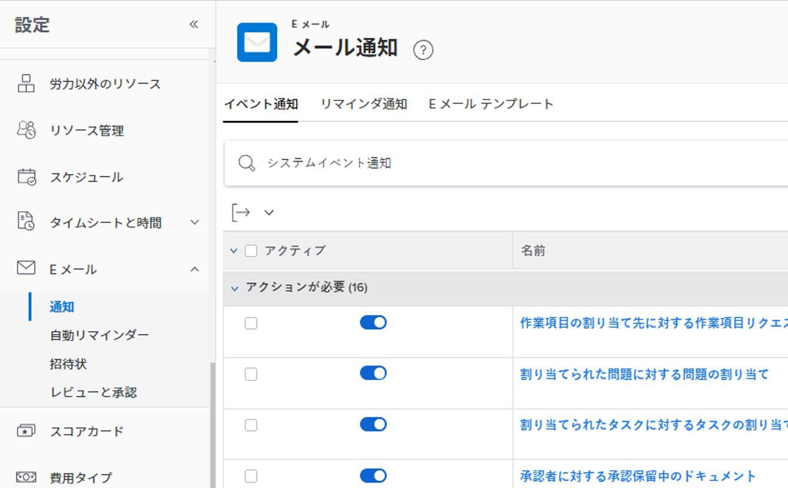

# システムの全員に対するイベント通知を設定する

<!--look for the "hidden" addition below for the tab redesign - August 2023-->

<!--DON'T DELETE, DRAFT OR HIDE THIS ARTICLE. IT IS LINKED TO THE PRODUCT, THROUGH THE CONTEXT SENSITIVE HELP LINKS-->

イベント通知トリガーは、特定のイベントが発生した際にユーザーに電子メールを送信します。 Adobe Workfront管理者または Planner のアクセスレベルを持つユーザーは、システム内のすべてのユーザーに対してイベント通知を設定できます。 イベント通知の設定は、イベント通知のアクティブ化と非アクティブ化で構成されます。

<!--Alina annotation on the word "all" in 2nd sentence: abive, drafted and remains QS only-->

有効にしたイベントと、ユーザーが自分のプロファイルで有効にしている内容に応じて、イベントが発生したときに、即座に、毎日、または即時と毎日の両方の電子メール通知を受け取ります。

最初に、すべてのユーザーに届く通知を、Workfrontインスタンスの「設定」領域で指定する必要があります。 「設定」領域で通知をアクティブ化すると、プロファイルページの各ユーザーに対してアクティブ化された通知が表示されます。

「設定」領域で通知が有効化され、ユーザーのプロファイルページに表示された後、個々のユーザーまたはプランライセンスを持つ別のユーザーは、特定のユーザーが受け取る通知と頻度を制御するために、ユーザープロファイルで有効化された通知を設定できます。 詳しくは、 [独自のイベント通知をアクティブ化または非アクティブ化する](../../../workfront-basics/using-notifications/activate-or-deactivate-your-own-event-notifications.md).

アクティブ化および非アクティブ化できるすべてのイベント通知の一覧については、 [Adobe Workfrontで使用可能なイベント通知](../../../administration-and-setup/manage-workfront/emails/event-notifications-available-in-wf.md).

グループ管理者が自分のグループに対してイベント通知を設定できるようにするためのイベント通知のロック解除について詳しくは、 [すべてのグループのイベント通知の設定をロック解除またはロックします](../../../administration-and-setup/manage-workfront/emails/unlock-configuration-of-event-notifications-for-groups.md) および [グループのイベント通知を表示および設定する](../../../administration-and-setup/manage-groups/create-and-manage-groups/view-and-configure-event-notifications-group.md).

## アクセス要件

この記事の手順を実行するには、次のアクセス権が必要です。

<table style="table-layout:auto"> 
 <col> 
 <col> 
 <tbody> 
  <tr> 
   <td role="rowheader">Adobe Workfront plan*</td> 
   <td>任意</td> 
  </tr> 
  <tr> 
   <td role="rowheader">Adobe Workfront license*</td> 
   <td>計画</td> 
  </tr> 
  <tr> 
   <td role="rowheader">アクセスレベル設定*</td> 
   <td> 
プランナー以上（リマインダー通知への管理アクセス権を持つ）
 
プランのユーザー管理アクセス権の付与については、 <a href="../../../administration-and-setup/add-users/configure-and-grant-access/grant-users-admin-access-certain-areas.md" class="MCXref xref">特定の領域に対する管理者アクセス権をユーザーに付与する</a>.
 </td> 
  </tr> 
 </tbody> 
</table>

&#42;保有するプラン、ライセンスの種類、アクセス権を確認するには、Workfront管理者に問い合わせてください。

## すべてのユーザーに対するイベント通知の設定

ユーザーがプロファイルで通知を有効または無効にする前に、Workfrontの「セットアップ」領域で通知を有効にする必要があります。

>[!TIP]
>
>「設定」領域からWorkfront目標の通知を有効化することはできません。 ユーザーは、自分のプロファイルでのみ、これらの通知をアクティブ化できます。 プランライセンスを持つユーザーは、他のユーザーに対してライセンス認証を行うことができます。 ユーザーに対するWorkfront Goals の通知の有効化について詳しくは、 [通知：目標](../../../workfront-basics/using-notifications/notifications-goals.md).

1. 次をクリック： **メインメニュー** アイコン  Adobe Workfrontの右上隅で、 **設定** .

1. クリック **電子メール** > **通知**.

   <!--hidden shot for the tab redesign - make live in August 2023:
   
   -->

1. 次を確認します。 **イベント通知** 」タブが開きます。
1. イベント名の左側にあるスイッチをクリックして、オンまたはオフにします。

   イベントのデフォルトの通知ステータスを確認するには、 [イベント通知](../../../workfront-basics/using-notifications/event-notifications.md).

1. （オプション）イベント通知の名前をクリックして、電子メール通知の件名行をカスタマイズします。

   電子メール通知の件名行のカスタマイズについて詳しくは、 [イベント通知の電子メールの件名をカスタマイズする](../../../administration-and-setup/manage-workfront/emails/custom-email-subjects-event-notification.md).

1. （オプション）電子メール通知の設定をロック解除して、グループ管理者がグループごとに個別に設定できるようにする場合は、「  通知の右側に移動して、ロック解除位置に切り替えます。 .

   >[!NOTE]
   >
   >この機能は、最初は、段階的な展開の一環として、クラスター 4 のお客様のみが使用できます。 その後すぐに、他のクラスターで使用できるようになります。 この記事は、この時点で更新されます。

   詳しくは、 [すべてのグループのイベント通知の設定をロック解除またはロックします](../../../administration-and-setup/manage-workfront/emails/unlock-configuration-of-event-notifications-for-groups.md).
