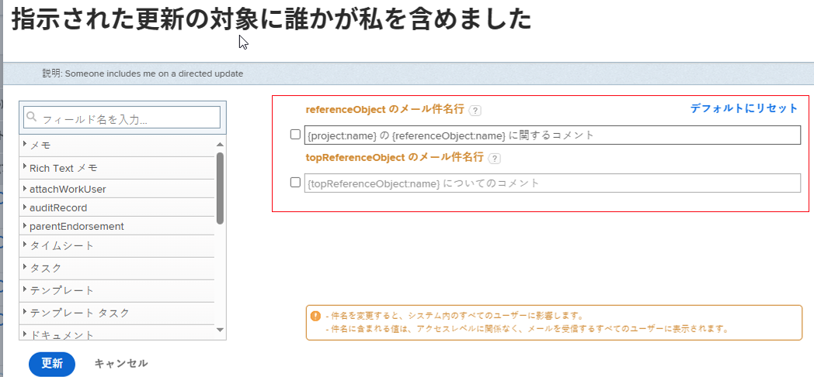
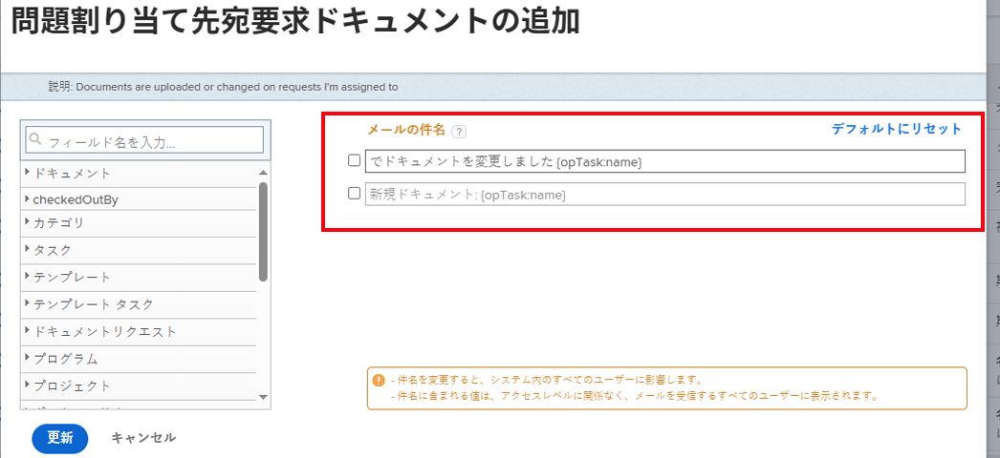

# イベント通知のメールの件名をカスタマイズ

イベント通知でトリガーされるメールの件名行をカスタマイズできます。

件名行を変更すると、受信者のアクセスレベルに関係なく、システム内のすべてのユーザーに影響します。メールの件名に含まれるすべてのオブジェクトとフィールドが、ユーザーに表示されます。

一部のイベント通知には複数の件名が含まれています。つまり、これらのイベント通知には、その機能に基づいて複数のメール件名を含めることができます。

>[!IMPORTANT]
>
>件名行が複数のオブジェクトを参照している場合は、デフォルトのフィールドを削除する際に注意してください。以下は、そのような件名行を含むイベント通知のリストです。
>
>* 自分が更新を受信する対象者として追加されました
>* 自分のチームが更新を受信する対象として追加されました
>* スレッド参加者に対する作業アイテムコメント
>* 作業アイテムの割り当て先に対する作業アイテムコメント
>

## アクセス要件

この記事の手順を実行するには、次のアクセス権が必要です。

<table style="table-layout:auto"> 
 <col> 
 </col> 
 <col> 
 </col> 
 <tbody> 
  <tr> 
   <td role="rowheader">Adobe Workfront プラン*</td> 
   <td>任意</td> 
  </tr> 
  <tr> 
   <td role="rowheader">Adobe Workfront ライセンス*</td> 
   <td>プラン</td> 
  </tr> 
  <tr> 
   <td role="rowheader">アクセスレベル設定*</td> 
   <td> 
リマインダー通知への管理アクセス権を持つ、プランナー以上の権限
 
Plan ユーザーへの管理アクセス権の付与については、<a href="../../../administration-and-setup/add-users/configure-and-grant-access/grant-users-admin-access-certain-areas.md" class="MCXref xref">特定のエリアに対する管理者アクセス権をユーザーに付与</a>を参照してください。
 </td> 
  </tr> 
 </tbody> 
</table>

&#42;ご利用のプラン、ライセンスタイプまたはアクセス権を確認するには、Workfront 管理者にお問い合わせください。

## イベント通知のメールの件名行をカスタマイズ {#customize-email-subject-lines-for-event-notifications}

1. Adobe Workfront の右上隅にある&#x200B;**メインメニュー**&#x200B;アイコン 、**設定**  の順にクリックします。

1. 左側のパネルで、**メール**／**通知**&#x200B;をクリックします。

1. 「**イベント通知**」タブをクリックします。
1. カスタマイズするイベント通知の名前をクリックして、**イベント通知**&#x200B;ボックスを開きます。
1. **メールの件名行**&#x200B;ボックスで、メールの件名のテキストおよびフィールド（カスタムフィールドを含む）を変更します。

   追加されたフィールドの名前は、データベース構造のキャメルケース構文と一致する必要があります。<!--For more information about how our objects and their fields are named in the Workfront database, see the [Adobe Workfront API](../../../wf-api/workfront-api.md).-->

1. 「**アップデート**」をクリックして、メールの新しい件名行を保存します。

## 複数オブジェクトのメールのメール件名行をカスタマイズ

一部のイベント通知には、トリガーされるオブジェクトに応じて、複数の件名があります。

例えば、「Somebone included me on a directed update」には 2 つの異なる件名があります。1 つ目はタスク、問題、テンプレートタスク、ドキュメント（「referenceObject」とも呼ばれます）、もう 1 つはポートフォリオ、プログラムなどのコメントを許可するオブジェクト（「topReferenceObject」とも呼ばれます）。

タスク、イシュー、テンプレートタスクやドキュメントに関する会話にユーザーが含まれる場合は、最初の件名行を含むメールが生成されます。件名行には「referenceObject:name」が含まれ、システムはオブジェクトを定義し、適切な名前を件名フィールドに表示します。 メールの件名行は、「プロジェクト ABC 上のタスク 123 についてのコメント」のようになります。

プロジェクトの会話に追加すると、2 番目の件名のメールが生成されます。件名行には「topReferenceObject:name」が含まれ、Workfrontは参照されたオブジェクトを識別し、件名内の「topReferenceObject:name」の代わりにそのオブジェクト名を返します。 メールの件名行は、「プロジェクト ABC についてのコメント」のようになります。

メールの件名行を編集し、どちらかの件名行にフィールドを追加するには、この記事にある[イベント通知のメール件名行をカスタマイズ](#customize-email-subject-lines-for-event-notifications)を参照してください。

## 複数アクションのメールのメール件名行をカスタマイズ

一部のイベント通知には、オブジェクトに対して実行される様々なアクションの概要を示す複数のメール件名もあります。

例えば、ドキュメントをイシューに追加するリクエストは、2 種類の異なるメールをトリガーできるイベントです。1 つはドキュメントの追加時、もう 1 つはドキュメントの編集時です。

メールの件名行を編集し、どちらかの件名行にフィールドを追加するには、この記事にある[イベント通知のメール件名行をカスタマイズ](#customize-email-subject-lines-for-event-notifications)を参照してください。
