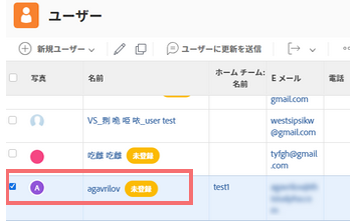
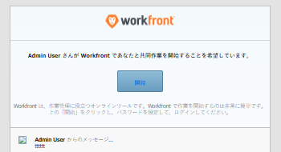

# 新規ユーザーへのメール招待の管理

<!--

*** DON'T DELETE, DRAFT OR HIDE THIS ARTICLE. IT IS LINKED TO THE PRODUCT, THROUGH THE CONTEXT SENSITIVE HELP LINKS. **

-->

>[!IMPORTANT]
>
>このページで説明する手順は、Admin Console にまだ登録されていない組織にのみ適用されます。組織が Adobe Admin Console に登録されている場合は、Adobe Admin Console でこのアクションを実行してください。
>
>組織が Adobe Admin Console にオンボーディングされているかどうかに応じて異なる手順のリストについて詳しくは、[プラットフォームベースの管理上の違い（Adobe Workfront/Adobe Business Platform）](../../../administration-and-setup/get-started-wf-administration/actions-in-admin-console.md)を参照してください。

Adobe Workfront 管理者は、招待メールを使用してユーザーを Workfront に追加し、追加されたことをユーザーに通知することができます。

メールの招待状を使用すると、新規ユーザーはリンクをたどって Workfront アカウントのパスワードを選択できます。そうした後、アカウントの設定を完了できます。

新規アカウントのセキュリティを確保するために、新規ユーザーは自分のパスワードを選択できるよう、メールの招待状を使用することをお勧めします。あるいは、新規ユーザーのアカウントを作成するときに、新しいパスワードを選択することもできます。Workfront に新しいユーザーを追加する方法について詳しくは、[ユーザーを追加](../../../administration-and-setup/add-users/create-and-manage-users/add-users.md)を参照してください。

以下の新しいユーザーメールを設定できます。

* Workfront に追加された新規ユーザー
* Workfront に追加された、依頼者のライセンスを持つユーザー

メールの招待状が送信されると、すべての新規ユーザーに同じメールが表示されます。

メールの招待状の受信について詳しくは、[メールの招待状を受信し、Adobe Workfront 用のパスワードを作成](../../../workfront-basics/manage-your-account-and-profile/managing-your-workfront-account/receive-email-invitations.md)を参照してください。

## アクセス要件

この記事の手順を実行するには、次のアクセス権が必要です。

<table style="table-layout:auto"> 
 <col> 
 <col> 
 <tbody> 
  <tr> 
   <td role="rowheader">Adobe Workfront プラン</td> 
   <td>任意</td> 
  </tr> 
  <tr> 
   <td role="rowheader">Adobe Workfront ライセンス</td> 
   <td>プラン</td> 
  </tr> 
  <tr> 
   <td role="rowheader">アクセスレベル設定</td> 
   <td> 
システム管理者
 </td> 
  </tr> 
 </tbody> 
</table>

## メールの招待状を生成 {#generate-email-invitations}

メールの招待状は、以下のシナリオで生成されます。

* 新規ユーザーを作成し、**新規ユーザー**&#x200B;フォームにある&#x200B;**このユーザーに招待メールを送信**&#x200B;を選択します。新規ユーザーの作成について詳しくは、[ユーザーを追加](../../../administration-and-setup/add-users/create-and-manage-users/add-users.md)を参照してください。
* 複数の新規ユーザーを読み込み、「**このユーザーに招待メールを送信**」オプションを選択します。複数の新規ユーザーの読み込みについて詳しくは、[ユーザーの読み込み](../../../administration-and-setup/add-users/create-and-manage-users/import-users.md)を参照してください。
* ユーザーを作成した後は、Workfront にアカウントをまだ登録しておらず、Workfront パスワードが確定していないユーザーに対して、招待状を手動で生成できます。\
  アカウントを作成済みだが、まだ登録していないユーザーは、Workfront で&#x200B;**未登録**&#x200B;とマークされます。

  >[!NOTE]
  >
  >ユーザー作成時に&#x200B;**このユーザー招待メールを送信**&#x200B;ボックスを選択解除すると、メールの招待状を手動で生成することはできません。メールの招待状を手動で再送信できるのは、アカウントの作成時に元のメールの招待状を受信したユーザーのみです。新規ユーザーの作成について詳しくは、[ユーザーを追加](../../../administration-and-setup/add-users/create-and-manage-users/add-users.md)を参照してください。

既存の未登録ユーザーへのメール招待状を手動で生成するには、以下のように行います。

1. Adobe Workfront の右上隅にある&#x200B;**メインメニュー**&#x200B;アイコン 、**ユーザー**  の順にクリックします。
1. 名前の後に「**未登録**」ラベルが表示されているユーザーを選択します。

   

1. その他アイコン  をクリックし、次に&#x200B;**登録についてユーザーに後で通知**&#x200B;をクリックします。

   新規ユーザーに、Workfront パスワードの作成に使用できる新しいリンクを含む招待メールが送信されます。

   >[!NOTE]
   >
   >組織が Admin Console にオンボードされていて、Workfront からユーザーを追加する場合は、新規ユーザーにメールの招待状を送信するオプションはありません。
   >
   >新規アドビユーザーが Admin Console に追加され、登録プロセスを完了するように勧めるメールが Admin Console から送信されます。どのアドビシステムにアクセスするにも、すべてのユーザーが登録プロセスを完了する必要があります。
   >
   >既存のアドビユーザーの場合、Workfront が使用可能になっていることを知らせるメールがユーザーに届く場合と届かない場合があります。これは、製品のアドビ管理者が制御する環境設定です。

## メールの招待状を設定 {#configure-email-invitations}

Workfront 管理者は、新規ユーザーへの招待メールに含めるメッセージを設定できます。

1. Adobe Workfront の右上隅にある&#x200B;**メインメニュー**&#x200B;アイコン 、**設定**  の順にクリックします。

1. 左側のリストで、**メール**／**招待状**&#x200B;とクリックします。

1. **一般のオプション**&#x200B;セクションで、以下の変更のいずれかを行います。

   <table style="table-layout:auto"> 
    <col> 
    <col> 
    <tbody> 
     <tr> 
      <td role="rowheader"><strong>＿日後に招待リンクを非アクティブ化</strong> </td> 
      <td> 
招待メールに Workfront への有効なリンクが含まれなくなるまでの時間を選択します。デフォルトは 45 日です。
 </td> 
     </tr> 
     <tr> 
      <td role="rowheader"><strong>メッセージや利用規約を含める</strong> </td> 
      <td> 
Workfront に追加されたすべての新規ユーザーの招待メールを変更する場合は、このオプションを選択します。これには、依頼者のライセンスを持つユーザーは含まれません。
 
       <ul> 
        <li><strong>メッセージ</strong>：すべての新規ユーザーに対するメールの招待状の変更を選択する場合は、メールの本文としてメールの招待状に含めるテキストを指定します。</li> 
        <li><strong>利用条件</strong>：すべての新規ユーザーに対するメールの招待状の変更を選択する場合は、メールの招待状に含めるテキストを利用条件として指定します。 </li> 
        <li><strong>ヘルプデスクユーザー向けのメッセージや利用規約を含める</strong>：Workfront に追加された、依頼者のライセンスを持つすべての新規ユーザーに対してメールの招待状を変更する場合は、このオプションを選択します。</li> 
        <li><strong>メッセージ</strong>：要求者ライセンスを持つすべての新規ユーザーへのメールの招待状を変更する場合は、メールの本文としてメールの招待状に含めるテキストを指定します。</li> 
        <li><strong>条件</strong>：要求者のライセンスを持つすべての新規ユーザーへのメールの招待状を変更する場合は、メールの招待状に含めるテキストを条件として指定します。 </li> 
        <li> 
「<strong>招待状のプレビュー</strong>」セクションに、メールの招待状のプレビューを表示できます。カスタマイズしたメッセージをメールの招待状に含めるよう選択した場合は、カスタマイズしたメッセージがこの領域に表示されます。
 
  
 </li> 
       </ul> </td> 
     </tr> 
    </tbody> 
   </table>

1. 「**保存**」をクリックします。
