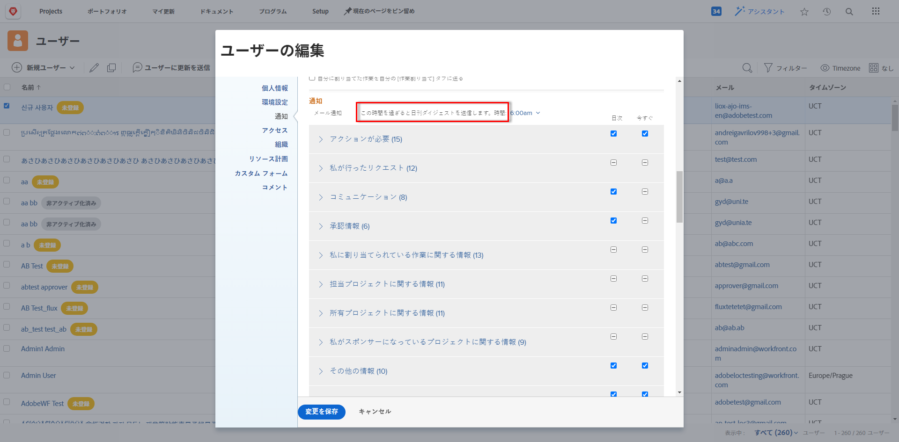

# 複数のユーザーの電子メール通知設定を変更する

<!-- Audited: 12/2023 -->

Adobe Workfront管理者、または Planner のアクセスレベルで他のユーザーの設定を編集できる場合、一度に複数のユーザーの通知設定を構成できます。 これには、ユーザーがイベントとして通知を受け取るか、1 日のダイジェスト電子メールで通知を受け取るかを指定することが含まれます。詳しくは、 [Adobe Workfront通知](../../../workfront-basics/using-notifications/wf-notifications.md). ユーザーの編集に必要なアクセスレベルについて詳しくは、 [ユーザーへのアクセス権の付与](../../../administration-and-setup/add-users/configure-and-grant-access/grant-access-other-users.md).

また、自分のプロファイルを含め、一度に 1 人のユーザーに対する電子メール通知を設定することもできます。 詳しくは、 [独自の電子メール通知を変更する](../../../workfront-basics/using-notifications/activate-or-deactivate-your-own-event-notifications.md).

## アクセス要件

この記事の手順を実行するには、次のアクセス権が必要です。

<table style="table-layout:auto"> 
 <col> 
 <col> 
 <tbody> 
  <tr> 
   <td role="rowheader">Adobe Workfrontプラン</td> 
   <td>任意</td> 
  </tr> 
  <tr> 
   <td role="rowheader">Adobe Workfrontライセンス</td> 
   <td> 
新規プラン：標準 

 
または
 

現在のプラン：プラン 
 
</td> 
  </tr> 
 </tbody> 
</table>

この表の情報の詳細については、 [Workfrontドキュメントのアクセス要件](/help/quicksilver/administration-and-setup/add-users/access-levels-and-object-permissions/access-level-requirements-in-documentation.md).

## 複数のユーザーの電子メール通知設定を変更する

一括通知設定を構成する場合、選択したユーザーに共通する設定のみを変更できます。

通知設定を変更すると、ラベル **編集済み** はその通知設定に対して表示され、その通知設定が変更されたことを知らせます。

複数のユーザーの電子メール通知設定を変更するには：

{{step-1-to-users}}

1. ユーザーを選択し、「 **編集**.
1. Adobe Analytics の **担当者の編集** 表示されるボックスで、 **通知**.

1. カテゴリを展開して、そのカテゴリに関連する通知設定を表示します。

   1 人以上のユーザーが選択し、そのユーザーの通知が他の選択したユーザーの通知と一致しない場合、その通知のカテゴリチェックボックスには水平線が表示されます  チェックマークの代わりに使用します。

1. ユーザーが毎日または即座に受信する通知をクリックするか、受信を停止する通知をクリアします。

   >[!NOTE]
   >
   >   の **通信** 」カテゴリでは、個々の通知を選択して即時配信のみを行うことができます。 1 日のダイジェストで配信される通知をすべて選択する必要があります。

1. 日別のダイジェストとして送信する通知を選択した場合は、ダイジェストを配信する時刻を **通知** セクション内 **1 日のダイジェストの電子メール送信後** メニュー。

   

   1 日のダイジェストには、選択した時間の 24 時間前に通知の条件を満たすイベントが含まれます。 ユーザーは、通知タイプごとに 1 日に 1 通のダイジェスト電子メールを受け取ります。

   毎日のダイジェストは、選択した時間の後に、システムで配信用にキューに入れられている電子メールの数に応じて、到着する場合があります。 一覧に表示される時刻は、ブラウザー設定で指定されたローカル時間です。
