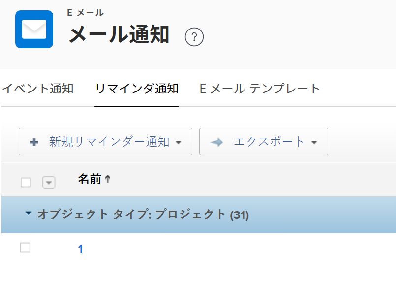
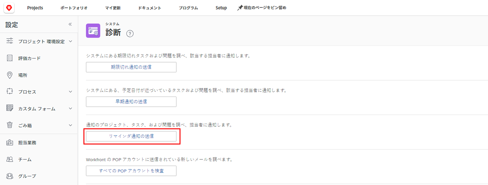

# リマインダー通知の設定

<!-- Audited: 1/2024 -->

リマインダー通知は、指定された基準に基づいて受信者にメールを送信します。リマインダー通知を、プロジェクト、タスク、タスク、タイムシートなどの作業項目に手動で関連付けることができます。

<!--
DRAFTED IN FLARE:
An example of how this can be used would be helpful here and/or in the section 
<a href="../../../workfront-basics/using-notifications/wf-notifications.md#reminder-notifications" class="MCXref xref">Reminder notifications</a>
 in 
<a href="../../../workfront-basics/using-notifications/wf-notifications.md" class="MCXref xref">Adobe Workfront notifications</a>

-->

## アクセス要件

この記事の手順を実行するには、次のアクセス権が必要です。

<table style="table-layout:auto"> 
 <col> 
 <col> 
 <tbody> 
  <tr> 
   <td role="rowheader">Adobe Workfront プラン</td> 
   <td>任意</td> 
  </tr> 
  <tr> 
   <td role="rowheader">Adobe Workfront ライセンス</td> 
   <td> 
新規：標準 

 
または
 

現在：プラン
 
</td> 
  </tr> 
  <tr> 
   <td role="rowheader">アクセスレベル設定</td> 
   <td> 
リマインダー通知への管理アクセス権を持つ、プランナー以上の権限
</td> 
  </tr> 
 </tbody> 
</table>

この表の情報の詳細については、 [Workfrontドキュメントのアクセス要件](/help/quicksilver/administration-and-setup/add-users/access-levels-and-object-permissions/access-level-requirements-in-documentation.md).

## リマインダーメールのカスタマイズ

リマインダー通知電子メールの件名、本文およびHTMLをカスタマイズできます。

または、リマインダー通知に含まれるデフォルトのメールを使用することもできます。デフォルトのメールでは、リマインダーの通知名をメールの件名として使用し、通知をトリガーしたイベントを含むメール本文のオブジェクト名を使用します。

リマインダーメールをカスタマイズする場合は、メールテンプレートを作成し、それをリマインダー通知に添付する必要があります。

メールテンプレートの作成方法について詳しくは、[メールテンプレートの設定](../../../administration-and-setup/manage-workfront/emails/configure-email-templates.md)を参照してください。

## リマインダー通知の作成

{{step-1-to-setup}}

1. **メール**／**通知**／**リマインダー通知**&#x200B;をクリックします。

   

1. **新しいリマインダー通知**&#x200B;をクリックします。

1. ドロップダウンリストで、リマインダー通知に関連付けるオブジェクトタイプをクリックします。

   例えば、リマインダー通知をタイムシートに添付する場合は、**タイムシート**&#x200B;をクリックします。

1. 表示される「**新しいリマインダー通知**」ボックスで、次の情報を指定します。

   <table style="table-layout:auto"> 
    <col> 
    <col> 
    <tbody> 
     <tr> 
      <td role="rowheader">リマインダー通知名</td> 
      <td>リマインダー通知の名前を指定します。</td> 
     </tr> 
     <tr> 
      <td role="rowheader">対象期間</td> 
      <td> 
「<strong>タイミング</strong>」フィールドの日付の前後の時間数、稼働日、日数（暦日）、週数、または月数を指定します。
 
<b>メモ</b>：  
        <ul> 
         <li> 
リマインダー通知は、指定した日付の 24 時間後、すべての条件が満たされると開始されます。
 </li> 
         <li> 
プロジェクト、タスク、イシューに関するリマインダー通知は、米国山岳時間の毎晩深夜にトリガーされます。その日のリマインダー通知の対象となるすべてのオブジェクトは、その日の直後に指定されたユーザーに通知をトリガーします。
 </li> 
         <li> 
タイムシートのリマインダー通知は、タイムゾーンとタイムシートの終了日、開始日、または最終更新日に基づいて、指定された時刻に送信されます。
 </li> 
        </ul> 
 </td> 
     </tr> 
     <tr> 
      <td role="rowheader">タイミング</td> 
      <td> 
スケジュールするリマインダー通知をトリガーするイベントを選択します。
 
リマインダー通知がプロジェクト、タスク、またはイシューを対象としている場合、使用可能なオプションは完了日または開始日に関連します。リマインダー通知では、プロジェクト、タスク、およびイシューの完了日と開始日のタイムスタンプが考慮されます。

   
リマインダー通知がタイムシートを対象としている場合、使用可能なオプションは終了日、開始日、または最終更新日に関連しています。タイムシートのリマインダー通知では、タイムシートの終了日、開始日、最終更新日のタイムスタンプが考慮されます。タイムシートは開始日の午前 0 時（午前 12 時 00 分）に始まり、終了日の午前 0 時（午後 11 時 59 分）の直前に終了します。

   
<b>メモ</b>

      
タイムシートリマインダー通知は 24 時間に 1 回のみ配信されます。
 
24 時間以内に複数のリマインダー通知を設定すると、Workfront はその通知にすべてのリマインダーが含まれる 1 つの通知メールを送信します。

      
例えば、期日の 10 時間前、2 時間前、1 時間前にトリガーされるように 3 つのリマインダー通知を設定した場合、同じ日に発生した場合、3 つのリマインダーはすべて同じ通知に結合されます。
 
ただし、期限の 26 時間前にリマインダー通知を設定し、期限の 1 時間前に別の通知を設定すると、ユーザーは 2 つの別々の通知を受け取ることになります。 

   </td> 
     </tr> 
     <tr> 
      <td role="rowheader">基準</td> 
      <td> 
スケジュールするリマインダー通知を絞り込むための基準を選択します。選択した基準に適合しない限り、リマインダー通知はスケジュールされません。
 
手順 4 で選択したオブジェクトタイプに応じて、次の基準オプションが使用可能です。
 
       <ul> 
        <li><strong>現在のプロジェクトで不完全です：</strong> <i>（タスクおよび問題のリマインダーに使用できます）</i> リマインダー通知は、リマインダー通知が関連付けられているオブジェクトの状態が [ 完了 ] ではなく、プロジェクトの状態が [ 現在 ] の場合にのみ、送信されるようにスケジュールされます。</li> 
        <li><strong>現在のプロジェクト内のすべて：</strong> <i>（タスクおよび問題のリマインダーに使用できます）</i> リマインダー通知は、オブジェクトの状態に関係なく、また、リマインダー通知が関連付けられているプロジェクトの状態が現在の状態の場合にのみ、送信されるようにスケジュールされます。</li> 
        <li><strong>不完全なプロジェクト：</strong> <i>（プロジェクトのリマインダーに使用できます）</i> プロジェクトのステータスが [ 完了 ] 以外の場合は、リマインダー通知が送信されるようにスケジュールされています。</li> 
        <li><strong>すべてのプロジェクト：</strong> <i>（プロジェクトのリマインダーに使用できます）</i> リマインダー通知は、プロジェクトのステータスに関係なく、送信されるようにスケジュールされます。</li> 
        <li><strong>タイムシートを開く：</strong> <i>（タイムシートのリマインダーに使用可能）</i> タイムシートの状態が [ 開封 ] になると、リマインダー通知が送信されるようにスケジュールされます。</li> 
        <li><strong>提出済みタイムシート：</strong> <i>（タイムシートのリマインダーに使用可能）</i> タイムシートの状態が [ 送信済み ] になると、リマインダー通知が送信されるようにスケジュールされます。</li> 
        <li><strong>タイムシートを開くか、週 40 時間未満にする：</strong> <i>（タイムシートのリマインダーに使用可能）</i> タイムシートの状態が [ 開封 ] の場合、またはタイムシートが 40 時間未満の場合に、リマインダー通知が送信されるようにスケジュールされます。</li> 
        <li><strong>E メール テンプレート</strong>：ドロップダウンから、リマインダーに添付するメールテンプレートを選択します。 メールテンプレートの作成方法については、<a href="../../../administration-and-setup/manage-workfront/emails/configure-email-templates.md" class="MCXref xref">メールテンプレートの設定</a>を参照してください。</li> 
       </ul> </td> 
     </tr> 
     <tr> 
      <td role="rowheader">受信者</td> 
      <td>通知の受信者となるユーザーのタイプを選択します。所有者、承認者、担当者など、様々なオブジェクト関係者から選択します。</td> 
     </tr> 
    </tbody> 
   </table>

1. 「**保存**」をクリックします。
1. [オブジェクトへのリマインダー通知の添付](../../../workfront-basics/using-notifications/attach-reminder-notification-object.md)の説明に従って、作業アイテムにリマインダー通知を添付します。

## リマインダー通知を受信

リマインダー通知が添付されているアイテムで条件が満たされると、リマインダー通知で定義されているユーザーにメール通知がトリガーされます。

リマインダー通知の受信について詳しくは、[Adobe Workfront 通知](../../../workfront-basics/using-notifications/wf-notifications.md)の[リマインダー通知](../../../workfront-basics/using-notifications/wf-notifications.md#reminder-notifications)の節を参照してください。

## リマインダー通知の配信をテスト

リマインダー通知は、米国山岳時間の毎晩深夜にトリガーされます。リマインダー通知の対象となるすべてのオブジェクトは、その直後に、指定されたユーザーへの通知をトリガーします。

リマインダー通知を手動でトリガーさせるには、まずリマインダーの条件を満たす必要があります。\
例えば、プロジェクトの予定完了日の 1 時間後にリマインダーがトリガーされるように設定されている場合、リマインダーが設定されてから現在までにその時間が経過している必要があります。リマインダーがアクティブになる前に予定完了日が過ぎたプロジェクトは、通知をトリガーしません。

リマインダー通知を手動でトリガーさせるには、次の手順に従います。

{{step-1-to-setup}}

1. Workfront の左下隅で、**システム**／**診断**&#x200B;をクリックします。

1. 「**リマインダ通知の送信**」をクリックし、通知が送信されたことを確認するメッセージが画面の上部に表示されるのを待ちます。

   リマインダー通知で指定されたユーザーに、メールが届きます。

