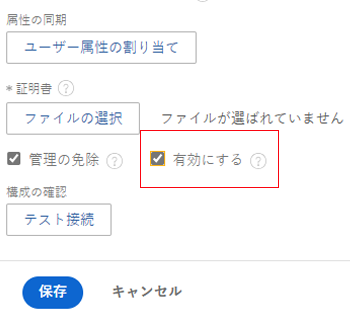

# API キーの管理

<!--DON'T DELETE, DRAFT OR HIDE THIS ARTICLE. IT IS LINKED TO THE PRODUCT, THROUGH THE CONTEXT SENSITIVE HELP LINKS.

-->

API セキュリティ脆弱性を最小限に抑えるために、Adobe Workfront 管理者は、アプリケーションがユーザーに代わって Workfront へのアクセスに使用される API キーを管理できます。

現在の管理者 API キーのリセットまたは削除、API キーを期限切れに設定、すべてのユーザーの API キーの削除を行うことができます。

Workfront API を活用するアプリケーションの例を次に示します。

* Dropbox、Google Drive、Workfront DAM などのドキュメントの統合
* Workfront モバイルアプリケーション

>[!IMPORTANT]
>
>API キーをリセットまたは削除する場合、Workfront API を利用し、この API キーを介して Workfront に対して認証するアプリケーションは、Workfront へのアクセス権を取り戻すために再設定する必要があります。

## アクセス要件

この記事の手順を実行するには、次のアクセス権が必要です。

<table style="table-layout:auto"> 
 <col> 
 <col> 
 <tbody> 
  <tr> 
   <td role="rowheader">Adobe Workfront プラン</td> 
   <td>任意</td> 
  </tr> 
  <tr> 
   <td role="rowheader">Adobe Workfront ライセンス</td> 
   <td>プラン</td> 
  </tr> 
  <tr> 
   <td role="rowheader">アクセスレベル設定</td> 
   <td> 
Workfront 管理者である必要があります。
 
<b>メモ</b>：まだアクセス権がない場合は、Workfront 管理者に問い合わせて、アクセスレベルに追加の制限が設定されているかどうかを確認してください。Workfront 管理者がアクセスレベルを変更する方法について詳しくは、<a href="../../../administration-and-setup/add-users/configure-and-grant-access/create-modify-access-levels.md" class="MCXref xref">カスタムアクセスレベルの作成または変更</a>を参照してください。
 </td> 
  </tr> 
 </tbody> 
</table>

## Workfront API キー

Workfront のそれぞれのユーザーが、一意の API キーを持っています。このキーは、ユーザーが Workfront API（Workfront モバイルアプリやドキュメント統合など）を活用する統合にアクセスする際に、ユーザーごとに生成されます。

>[!NOTE]
>
> 実稼動環境で生成した API キーは、毎週の更新中にプレビュー環境にコピーされます。プレビュー環境で生成した API キーは、毎週の更新中に実稼動用 API キーで上書きされます。

Workfront 管理者には一意の API キーが割り当てられています。アプリケーションが管理者 API キーを使用して Workfront にアクセスすると、アプリケーションは Workfront への管理アクセス権を持つことになります。

## 管理者 API キーの管理

管理者ユーザーアカウントの API キーを生成、リセットまたは削除することができます。

>[!NOTE]
>
>API を使用して API キーを生成することもできます。詳しくは、[イベント登録 API](../../../wf-api/general/event-subs-api.md) にある[イベント登録 API](../../../wf-api/general/event-subs-api.md) の節を参照してください。

1. Adobe Workfront の右上隅にある&#x200B;**メインメニュー**&#x200B;アイコン  をクリックし、「**設定**」 をクリックします。

1. **システム**／**顧客情報**&#x200B;をクリックします。
1. （条件付き）次のアクションのいずれかを実行します。

   API キーを生成するには、「**API キーを設定**」セクションで、「**API キーを生成**」をクリックします。

   または\
   API キーをリセットするには、「**API キーの設定**」セクションで、「**リセット**」をクリックし、「**リセット**&#x200B;をクリックします。

   または

   API キーを削除するには、「**API キーの設定**」セクションで、「**削除**&#x200B;をクリックし、「**削除**」をクリックします。

## 管理者以外のユーザー向けの API キーの生成

Workfront 管理者以外の役割を持つユーザーの API キーを生成および管理できます。

>[!NOTE]
>
>組織の Workfront インスタンスが Adobe IMS によって有効化されている場合は使用できません。詳細情報が必要な場合は、ネットワークまたは IT 管理者にお問い合わせください。

1. （条件付き）組織がシングルサインオン（SSO）アクセス管理を使用している場合、SSO 認証を必要とするオプションを一時的に無効にします。

   1. Adobe Workfront の右上隅にある&#x200B;**メインメニュー**&#x200B;アイコン  をクリックし、「**設定**」 をクリックします。

   1. **システム**&#x200B;を展開し、次に「**シングルサインオン（SSO）**」をクリックします。\
      

   1. SSO 認証が必要なチェックボックスを無効にします。

      例えば、組織が SAML 2.0 を使用している場合は、「**SAML 2.0 認証のみを許可**」を無効にします。

1. ブラウザーのアドレスバーに、次の API 呼び出しを入力します。

   `<domain>`**.my.workfront.com/attask/api/v7.0/user?action=generateApiKey&amp;username=**username**&amp;password=**password**&amp;method=PUT

   `<domain>` を Workfront ドメイン名に置き換え、ユーザー名とパスワードをユーザーの Workfront 資格情報に置き換えます。

1. （条件付き）手順 1 で SSO 認証を要求するオプションを無効にした場合は、これを有効にします。

   1. Adobe Workfront の右上隅にある&#x200B;**メインメニュー**&#x200B;アイコン  をクリックし、**設定**  をクリックします。

   1. **システム**&#x200B;を展開し、次に「**シングルサインオン（SSO）**」をクリックします。

   1. **タイプ**&#x200B;ドロップダウンメニューで、「SSO メソッド」を選択します。。
   1. SSO 認証が必要なチェックボックスをオンにします。

## API キーの有効期限を設定

API キーは、システム内のすべてのユーザーの有効期限が切れるように設定できます。ユーザーの API キーの有効期限が切れると、ユーザーは Workfront API を使用して Workfront にアクセスするアプリケーションに対して再認証する必要があります。API キーの有効期限が切れる頻度を変更できます。ユーザーのパスワードの有効期限が切れた場合に、API キーを期限切れにするかどうかを設定することもできます。

1. Adobe Workfront の右上隅にある&#x200B;**メインメニュー**&#x200B;アイコン  をクリックしたあと、**設定**&#x200B;アイコン  をクリックします。

1. **システム**／**顧客情報**&#x200B;をクリックします。
1. **API キー設定**&#x200B;エリア内の、**作成後**&#x200B;の&#x200B;**API キーの有効期限：**&#x200B;ドロップダウンリストから、API キーを期限切れにする時間枠を選択します。

   このオプションを変更すると、変更を加えた時点から新しい期間が開始されます。例えば、このオプションを *1 か月*&#x200B;から *6 か月*&#x200B;に変更すると、API キーの有効期限は変更を行ってから 6 か月になります。

   デフォルトでは、API キーは毎月期限が切れます。

1. ユーザーのパスワードが期限切れになった時点で期限切れになるように API キーを設定するには、**ユーザーのパスワードが期限切れになったら API キーを削除**&#x200B;を選択します。

   デフォルトでは、このオプションは選択されていません。

   ユーザーパスワードが失効するように設定する方法については、[システムセキュリティの環境設定の指定](../../../administration-and-setup/manage-workfront/security/configure-security-preferences.md)を参照してください。

1. 「**保存**」をクリックします。

## すべてのユーザーの API キーを削除

Workfront システムに関する特定のセキュリティ違反を懸念する場合は、すべてのユーザーの API キーを同時に削除できます。

>[!IMPORTANT]
>
>すべてのユーザーの API キーを削除すると、システム内のすべてのユーザーの API キーがすべて無効になります。このアクションにより、Workfront で新しい API キーを生成して統合をすべてアップデートするまで、Workfront でのすべての統合が失敗します。

1. Adobe Workfront の右上隅にある&#x200B;**メインメニュー**&#x200B;アイコン  をクリックし、**設定**  をクリックします。

1. **システム**&#x200B;を展開して、「**顧客情報**」をクリックします。

1. **API キー設定**&#x200B;領域で、**すべての API キーを削除**、**削除**／**すべて**&#x200B;の順にクリックします。

## X.509 証明書を使用した API ログインの制限

>[!IMPORTANT]
>
>この節で説明する手順は、Adobe Business Platform にまだ登録されていない組織にのみ適用されます。組織が Adobe Business Platform にオンボーディングされている場合、Workfront API を介して Workfront にログインすることはできません。
>
>組織が Adobe Business Platform に登録されているかどうかによって異なる手順のリストについては、[プラットフォームによる管理の違い（Adobe Workfront Fusion／Adobe Business Platform）](../../../administration-and-setup/get-started-wf-administration/actions-in-admin-console.md)を参照してください。

サードパーティアプリケーションは、API を介して Workfront と通信できます。X.509 証明書を Workfront にアップロードすることで、Workfront サイトのセキュリティを強化するために API ログインリクエストを制限するよう Workfront を設定できます。有効にしたら、API を介したすべてのログインリクエストには、ユーザー名とパスワードに加えて、クライアント証明書が含まれている必要があります。

>[!NOTE]
>
>組織の Workfront インスタンスが Adobe IMS によって有効化されている場合は使用できません。詳細情報が必要な場合は、ネットワークまたは IT 管理者にお問い合わせください。

* [X.509 証明書の取得](#obtain-the-x-509-certificate)
* [Workfront への証明書のアップロード](#upload-the-certificate-to-workfront)
* [API ログイン呼び出しが制限されていることの確認](#verify-api-login-calls-are-restricted)

### X.509 証明書の取得 {#obtain-the-x-509-certificate}

有効な X.509 証明書を信頼できる証明機関（Verisign など）から取得し、ワークステーションの一時的な場所に配置します。

### Workfront への証明書のアップロード {#upload-the-certificate-to-workfront}

認証局から X.509 証明書を取得したら、Workfront にアップロードする必要があります。

1. Adobe Workfront の右上隅にある&#x200B;**メインメニュー**&#x200B;アイコン 、**設定**  の順にクリックします。

1. **システム**&#x200B;を展開して、「**顧客情報**」をクリックします。

1. **API キー設定**&#x200B;エリアで、「**X.509証明書を有効にする**」を選択します。
1. ワークステーションで、以前にダウンロードした X.509 証明書を参照して選択します。
1. （オプション）証明書名の横にある「**詳細を表示**」をクリックすると、証明書に関する次の詳細が表示されます。

   * 件名の共通名
   * 件名の組織
   * 件名の組織単位
   * 発行者の共通名
   * 発行者の組織
   * 発行者組織の単位
   * シリアル番号
   * イシューの日付
   * 有効期限

1. 「**保存**」をクリックします。

### API ログイン呼び出しが制限されていることの確認 {#verify-api-login-calls-are-restricted}

X.509 証明書を必要とするようにWorkfrontのインスタンスを設定する前に、有効なユーザー名とパスワードのパラメーターを使用して、`/login` エンドポイントへの API リクエストを実行します。sessionID を含む 200 件の応答を受け取ります。

Workfront のインスタンスの顧客情報ページで X.509 証明書を要件とした後、再度ログインを試みます。今回は、次のメッセージを含む 500 エラー応答を受け取ります。「信頼できないリクエストです。システム管理者に連絡して、証明書を添付してください。」

X.509 証明書が必須であることを確認したら、証明書の値に apiCertificate の追加パラメーターを設定して、同じログインリクエストを実行します。この操作が正しく実行された場合は、有効な sessionID を含む 200 件の応答を受け取ります。
