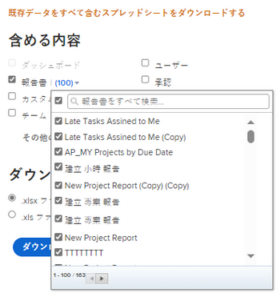

# キックスタートを介した Adobe Workfront からのデータの書き出し

<!-- Audited: 2/2024 -->

<!--

***DON'T DELETE, DRAFT OR HIDE THIS ARTICLE. IT IS LINKED TO THE PRODUCT, THROUGH THE CONTEXT SENSITIVE HELP LINKS. **

-->

Adobe Workfront 管理者は、キックスタートのデータエクスポーターを使用して Workfront からデータを書き出すことができます。書き出し後に他のアプリケーションで使用できます。

キックスタートを経由してデータを書き出すと、各オブジェクトに関連付けられているフィールド、これらのフィールドのコーディング方法およびこれらのフィールドの値はデータベース内でどのように形式化されているかを理解するのに役立ちます。

## アクセス要件

この記事の手順を実行するには、次のアクセス権が必要です。

<table style="table-layout:auto"> 
 <col> 
 <col> 
 <tbody> 
  <tr> 
   <td role="rowheader">Adobe Workfront プラン</td> 
   <td>任意</td> 
  </tr> 
  <tr> 
   <td role="rowheader">Adobe Workfront ライセンス</td> 
   <td>
   
新規：標準

   または
   
現在：プラン

   </td> 
  </tr> 
  <tr> 
   <td role="rowheader">アクセスレベル設定</td> 
   <td> 
Workfront 管理者である必要があります。
</td> 
  </tr> 
 </tbody> 
</table>

この表の情報の詳細については、 [Workfrontドキュメントのアクセス要件](/help/quicksilver/administration-and-setup/add-users/access-levels-and-object-permissions/access-level-requirements-in-documentation.md).

## キックスタートを使用してデータを書き出すメリットとデメリット

Workfront 内でデータを書き出すには、次の 2 つの方法があります。

* レポートまたはリストからのデータの書き出し

  レポートまたはリストからのデータの書き出しについて詳しくは、[データの書き出し](../../../reports-and-dashboards/reports/creating-and-managing-reports/export-data.md)を参照してください。

* キックスタートを使用したデータの書き出し

次の表に、各方法のメリットとデメリットを示します。

<table style="table-layout:auto"> 
 <col> 
 <col> 
 <col> 
 <thead> 
  <tr> 
   <th>  </th> 
   <th> 
書き出されたデータには、オブジェクトとフィールド値が含まれます
 </th> 
   <th> 
複数のオブジェクトタイプに関するデータを同時に書き出す機能
 </th> 
  </tr> 
 </thead> 
 <tbody> 
  <tr> 
   <td> 
<strong>リストビューからのデータの書き出し</strong> 
 
リストからのデータの書き出しについて詳しくは、<a href="../../../reports-and-dashboards/reports/creating-and-managing-reports/export-data.md" class="MCXref xref">データの書き出し</a>を参照してください。
 </td> 
   <td> 
はい
 
Workfront のネイティブフィールドと、オブジェクトに関連付けられているカスタムフィールドの両方が書き出されます。
 </td> 
   <td> 
いいえ
 </td> 
  </tr> 
  <tr> 
   <td> 
<strong>キックスタートを介したデータの書き出し</strong> 
 </td> 
   <td> 
はい（限定）
 
オブジェクトに関連付けられた Workfront のネイティブフィールドのほとんどは書き出されますが、書き出されないものもあります。例えば、プロジェクトのキックスタート書き出しを経由して、スケジュール、プロジェクト所有者、プロジェクトスポンサーの各フィールドを書き出すことはできません。
 
カスタムフォームが添付されたプロジェクトでは、フォーム上のフィールドに入力されたデータは書き出されません。
 
ただし、カスタムフォームを書き出すことはできます。結果のファイルには、テキストボックスやラジオボタンなど、フォームに設定されたフィールドが一覧表示されます。
 </td> 
   <td> 
はい
 
キックスタートを使用して Workfront データを書き出すと、複数のオブジェクトタイプに関連するデータを 1 度の書き出しで書き出すことができます。例えば、タスク、イシューおよびプロジェクトを 1 回の書き出しに含めることができます。
 </td> 
  </tr> 
 </tbody> 
</table>

## 書き出し制限

キックスタートを介してデータを書き出す場合は、次の制限があります（データは Excel ファイル形式で書き出されます）。

* **50,000 行：**&#x200B;ファイルで許可される行の数。
* **65,530 ハイパーリンク：**&#x200B;これは、65,530 個を超えるハイパーリンクを含むドキュメントに対して Excel が課す制限です。これらのドキュメントは、書き出し後は開くことができません。Excel ドキュメントのデータは 200 行に過ぎなくても、ドキュメント内に 65,530 個を超えるリンクがある場合、ドキュメントは開きません。

## キックスタートを介したデータの書き出し

{{step-1-to-setup}}

1. **システム**／**キックスタート**&#x200B;をクリックして、「**データを書き出す**」をクリックします。

1. 書き出すオブジェクトを選択します。 デフォルトでは、次のオブジェクトがの下に表示されます。 **含めるもの**:

   <table style="table-layout:auto"> 
    <col> 
    <col> 
    <col> 
    <thead> 
     <tr> 
      <th> 
<strong>オブジェクト</strong> 
 </th> 
      <th> 
<strong>Excel ファイルの書き出されたシート</strong> 
 </th> 
      <th> 
 <strong>書き出し形式</strong>
 </th> 
     </tr> 
    </thead> 
    <tbody> 
     <tr> 
      <td scope="col" valign="top"> 
ダッシュボード
 
 
 
 
 </td> 
      <td scope="col" valign="top"> 
パラメーター パラメーターオプション パラメーターグループ カテゴリパラメーター カテゴリ レポート ポータルのタブセクション ダッシュボード 環境設定
 </td> 
      <td scope="col" valign="top"> ZIP</td> 
     </tr> 
     <tr> 
      <td scope="col" valign="top"> 
レポート
 
 
 
 
 </td> 
      <td scope="col" valign="top">パラメーター パラメーターオプション パラメータグループ カテゴリパラメーター カテゴリ レポート 環境設定</td> 
      <td scope="col" valign="top"> ZIP </td> 
     </tr> 
     <tr> 
      <td scope="col" valign="top"> 
承認
 </td> 
      <td scope="col" valign="top"> 
ステップ承認者 承認ステップ 承認 承認プロセス 環境設定
 </td> 
      <td scope="col" valign="top"> 
 Excel
 </td> 
     </tr> 
     <tr> 
      <td scope="col" valign="top"> 
カスタムデータ
 </td> 
      <td scope="col" valign="top"> 
パラメーター パラメーターオプション パラメーターグループ カテゴリパラメーター カテゴリ 環境設定
 </td> 
      <td scope="col" valign="top"> 
 Excel
 </td> 
     </tr> 
     <tr> 
      <td scope="col" valign="top"> 
費用タイプ
 </td> 
      <td valign="top"> 
費用タイプ 環境設定
 </td> 
      <td scope="col" valign="top"> 
Excel
 </td> 
     </tr> 
     <tr> 
      <td valign="top"> 
時間タイプ
 </td> 
      <td valign="top"> 
時間タイプ 環境設定
 </td> 
      <td scope="col" valign="top"> 
Excel
 </td> 
     </tr> 
     <tr> 
      <td valign="top"> 
チーム
 </td> 
      <td valign="top"> チームメンバー チーム 環境設定 </td> 
      <td scope="col" valign="top"> 
 Excel
 </td> 
     </tr> 
     <tr> 
      <td valign="top"> 
ユーザー
 </td> 
      <td valign="top"> 
ユーザー 環境設定
 </td> 
      <td valign="top"> 
 Excel
 </td> 
     </tr> 
    </tbody> 
   </table>

1. 「**その他のオプション**」をクリックして、オブジェクトの完全なリストを表示します。

   ここに示すオブジェクトはすべて、データを Workfront に読み込む際にも使用できます。

   唯一の例外は、**アクセスレベル**&#x200B;オブジェクトです。書き出しに含まれるアクセスレベルデータシートは、参照用としてのみ提供されます。ID を使用して、新しいユーザーアカウントにアクセスレベルを割り当てることができます。

   キックスタートを介して Workfront にデータを読み込む方法について詳しくは、[キックスタートテンプレートを使用した Adobe Workfront へのデータの読み込み](../../../administration-and-setup/manage-workfront/using-kick-starts/import-data-via-kickstarts.md)を参照してください。次に、キックスタートを使用して書き出すことができるすべてのオブジェクトのリストを示します。

   <table style="table-layout:auto"> 
    <col> 
    <col> 
    <col> 
    <thead> 
     <tr> 
      <th> 
オブジェクト
 </th> 
      <th> 
Excel ファイルの書き出し済みシート
 </th> 
      <th> 
書き出し形式
 </th> 
     </tr> 
    </thead> 
    <tbody> 
     <tr> 
      <td scope="col" valign="top">アクセスレベル</td> 
      <td scope="col" valign="top">アクセスレベル 環境設定</td> 
      <td scope="col" valign="top">Excel</td> 
     </tr> 
     <tr> 
      <td scope="col" valign="top">割り当て</td> 
      <td scope="col" valign="top">割り当て 環境設定</td> 
      <td scope="col" valign="top">Excel</td> 
     </tr> 
     <tr> 
      <td scope="col" valign="top">会社</td> 
      <td scope="col" valign="top"> 会社 環境設定 </td> 
      <td scope="col" valign="top">Excel</td> 
     </tr> 
     <tr> 
      <td scope="col" valign="top">メールテンプレート</td> 
      <td scope="col" valign="top"> メールテンプレート 環境設定 </td> 
      <td scope="col" valign="top">Excel</td> 
     </tr> 
     <tr> 
      <td scope="col" valign="top">費用</td> 
      <td valign="top"> 費用 環境設定 </td> 
      <td scope="col" valign="top"> Excel</td> 
     </tr> 
     <tr> 
      <td valign="top">外部ページ</td> 
      <td valign="top"> 外部ページ 環境設定 </td> 
      <td scope="col" valign="top">Excel</td> 
     </tr> 
     <tr> 
      <td valign="top">フィルター</td> 
      <td valign="top"> フィルター 環境設定 </td> 
      <td valign="top">ZIP </td> 
     </tr> 
     <tr> 
      <td valign="top">グループ</td> 
      <td valign="top"> グループ 環境設定  </td> 
      <td valign="top">Excel</td> 
     </tr> 
     <tr> 
      <td valign="top">グループ化</td> 
      <td valign="top"> グループ化 環境設定 </td> 
      <td valign="top">ZIP</td> 
     </tr> 
     <tr> 
      <td valign="top">時間</td> 
      <td valign="top"> 時間 環境設定 </td> 
      <td valign="top">Excel</td> 
     </tr> 
     <tr> 
      <td valign="top">イシュー</td> 
      <td valign="top"> イシュー 環境設定 </td> 
      <td valign="top">Excel</td> 
     </tr> 
     <tr> 
      <td valign="top">担当業務</td> 
      <td valign="top"> 担当業務 環境設定 </td> 
      <td valign="top">Excel</td> 
     </tr> 
     <tr> 
      <td valign="top">マイルストーンパス</td> 
      <td valign="top"> マイルストーン マイルストーンパス 環境設定 </td> 
      <td valign="top">Excel </td> 
     </tr> 
     <tr> 
      <td valign="top">メモ</td> 
      <td valign="top"> メモ 環境設定 </td> 
      <td valign="top">Excel</td> 
     </tr> 
     <tr> 
      <td valign="top">ポートフォリオ</td> 
      <td valign="top"> ポートフォリオ 環境設定 </td> 
      <td valign="top">Excel</td> 
     </tr> 
     <tr> 
      <td valign="top">プロジェクト</td> 
      <td valign="top"> キュー プロジェクト ルーティングルール キューのトピック 環境設定 </td> 
      <td valign="top">Excel</td> 
     </tr> 
     <tr> 
      <td valign="top">リソース見積り</td> 
      <td valign="top"> リソース見積り 環境設定 </td> 
      <td valign="top">Excel</td> 
     </tr> 
     <tr> 
      <td valign="top">リソースプール</td> 
      <td valign="top"> リソースプール 環境設定 </td> 
      <td valign="top">Excel</td> 
     </tr> 
     <tr> 
      <td valign="top">リスク</td> 
      <td valign="top"> リスク 環境設定  </td> 
      <td valign="top">Excel</td> 
     </tr> 
     <tr> 
      <td valign="top">リスクタイプ</td> 
      <td valign="top"> リスクタイプ 環境設定  </td> 
      <td valign="top">Excel </td> 
     </tr> 
     <tr> 
      <td valign="top">スコアカード</td> 
      <td valign="top">スコアカードの質問 スコアカードオプション スコアカード 環境設定 </td> 
      <td valign="top">Excel </td> 
     </tr> 
     <tr> 
      <td valign="top">タスク</td> 
      <td valign="top"> タスク 環境設定 </td> 
      <td valign="top">Excel </td> 
     </tr> 
     <tr> 
      <td valign="top">テンプレート</td> 
      <td valign="top"> キュー テンプレート ルーティングルール キューのトピック 環境設定 </td> 
      <td valign="top">Excel  </td> 
     </tr> 
     <tr> 
      <td valign="top">テンプレートの割り当て</td> 
      <td valign="top"> テンプレートの割り当て 環境設定 </td> 
      <td valign="top">Excel </td> 
     </tr> 
     <tr> 
      <td valign="top">テンプレートタスク</td> 
      <td valign="top"> テンプレートのタスク 環境設定 </td> 
      <td valign="top">Excel </td> 
     </tr> 
     <tr> 
      <td valign="top">タイムシート</td> 
      <td valign="top"> タイムシートプロファイル タイムシート 環境設定 </td> 
      <td valign="top">Excel  </td> 
     </tr> 
     <tr> 
      <td valign="top"> 表示 </td> 
      <td valign="top"> 表示 環境設定  </td> 
      <td valign="top">ZIP</td> 
     </tr> 
    </tbody> 
   </table>

1. 「**ダウンロード」をクリックします。**

   書き出されたキックスタートファイルは、Excel ファイルとしてコンピューターにダウンロードされるか、または複数の Excel およびプロパティファイルを含む zip ファイルとしてダウンロードされます。各 Excel ファイルはシートの集まりで、各シートは選択したオブジェクトに関連付けられたフィールドを表します。すべての書き出しに関連付けられた&#x200B;**プロパティ**&#x200B;シートがあります。

   「**ダッシュボード**」および「**レポート**」オプションを使用すると、ダウンロードに含める特定のダッシュボードとレポートを選択できます。書き出しできるのは、システム全体で共有されるダッシュボードのみです。

   マトリックスレポートを書き出すことはできません。マトリックスレポートについて詳しくは、[マトリックスレポートの作成](../../../reports-and-dashboards/reports/creating-and-managing-reports/create-matrix-report.md)を参照してください。

   1 回の書き出しで、最大 100 個のダッシュボードと 100 個のレポートを選択できます。

   

   一度に複数のオブジェクトを書き出すことができます。

1. （推奨）書き出されたデータを分析し、表示するはずのすべての情報が書き出されたことを確認します。

   大規模な書き出しの場合、Workfront はバックグラウンドで Excel ファイルを生成し、遅延に関する警告メッセージを表示します。ダウンロードが完了すると、キックスタートファイルがメールで送信されます。

   
