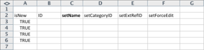

# キックスタートのシナリオ：会社、グループ、役割およびユーザーのキックスタートの準備

Adobe Workfront の実装を開始する際に、データを手動で入力する代わりに、顧客リスト、内部部門、担当業務、ユーザー情報を読み込むことができます。

## アクセス要件

この記事の手順を実行するには、次のアクセス権が必要です。

<table style="table-layout:auto"> 
 <col> 
 <col> 
 <tbody> 
  <tr> 
   <td role="rowheader">Adobe Workfront プラン</td> 
   <td>任意</td> 
  </tr> 
  <tr> 
   <td role="rowheader">Adobe Workfront ライセンス</td> 
   <td>プラン</td> 
  </tr> 
  <tr> 
   <td role="rowheader">アクセスレベル設定</td> 
   <td> 
Workfront 管理者である必要があります。
 
<b>メモ</b>：まだアクセス権がない場合は、Workfront 管理者に問い合わせて、アクセスレベルに追加の制限が設定されているかどうかを確認してください。Workfront 管理者がアクセスレベルを変更する方法について詳しくは、<a href="../../../administration-and-setup/add-users/configure-and-grant-access/create-modify-access-levels.md" class="MCXref xref">カスタムアクセスレベルの作成または変更</a>を参照してください。
 </td> 
  </tr> 
 </tbody> 
</table>

## 読み込みできるもの

次の表に、読み込む会社、グループ、役割を示します。

<table style="table-layout:auto"> 
 <col> 
 <col> 
 <col> 
 <thead> 
  <tr> 
   <th><strong>会社</strong> </th> 
   <th><strong>グループ</strong> </th> 
   <th><strong>役割</strong> </th> 
  </tr> 
 </thead> 
 <tbody> 
  <tr> 
   <td valign="top"> 
Acme, Co
 
Workfront, Inc.
 
<em>あなたの会社</em> 
 
XYZ, Inc.
 </td> 
   <td valign="top"> 
財務
 
IT 
 
マーケティング 
 
販売
 </td> 
   <td valign="top"> 
ビジネスアナリスト
 
コントローラークリエイティブ
 
設計者
 
リソース管理者
 
スクラムマスター
 
テクニカルライター
 
Web 開発者
 </td> 
  </tr> 
 </tbody> 
</table>

役割名は一意である必要があります。既存の担当業務は読み込みできません。

次の表に、読み込むユーザーと、それぞれの複数のユーザー属性を示します。

### ユーザー 1

| **名前（名）** | Chris |
|---|---|
| **名前（姓）** | Manning |
| **ユーザー名またはメール** | mailto:cmanning@foo.com |
| **パスワード** | updateMe |
| **アクセス** | チームメンバー |
| **会社** | &lt;*あなたの会社*> |
| **ホーム グループ** | マーケティング |
| **担当業務** | ビジネスアナリスト |

{style="table-layout:auto"}

### ユーザー 2

| **名** | Jennifer |
|---|---|
| **姓** | Campbell |
| **ユーザー名／E メール** | jcampbell@foo.com |
| **パスワード** | updateMe |
| **アクセス** | プロジェクトマネージャー |
| **会社** | &lt;*あなたの会社*> |
| **ホーム グループ** | マーケティング |
| **担当業務** | プロジェクトマネージャー |

{style="table-layout:auto"}

### ユーザー 3

| **名** | Jill |
|---|---|
| **姓** | Sullivan |
| **ユーザー名／E メール** | jsullivan@foo.com |
| **パスワード** | updateMe |
| **アクセス** | ヘルプデスク |
| **会社** | &lt;*あなたの会社*> |
| **ホーム グループ** | 販売 |
| **担当業務** | 販売担当者 |

{style="table-layout:auto"}

### ユーザー 4

| **名** | Marc |
|---|---|
| **姓** | Lewis |
| **ユーザー名／E メール** | mlewis@foo.com |
| **パスワード** | updateMe |
| **アクセス** | ポートフォリオマネージャー |
| **会社** | &lt;*会社>* |
| **ホームグループ** | 財務 |
| **担当業務** | コントローラー |

{style="table-layout:auto"}

### ユーザー 5

| **名前（名）** | Pam |
|---|---|
| **名前（姓）** | Reynolds |
| **ユーザー名またはメール** | preynolds@foo.com |
| **パスワード** | updateMe |
| **アクセス** | プロジェクトマネージャー |
| **会社** | *会社>* |
| **ホームグループ** | マーケティング |
| **担当業務** | IT |

{style="table-layout:auto"}

### ユーザー 6

| **名前（名）** | Ray |
|---|---|
| **名前（姓）** | Andrews |
| **ユーザー名またはメール** | randrews@foo.com |
| **パスワード** | updateMe |
| **アクセス** | 管理者 |
| **会社** | *会社>* |
| **ホームグループ** | リソース管理者 |
| **担当業務** | なし |

{style="table-layout:auto"}

## キックスタートテンプレートのダウンロード

1. Adobe Workfront の右上隅にある&#x200B;**メインメニュー**&#x200B;アイコンをクリックし、次に&#x200B;**設定**をクリックします。

1. **システム**／**キックスタート**／**データを読み込み**&#x200B;をクリックします。

1. **その他のオプション**&#x200B;をクリックして、読み込みオプションの完全なリストを表示します。
1. 読み込むアクセスレベル、会社、グループ、担当業務、ユーザーの各オブジェクトを選択します。

## 会社情報を入力

1. ダウンロードした **Workfront.xlsx** ファイルを開きます。

   >[!TIP]
   >
   >非常に幅の広いデータシートを扱う場合は、スプレッドシートエディターのウィンドウ枠の固定（または同等のツール）を使用して、スプレッドシートを簡単に操作できるようにすることが可能です。

1. 「CMPY 会社」シートに移動します。

   会社が既にシステムに存在しない限り、空にする必要があります。 

   

1. **isNew** 列に TRUE を指定します。
1. 追加される会社ごとに、このアクションを繰り返します。（この例では、4 つの会社が追加されているので、3～6 行目でこのアクションを実行します）。

   

1. 一意の ID を指定します。

   これは、ID 列の各行に対して行う必要があります。1 で始まる整数は、新しいレコードを作成する際に適切に機能します。

   

1. 名前を指定します。

   各顧客の名前を **setName** 列で指定します。

   

1. 「GROUP」グループシートに移動します。

   Workfront で既にグループを作成している場合を除き、このシートには、Workfront のすべてのアカウントでプロビジョニングされたデフォルトグループのみが表示されます。

    

1. **isNew** 列を設定します。シナリオに従って、4 つのグループが読み込まれるので、「isNew」列の 4～7 行目に TRUE を指定します。
1. 一意の ID を指定します。

   これは、ID 列の各行に対して行う必要があります。1 で始まる整数は、新しいレコードを作成する際に適切に機能します。

   

1. 名前を指定します。

   **setName** 列で各部門の名前を指定します。

   

   役割の情報を指定します。「ROLE」役割シートに移動します。

1. アカウントで既に役割を作成または削除している場合を除き、このシートには、Workfront のすべてのアカウントでプロビジョニングされた 8 つの役割が表示されます。

   

1. True 文を設定します。

   7 つの担当業務が読み込み中で、「isNew」列の 12～18 行目に TRUE を入力します。

   

1. 一意の ID を指定します。

   これは、ID 列の各行に対して行う必要があります。1 で始まる整数は、新しいレコードを作成する際に適切に機能します。

   

   

1. 各役割の名前を setName 列に入力して指定します。

   

1. 必要に応じて、追加の詳細を入力します。

   必要に応じて、作成する役割の請求率、コスト率、説明を含めます。

1. 「USER」ユーザーシートに移動して、ユーザー情報を入力します。

   アカウントで既にユーザーを作成している場合を除き、このシートには、Workfront のすべてのアカウントでプロビジョニングされた管理者ユーザーのみが表示されます。

    

1. 6 人のユーザーが読み込まれるので、「isNew」列の行 4～9 に TRUE を指定して、True 値を設定します。

   

1. ID 列の各行に一意の ID を指定して、一意の ID を設定します。通常、1 で始まる整数は、新しいレコードに対して適切に機能します。

   

1. 各ユーザーの名前を「setFirstName」列と「setLastName」列に入力します。

   

1. 「setEmail」、「setPassword」、「setUsername」の各列に値を指定して、詳細値を設定します。

   

1. アクセスレベルの値を指定します。

   例えば、チームメンバーの Chris Manning は、「ACSLVL」アクセスレベルシートで、チームメンバーのアクセスレベルの ID を検索します。その ID をクリップボードにコピーし、「USER」ユーザーシートで Chris の行の **setAccessLevelID** 列に貼り付けます。

   ユーザーおよびアクセスレベルごとに、この手順を繰り返します。

    

1. ホームグループの詳細を指定します。

   シナリオによると、Chris Manning はマーケティンググループに所属しています。「GROUP」グループシートで、マーケティンググループの ID を探し、クリップボードにコピーして、「USER」ユーザーシートで Chris の行の **setHomeGroupID** 列に貼り付けます。ユーザーとグループの割り当てごとに、この手順を繰り返します。

    

1. 会社の詳細を指定します。

   このシナリオのすべてのユーザーは、同じ会社に所属しています。「CMPY」会社シートで、「Your Own Company」会社の ID を探し、その ID をクリップボードにコピーして、「USER」ユーザータブで、「setCompanyID」列の各行にこの値を貼り付けます。

   ユーザーとグループの割り当てごとに、この手順を繰り返します。

   

   

1. 担当業務の詳細を指定します。

   シナリオによると、Chris Manning にはビジネスアナリストの役割があります。「ROLE」役割シートで、ビジネスアナリストの役割の ID を探し、クリップボードにコピーして、「USER」ユーザーシートで Chris の行の「setRoleID」列に貼り付けます。ユーザーとグループの割り当てごとに、この手順を繰り返します。

   

   

1. 必要に応じて、その他のユーザーの詳細を入力し、ファイルを保存します。
1. Excel ファイルを読み込みます。

   この記事の&#x200B;**キックスタートファイルを読み込み**&#x200B;の節で示されている手順に従います。
