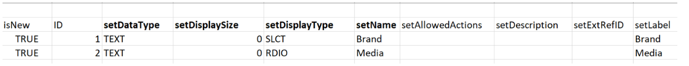

# キックスタートのシナリオ：複数オプションのカスタムフィールドを Workfront に読み込み

キックスタート機能を使用して、Adobe Workfront で複数のオプションを持つカスタムフィールドを読み込むことができます。

複数のオプションを持つカスタムフィールドの例を次に示します。

* 複数選択ドロップダウン
* ドロップダウン
* チェックボックス
* ラジオボタン

これらのフィールドには、多数（場合によっては数百）のオプションが含まれることがあります。キックスタート機能を使用して読み込むと、Workfront 管理者として多くの時間を節約し、エラーを回避できます。

>[!IMPORTANT]
>
>キックスタートを使用して複数のオプションを持つカスタムフィールドを読み込むには、以下の節で説明する手順を実行する必要があります。
>
>1. Workfront から既存のカスタムデータを書き出し（オプションの手順）
>1. カスタムデータ用のキックスタートテンプレートを書き出し
>1. キックスタートの Excel スプレッドシートにデータを入力
>1. Excel スプレッドシートを Workfront にアップロード

## Workfront から既存のカスタムデータを書き出し（オプションの手順）

Workfront のデータベース構造に詳しくない場合や、Workfront で情報の読み込みが必要なキックスタートファイルに精通していない場合は、最初に読み込むフィールドと同様の既存の情報を含むキックスタートファイルを、Workfront から書き出すことをお勧めします。

例えば、カスタムフォームやカスタムフィールドを読み込む場合は、最初に既存のカスタムデータを含むキックスタートファイルを書き出す必要があります。

最初に既存のデータを書き出すと、データをスキャンし、新しいデータをどのようにフォーマットする必要があるかを確認できます。

Workfront データベースのオブジェクトと構造について十分に理解している場合は、次の節に進んでください。

Workfront から既存のデータを書き出すには、以下を実行します。

1. Workfront インターフェイスの右上隅で&#x200B;**メインメニュー／設定**&#x200B;をクリックします。
1. 左側の&#x200B;**システム**&#x200B;メニューを展開し、「**データを書き出し（キックスタート）**」をクリックします。

   

1. 「**含める内容**」セクションで、「**カスタムデータ**」を選択します。

   

1. 「**ダウンロード形式**」セクションで、「**.xlsx ファイル**」を選択します。

   >[!TIP]
   >
   >    システム内のカスタムデータの量によっては、この処理に長い時間がかかる場合があります。

   

1. 「**ダウンロード**」をクリックします。.xlsx ファイルがお使いのコンピューターにダウンロードされます。ファイルに移動して開きます。

   

1. ダウンロードしたファイルを確認し、次の詳細をメモしておきます。

   * ファイルには複数のシートが含まれています。すべてのシートの情報を知る必要がない場合もありますが、情報の読み込みには一部のシートを使用します。少し時間をかけて、内容、特に各シートの内容の形式について理解してください。
   * 列名と、各列のデータの表示形式に特に注意してください。
   * いずれのシートも、列の名前や順序を変更しないでください。列ヘッダーは、各行に情報を入力する必要があるフィールドを示します。列ヘッダーが太字で表示されている場合は、必須フィールドなので、その列に情報を入力する必要があります。

   >[!IMPORTANT]
   >
   >一部の列ヘッダーは、太字で表示されていなくても入力が必須の場合があります。

   * ダウンロードしたファイルは、後で参照するため保持しておき、次の節に進みます。

## カスタムデータ用のキックスタートテンプレートを書き出し

システム内の既存のカスタムフィールドに関する情報をスキャンした後、読み込みに使う新しいキックスタートテンプレートをダウンロードします。

1. Workfront インターフェイスの右上隅で&#x200B;**メインメニュー／設定**&#x200B;をクリックします。

1. 左側の&#x200B;**システム**&#x200B;メニューを展開します。

1. 「**データを読み込み（キックスタート）**」をクリックします。

   

1. **空白のキックスタートスプレッドシートをダウンロードする**&#x200B;エリアで「**カスタムデータ**」チェックボックスをオンにして、「**ダウンロード**」をクリックします。

   

   空のキックスタートファイルがお使いのコンピューターにダウンロードされます。

   >[!NOTE]
   >
   >ファイル内のシート数、名前、各シート内の列の数および列の名前を、上記の節でダウンロードした既存のカスタムデータを含むキックスタートのものと同じにする必要があります。

## キックスタートの Excel スプレッドシートにデータを入力

Excel スプレッドシートにデータを入力する前に、上記の節で説明されているようにキックスタートテンプレートをダウンロードします。

>[!IMPORTANT]
>
>情報の読み込みには、アドホックの Excel スプレッドシートを使用しないでください。キックスタート機能を使用して Workfront に情報を読み込むスプレッドシートは必ず、Workfront からダウンロードしたファイルの内容、およびこの記事で説明している内容に一致している必要があります。

Excel スプレッドシートに新しいカスタムフィールドの情報を入力するには、以下を実行します。

1. 前の項でダウンロードした Excel スプレッドシートを開き、シートがいくつか表示されていることを確認します。各シートは、アプリケーション内の 1 つのオブジェクトを表します。

   >[!INFO]
   >
   >例えば、**パラメーター**（カスタムフィールドを指します）、**パラメーターオプション**（カスタムフィールドオプションを指します）、**カテゴリ**（カスタムフォームを指します）です。
   >
   >オブジェクトの名前と属性は、Workfront データベースでサポートされている形式で記述する必要があります。
   >
   >これらのオブジェクトの意味について詳しくは、 [用語集 [!DNL Adobe Workfront] 用語](../../../workfront-basics/navigate-workfront/workfront-navigation/workfront-terminology-glossary.md).
   >
   >Workfront データベース内のオブジェクトの名前について詳しくは、[API エクスプローラー](../../../wf-api/general/api-explorer.md)を参照してください。
   >
   >

1. 次の情報が正しくフォーマットされていることを確認します。

   * すべてのシートの最初の行は空のままにする必要があります。空の場合は、インポートによってエラーが発生します。
   * 各シートの列見出しは、インポート時に設定できるオブジェクトの属性を表します。すべての列ヘッダーは、シートを書き出すときに見つかった順序のままである必要があり、名前を変更することはできません。
   * 太字の列ヘッダーは必須フィールドで、値を持つ必要があります。

     >[!TIP]
     >
     >一部の列は太字ではありませんが、必須です。例えば、`isNew` および `ID` 列は太字ではありませんが、必須フィールドです。

1. `**PARAM Parameter`** シートを選択し、次の必須列に新しいカスタムフィールドに関する情報を追加します。

   * **`isNew`** = には、新しいカスタムフィールドを表す各行のこの列に **`TRUE`** を入力します。これは、フィールドが新しいもので、Workfront に存在しないことを示します。

     >[!TIP]
     >
     >    行が既に Workfront にある既存のフィールドを表す場合は、**`isNew`** = **`FALSE`** を入力します。

   * **`ID`** = は、新しいフィールドを表す各行の一意の数値である必要があります。各新しいフィールドに一意の番号が含まれている限り、1 から始まる任意の数字を使用できます。
   * **`setDataType`** = は、新しいフィールドを表す各行に対する設定で、フィールドがサポートするデータタイプを入力します。データタイプは、データベースに表示されるとおりに入力する必要があります。次のデータタイプから選択します。
      * 数字の場合 **`NMBR`**
      * 通貨の場合 **`CURC`**
      * テキストの場合 **`TEXT`**
   * `**setDisplaySize**`= 表示サイズ（「**setDisplaySize**」）は、任意の複数のオプションのカスタムフィールドに対する設定で、常に 0 になります。
   * **`setDisplayType`** = は、新しいフィールドを表す各行に対する設定で、フィールドの表示タイプを入力します。表示タイプは、データベースに表示されるとおりに入力する必要があります。

     複数オプションのカスタムフィールドの場合は、次のオプションから選択します。

      * 複数選択ドロップダウンの場合 **`MULT`**
      * ドロップダウン場合、**`SLCT`**
      * ラジオボタンの場合、**`RDIO`**
      * チェックボックスの場合、**`CHCK`**

     >[!TIP]
     >
     >データタイプおよび表示タイプの情報を見つけるには、「[API エクスプローラー](../../../wf-api/general/api-explorer.md)」を参照して、**パラメーター**&#x200B;オブジェクトを展開し、「**フィールド**」タブでこれらの属性を探します。

   * **`setName`** = には、Workfront で表示するカスタムフィールドの名前を入力します。

     >[!INFO]
     >
     >例えば、「_ブランド_」というチェックボックスフィールドと「_メディア_」というラジオボタンフィールドの 2 つのカスタムフィールドをインポートする場合があります。

   * **`setName`** 列と **`setValue`** 列には通常、同じ情報が含まれており、Workfront インターフェイスで新しいフィールドに必要な名前が反映されている必要があります。

   フィールドの値は、例えばレポートに表示される名前ですが、オブジェクトに添付されたカスタムフォームには名前が表示されます。

   詳しくは、[カスタムフォームにカスタムフィールドを追加する](../../../administration-and-setup/customize-workfront/create-manage-custom-forms/add-a-custom-field-to-a-custom-form.md)を参照してください。

   

1. **`POPT Parameter Options`**** シートを選択し、次の必須列に各カスタムフィールドのオプションに関する情報を追加します。

   * **`isNew`** = には、新しいフィールドオプションを表す各行のこの列の **`TRUE`** を入力します。

     >[!TIP]
     >
     >    行が既存のオプションを表す場合は、**`isNew`** = **`FALSE`** を入力します。

   * **`ID`** = は、新しいオプションを表す各行の一意の数値である必要があります。各新しいオプションに一意の番号が含まれている限り、1 から始まる任意の数字を使用できます。
   * **`setIsDefault`** = には、各フィールドに、デフォルトで表示するオプションには `TRUE` を入力し、他のすべてのオプションには `FALSE` を入力します。例えば、「_Nike_」を「_ブランド_」のデフォルトオプションにし、「_Print_」を「_メディア_」のデフォルトオプションにします。

     >[!TIP]
     >
     >各フィールドに指定できるデフォルトのオプションは 1 つだけです。

   * **`setParameterID`** = 「_ブランド_」カスタムフィールドに対応するオプションの **`setParameterID`** は 1 で、「_メディア_」に対応するオプションの **`setParameterID`** は 2 です。`PARAM` および `POPT` シートは相互に参照され、どのオプションがどのカスタムフィールドに属しているかを示します。
   * **`setDisplayOrder`**= 表示順列は、カスタムフィールドでオプションが表示される順序を示します。どのフィールドに属するかに関係なく、1 から始めて、すべてのオプションを昇順で続行できます。ここで重要なのは、各オプションに一意の数字を設定することです。
   * 「**`setLabel`**」および「`**setValue`**」列には通常同じ情報が含まれ、Workfront UI で必要な名前が反映されている必要があります。オプションの値は、例えばレポートに表示される名前です。ラベルはオブジェクトへの添付時にカスタムフォームに表示されます。詳しくは、[カスタムフォームへのカスタムフィールドの追加](../../../administration-and-setup/customize-workfront/create-manage-custom-forms/add-a-custom-field-to-a-custom-form.md)を参照してください。
   * **`setIsHidden`** には、いずれかのオプションを非表示にする場合、「`TRUE`」を入力します。

   

1. （オプション）後で新しいフィールドを追加するためのカスタムフォームも作成する場合は、「**`CTGY Category`**」シートを選択し、カスタムフォームの情報に関する次の必須列を追加して更新します。

   * **`isNew`** には、新しいカスタムフォームを表す各行のこの列に「**`TRUE`**」を入力します。
   * **`ID`** には、新しいフォームを表す各行に一意の番号を入力します。1 から始まる任意の数字を使用できますが、新しいオプション（行）の番号がそれぞれ一意である必要があります。
   * **`setGroupID`** には、自分のホームグループ、またはこのフォームにアクセスするメンバーが属するシステム内の他のグループのグループ ID を追加します。必須フィールドです。

   グループの `ID` を見つけるには、グループレポートを作成し、ビューで `ID` フィールドを追加するか、グループに移動してそのグループの URL を探します。グループ ID は、グループのページの URL に含まれています。例えば、グループの URL が `https://companyName.my.workfront.com/group/575b000800467a6f66e747932c807464/members` の場合、グループ ID は `575b000800467a6f66e747932c807464` です。

   * **`setCatObjCode` ** は、作成するフォームのオブジェクトタイプのオブジェクトコードです。次のオプションからコードを入力します。
      * **`CMPY`**（会社）
      * **`TASK`**（タスク）
      * **`PROJ`**（プロジェクト）
      * **`PORT`**（ポートフォリオ）
      * **`PRGM`**（プログラム）
      * **`USER`**（ユーザー）
      * **`DOCU`**（ドキュメント）
      * **`OPTASK`**（イシュー）
      * **`EXPNS`**（費用）
      * **`ITRN`**（イテレーション）
      * **`BILL`**（請求記録）
      * **`GROUP`**（グループ）

     >[!NOTE]
     >
     >複数オブジェクトのフォームの場合は、UI でフォームを作成する際に最初に選択するオブジェクトを入力します。例えば、Workfront インターフェイスで「タスク」を選択してから「イシュー」、「ポートフォリオ」などを選択し、そのフォームをプロジェクトでは使用しない場合は、`setCatObjCode` に `TASK` を設定します。

   * **`setName`** は、Workfront インターフェイスに表示するカスタムフォームの名前です。

     

1. スプレッドシートを.xls または.xlsx ファイルとしてコンピューターに保存します。Excel スプレッドシートが入力され、Workfront に読み込む準備が整います。

## Excel スプレッドシートを Workfront にアップロード

前の項で説明した手順を実行した後、次の手順に従って、新しいフィールドおよびフォームを Workfront にアップロードします。

1. **メインメニュー／設定／システム**&#x200B;で、「**データのインポート** **（キックスタート）**」をクリックします。

1. 「**Kick-Start スプレッドシートでデータをアップロードする**」セクションで、「**ファイルを選択**」をクリックします。

1. 作成した Excel スプレッドシートをコンピューター上で参照し、見つかったら選択します。Workfront がファイルを認識されると、「アップロード」ボタンが青に変わります。
1. 「**アップロード**」をクリックします。

   

1. インポートが成功したことを示す通知が表示されます。インポートする情報の量によっては、この手順に数秒から 1 分かかる場合があります。

   

   新しいカスタムフィールドとフォームが Workfront システムに追加されます。これらは、設定のカスタムフォームエリアにあります。

   >[!NOTE]
   >
   >新しいフォームとインポートしたフィールドは、まだ接続されていません。フォームのインポートに、カスタムフィールドは含まれません。カスタムフィールドは、新しいカスタムフォームまたは別の既存のカスタムフォームに手動で追加する必要があります。

   カスタムフォームへのフィールドの追加について詳しくは、[カスタムフォームへのカスタムフィールドの追加](../../../administration-and-setup/customize-workfront/create-manage-custom-forms/add-a-custom-field-to-a-custom-form.md)を参照してください。

1. （条件付き）インポートが成功しなかった場合は、問題を示すエラーメッセージが表示されます。問題が発生したフィールド、シートおよび行番号を特定し、Excel ファイルの情報を修正してから、もう一度ファイルを読み込んでみてください。

   

1. （条件付き）問題の内容によっては、エラーメッセージに記載されているように、一部の情報が既に読み込まれている場合があります。シートを再度読み込むには、まず次のいずれかを行う必要があります。

   * Workfront から正常に読み込まれた情報をカスタムフォームエリアから削除し、エラーメッセージに示されている修正を行います。
   * 既に読み込まれているフィールドやフォームについては、フィールドやフォームが既にシステムに存在することを示し、修正を行います。
フィールドやカスタムフォームが既に Workfront に存在することを示すには、キックスタート読み込みシートで、フォーム（`CTGY`）またはフィールド（`PARAM`）に関する情報を含んだシートの `inNew` フィールドが `FALSE` としてマークされていることを確認します。
