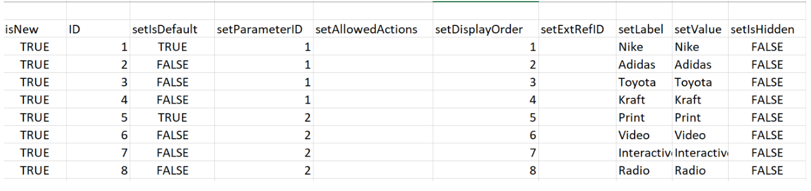

# キック開始シナリオ：複数オプションのカスタムフィールドをWorkfrontに読み込む

キックスタート機能を使用して、Adobe Workfrontで複数のオプションを持つカスタムフィールドを読み込むことができます。

複数のオプションを持つカスタムフィールドの例を次に示します。

* 複数選択ドロップダウン
* ドロップダウン
* チェック ボックス
* ラジオ ボタン

これらのフィールドには、多数（場合によっては数百）のオプションが含まれることがあります。 Kick-Start 機能を使用して読み込むと、Workfront管理者として多くの時間を節約し、エラーを回避できます。

>[!IMPORTANT]
>
>キックスタートを使用して複数のオプションを持つカスタムフィールドを読み込むには、以下のセクションで説明されている手順に従う必要があります。
>
>1. Workfrontからの既存のカスタムデータのエクスポート（オプション手順）
>1. カスタムデータ用のキックスタートテンプレートのエクスポート
>1. Excel の「キック開始」スプレッドシートを設定する
>1. Excel スプレッドシートをWorkfrontにアップロード

## Workfrontからの既存のカスタムデータのエクスポート（オプション手順）

Workfrontのデータベース構造に詳しくない場合や、Workfrontで情報の読み込みが必要な kick-start ファイルに詳しくない場合は、読み込むフィールドと同様に、Workfrontから既存の情報を使用して kick-start ファイルを書き出すことをお勧めします。

例えば、カスタムフォームやカスタムフィールドを読み込む場合は、最初に既存のカスタムデータを含むキックスタートファイルを書き出す必要があります。

最初に既存のデータをエクスポートすると、データをスキャンし、新しいデータの形式を設定する必要があるかを確認できます。

Workfrontデータベースのオブジェクトと構造について十分に理解している場合は、次の節に進んでください。

Workfrontから既存のデータを書き出すには：

1. クリック **メインメニュー > 設定** Workfrontインターフェイスの右上隅に表示されます。
1. を展開します。 **システム** 左側のメニューから、 **データを書き出し（キックスタート）**.

   

1. 選択 **カスタムデータ** （内） **含めるもの** 」セクションに入力します。

   

1. 選択 **.xlsx ファイル** （内） **ダウンロード形式** 」セクションに入力します。

   >[!TIP]
   >
   >    システム内のカスタムデータの量によっては、この処理に長い時間がかかる場合があります。

   

1. クリック **ダウンロード**. .xlsx ファイルがお使いのコンピューターにダウンロードされます。 に移動して開きます。

   

1. ダウンロードしたファイルを調べ、次の詳細をメモします。

   * ファイルには複数のシートが含まれています。 すべてのシートの情報を知る必要がない場合もありますが、情報の読み込みには一部のシートを使用します。 コンテンツの内容、特に各シートのコンテンツの形式について理解するには、少し時間を割いてください。
   * 列名と、各列のデータが表示される形式に特に注意してください。
   * どのシートの列の名前や順序も変更しないでください。 列ヘッダーは、各行に情報を入力する必要があるフィールドを示します。 列ヘッダーが太字で表示されている場合は、必須フィールドなので、その列に情報を入力する必要があります。

   >[!IMPORTANT]
   >
   >一部の列ヘッダーが太字で表示されない場合がありますが、それでも必須の場合があります。

   * 後で参照できるように、ダウンロードしたファイルを保持して、次の節に進みます。

## カスタムデータ用のキックスタートテンプレートのエクスポート

システム内の既存のカスタムフィールドに関する情報をスキャンした後、新しいキックスタートテンプレートをダウンロードして、インポートで使用できます。

1. クリック **メインメニュー > 設定** Workfrontインターフェイスの右上隅に表示されます。

1. を展開します。 **システム** メニューを左に表示します。

1. クリック **データを読み込み（キック開始）**.

   

1. Adobe Analytics の **空のキックスタートスプレッドシートをダウンロード** 領域で、 **カスタムデータ** チェックボックスをオンにして「 」をクリックします。 **ダウンロード**.

   

   空のキックスタートファイルがコンピュータにダウンロードされます。

   >[!NOTE]
   >
   >ファイル内のシート数、名前、各シート内の列の数、名前は、既存のカスタムデータを含む上記のセクションでダウンロードしたキックスタートの列と同じにする必要があります。

## Excel の「キック開始」スプレッドシートを設定する

Excel スプレッドシートにデータを入力する前に、上記の節で説明したキックスタートテンプレートをダウンロードします。

>[!IMPORTANT]
>
>アドホック Excel スプレッドシートを使用して情報を読み込まないでください。 キックスタート機能を使用してWorkfrontに情報を読み込むスプレッドシートは、Workfrontからダウンロードしたファイルの内容と一致し、この記事で説明している内容に一致している必要があります。

Excel スプレッドシートに新しいカスタムフィールドの情報を入力するには：

1. 前の節でダウンロードした Excel スプレッドシートを開き、多数のシートが表示されていることを確認します。 各シートは、アプリケーション内の 1 つのオブジェクトを表します。

   >[!INFO]
   >
   >例： **パラメーター** （カスタムフィールドを指します）。 **パラメーターオプション**（カスタムフィールドオプションを参照）、 **カテゴリ** （カスタムフォームを参照）。
   >
   >オブジェクトの名前と属性は、Workfrontデータベースでサポートされている形式で記述する必要があります。
   >
   >これらのオブジェクトの意味について詳しくは、 [用語集 [!DNL Adobe Workfront] 用語](../../../workfront-basics/navigate-workfront/workfront-navigation/workfront-terminology-glossary.md).
   >
   >Workfrontデータベース内のオブジェクトの名前について詳しくは、 [API エクスプローラ](../../../wf-api/general/api-explorer.md).
   >
   >

1. 次の情報が正しくフォーマットされていることを確認します。

   * すべてのシートの最初の行は空のままにする必要があります。空の場合は、インポートによってエラーが発生します。
   * 各シートの列見出しは、インポート時に設定できるオブジェクトの属性を表します。 シートを書き出す際に、すべての列見出しを同じ順序に保つ必要があり、名前を変更することはできません。
   * 太字の列ヘッダーは必須フィールドで、値を持つ必要があります。

     >[!TIP]
     >
     >一部の列は太字ではありませんが、必須です。 例えば、 `isNew` および `ID` 列は太字ではありませんが、必須フィールドです。

1. を選択します。 `**PARAM Parameter`**シートを作成し、次の必須列に新しいカスタムフィールドに関する情報を追加します。

   * **`isNew`** =入力 **`TRUE`** 新しいカスタムフィールドを表す各行のこの列。 これは、フィールドが新しいもので、Workfrontに存在しないことを示します。

     >[!TIP]
     >
     >    行が既にWorkfrontにある既存のフィールドを表す場合は、「 **`isNew`** = **`FALSE`**.

   * **`ID`** =は、新しいフィールドを表す各行の一意の数値である必要があります。 各新しいフィールドに一意の番号が含まれている限り、1 から始まる任意の数字を使用できます。
   * **`setDataType`** =新しいフィールドを表す各行に対して、フィールドがサポートするデータ型を入力します。 データタイプは、データベースに表示されるとおりに入力する必要があります。 次のデータタイプから選択します。
      * **`NMBR`** （数値）
      * **`CURC`** （通貨の場合）
      * **`TEXT`** （テキストの場合）
   * `**setDisplaySize**`=表示サイズ (&#39;**setDisplaySize**&#39;) は、任意の複数のオプションのカスタムフィールドに対して常に 0 になります。
   * **`setDisplayType`** =新しいフィールドを表す各行に対して、フィールドの表示タイプを入力します。 表示タイプは、データベースに表示されるとおりに入力する必要があります。

     複数オプションのカスタムフィールドの場合は、次のオプションから選択します。

      * **`MULT`** 複数選択ドロップダウンの場合
      * **`SLCT`** （ドロップダウン用）
      * **`RDIO`** （ラジオボタンの場合）
      * **`CHCK`** チェックボックス

     >[!TIP]
     >
     >データタイプおよび表示タイプの情報を見つけるには、 [API エクスプローラ](../../../wf-api/general/api-explorer.md)、を展開します。 **パラメーター** オブジェクトを選択し、以下の属性を探します。 **フィールド** タブをクリックします。

   * **`setName`** = Workfrontで表示するカスタムフィールドの名前を入力します。

     >[!INFO]
     >
     >例えば、 _ブランド_、チェックボックスフィールド、 _メディア_：ラジオボタンフィールド。

   * The **`setName`** そして **`setValue`** 通常、列には同じ情報が含まれ、新しいフィールドに対するWorkfrontインターフェイスでの必要な名前が反映されている必要があります。

   フィールドの値は、例えば、レポートに表示される名前です。名前は、オブジェクトに添付されたカスタムフォームに表示されます。

   詳しくは、 [カスタムフォームにカスタムフィールドを追加する](../../../administration-and-setup/customize-workfront/create-manage-custom-forms/add-a-custom-field-to-a-custom-form.md).

   

1. を選択します。 **`POPT Parameter Options`** シートを作成し、次の必須列の各カスタムフィールドのオプションに関する情報を追加します。

   * **`isNew`** =入力 **`TRUE`** 新しいフィールドオプションを表す各行のこの列。

     >[!TIP]
     >
     >    行が既存のオプションを表す場合は、「 **`isNew`** = **`FALSE`**.

   * **`ID`** =は、新しいオプションを表す各行の一意の数値である必要があります。 新しい各オプションに一意の番号が指定されている限り、1 から始まる任意の数字を使用できます。
   * **`setIsDefault`** =入力 `TRUE` デフォルトで表示するオプション、および `FALSE` （その他のすべてのオプションの場合）。  例えば、次のような場合に、 _ナイキ_ のデフォルトのオプション _ブランド_ および _印刷_ のデフォルトのオプション _メディア_.

     >[!TIP]
     >
     >各フィールドに指定できるデフォルトのオプションは 1 つだけです。

   * **`setParameterID`** = _ブランド_ カスタムフィールドには **`setParameterID`** が 1 に設定され、 _メディア_ 持ってい**`setParameterID`**/2 The `PARAM` および `POPT` シートは相互に参照され、どのオプションがどのカスタムフィールドに属しているかを示します。
   * **`setDisplayOrder`**=表示順列は、カスタムフィールドでオプションが表示される順序を示します。 どのフィールドに属するかに関係なく、1 から始めて、すべてのオプションを昇順で続行できます。 ここで重要なのは、各オプションに一意の数字を設定することです。
   * The **`setLabel`** そして `**setValue`**列には通常同じ情報が含まれ、Workfront UI で必要な名前が反映されている必要があります。 オプションの値は、例えば、レポートに表示される名前です。ラベルは、オブジェクトに添付されると、カスタムフォームに表示されます。 詳しくは、 [カスタムフォームにカスタムフィールドを追加する](../../../administration-and-setup/customize-workfront/create-manage-custom-forms/add-a-custom-field-to-a-custom-form.md).
   * **`setIsHidden`** =入力 `TRUE` 任意のオプションを非表示にする場合。

   

1. （オプション）後で新しいフィールドを追加できるカスタムフォームも作成する場合は、  **`CTGY Category`** カスタムフォーム情報の次の必須列をシートに追加して更新します。

   * **`isNew`** =入力 **`TRUE`** 新しいカスタムフォームを表す各行のこの列。
   * **`ID`** =新しいフォームを表す各行に一意の番号を入力します。 新しいオプションまたは行に一意の番号が付いている限り、1 から始まる任意の数字を使用できます。
   * **`setGroupID`** =自分のホームグループ、またはシステム内で、このフォームにアクセスするメンバーのグループ ID を追加します。 必須フィールドです。

   次の情報を見つけるには、 `ID` グループの場合は、グループレポートを作成し、 `ID` フィールドを選択するか、グループに移動して、そのグループの URL を探します。 グループ ID は、グループのページの URL に含まれます。 例えば、グループの URL が `https://companyName.my.workfront.com/group/575b000800467a6f66e747932c807464/members`の場合、グループ ID は `575b000800467a6f66e747932c807464`.

   * **`setCatObjCode` **=これは、フォームを作成するオブジェクトの種類のオブジェクトコードです。 次のオプションからコードを入力します。
      * **`CMPY`** （会社用）
      * **`TASK`** タスクの
      * **`PROJ`** （プロジェクト用）
      * **`PORT`** Portfolio
      * **`PRGM`** （プログラム用）
      * **`USER`** （ユーザー用）
      * **`DOCU`** （ドキュメント用）
      * **`OPTASK`** （問題）
      * **`EXPNS`** 費用
      * **`ITRN`** （反復）
      * **`BILL`** （請求レコード）
      * **`GROUP`** （グループ用）

     >[!NOTE]
     >
     >複数オブジェクトのフォームの場合は、UI でフォームを作成する際に最初に選択するオブジェクトを入力します。 例えば、 `setCatObjCode` から `TASK`をクリックした場合、Workfrontインターフェイスで「タスク」を選択し、次に「問題」、「Portfolio」などを選択したとしても、フォームをプロジェクトで使用できないようにする必要があります。

   * **`setName`** = Workfrontインターフェイスに表示するカスタムフォームの名前です。

     

1. スプレッドシートを.xls または.xlsx ファイルとしてコンピューターに保存します。 Excel スプレッドシートが入力され、Workfrontに読み込む準備が整いました。

## Excel スプレッドシートをWorkfrontにアップロード

前の節で説明した手順を実行した後、次の手順に従って、新しいフィールドおよびフォームをWorkfrontにアップロードします。

1. クリック **データを読み込み** **（キックスタート）** **「メイン」メニュー > 「設定」>「システム」** メニュー。

1. クリック **ファイルを選択** セクションの下で **Kick-Start スプレッドシートを使用してデータをアップロード**.

1. 作成した Excel スプレッドシートをコンピューター上で参照し、見つかったら選択します。  ファイルがWorkfrontで認識されると、「アップロード」ボタンが青に変わります。
1. クリック **アップロード。**

   

1. インポートが成功したことを示す通知が表示されます。 読み込む情報の量によっては、この手順に数秒から 1 分かかる場合があります。

   

   新しいカスタムフィールドとフォームがWorkfrontシステムに追加されました。 これらは、「セットアップ」の「カスタムForms」領域にあります。

   >[!NOTE]
   >
   >新しいフォームと読み込んだフィールドは、まだ接続されていません。 カスタムフィールドを含まないフォームがインポートされます。 フィールドは、新しいカスタムフォームまたは別の既存のカスタムフォームに手動で追加する必要があります。

   カスタムフォームへのフィールドの追加について詳しくは、 [カスタムフォームにカスタムフィールドを追加する](../../../administration-and-setup/customize-workfront/create-manage-custom-forms/add-a-custom-field-to-a-custom-form.md).

1. （条件付き）インポートが成功しなかった場合は、問題を示すエラーメッセージが表示されます。 問題が発生したフィールド、シート、行番号を特定し、Excel ファイルの情報を修正してから、もう一度ファイルをインポートしてみてください。

   

1. （条件付き）エラーメッセージに記載されているように、問題の内容に応じて、一部の情報が既にインポートされている場合があります。 シートを再度読み込む前に、次のいずれかの操作を行う必要があります。

   * Workfrontから正常に読み込まれた情報をカスタムForms領域から削除し、エラーメッセージに示される修正をおこないます。
   * 読み込み済みのフィールドやフォームについて、既にシステム上にフィールドやフォームが存在することを示し、修正を行います。
フィールドまたはカスタムフォームが既にWorkfrontにあることを示すには、 `inNew` フィールドは次のようにマークされます： `FALSE` フォームに関する情報を含むシートの (`CTGY`) またはフィールド (`PARAM`) をクリックして、インポートシートに貼り付けます。
