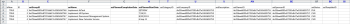

# キックスタートのシナリオ：シンプルなプロジェクトおよびタスクの読み込みの準備

キックスタートのメソッドを使用して、基本的なプロジェクトとタスクの読み込みに使用できる設定とコントロールについて詳しく説明します。

## シナリオ

実装チームは、アクティブなプロジェクトのプロジェクトおよびタスクの情報を、システムに手動で入力するのではなく、読み込みを実行します。

* [プロジェクト](#projects)
* [タスクリスト](#task-list)

### プロジェクト {#projects}

次の表に、4 つのプロジェクトおよびキックスタートのファイル形式にマッピングする必要がある基本的な詳細を示します。

このシナリオでは、ユーザーが既に Adobe Workfront に読み込まれていることを前提とします。ユーザーがまだ Workfront に存在しない場合は、別の名前を使用するか、このシナリオより前にユーザーと共にキックスタートのシナリオを完了します。

1. Workfront を実装します。

   | 予定開始日 | 今日 |
   |---|---|
   | プロジェクトマネージャー | Jennifer Campbell |
   | プロジェクトスポンサー | Marc Lewis |
   | グループ | マーケティング |
   | 会社 | *YourCompany* |

   {style="table-layout:auto"}

1. HR システムを実装します。

   | 予定開始日 | 20XX年7月14日 |
   |---|---|
   | プロジェクトマネージャー | Pam Reynolds |
   | プロジェクトスポンサー | Marc Lewis |
   | グループ | マーケティング |
   | 会社 | *YourCompany* |

   {style="table-layout:auto"}

1. ドキュメント管理システムを実装します。

   | 予定開始日 | 20XX年8月23日 |
   |---|---|
   | プロジェクトマネージャー | Jennifer Campbell |
   | プロジェクトスポンサー | Ray Andrews |
   | グループ | IT |
   | 会社 | *YourCompany* |

   {style="table-layout:auto"}

1. 新しいカレンダーシステムを実装します。

   | 予定開始日 | 20XX年9月6日 |
   |---|---|
   | プロジェクトマネージャー | Pam Reynolds |
   | プロジェクトスポンサー | Ray Andrews |
   | グループ | IT |
   | 会社 | *YourCompany* |

   {style="table-layout:auto"}

### タスクリスト {#task-list}

次のタスクリストは、プロジェクトの非常に簡略化されたタスクリストを表示します。プロジェクト間の唯一の違いは、各プロジェクトの開始日と進行状況です。

親タスクは、子タスクの期間、作業内容および完了率を継承します。サマリータスクになるために、これらの値を設定する必要はありません。

>[!NOTE]
>
>このシナリオで示す手順は、[キックスタートのシナリオ：会社、グループ、役割およびユーザーのキックスタートの準備](../../../administration-and-setup/manage-workfront/using-kick-starts/kick-starts-scenario-company-group-role-user-prep.md)で提供される手順ほど明確ではありません。会社シートおよびグループのシートから値を検索してコピーする方法を既に学習していることを前提としているため、これらの手順については説明しますが、具体的には説明しません。

1. 設定を行います。
1. ユーザーを読み込みます。

   <table style="table-layout:auto"> 
    <col width="50%"> 
    <col width="50%"> 
    <tbody> 
     <tr> 
      <td role="rowheader">割り当て先</td> 
      <td>Ray Andrews</td> 
     </tr> 
     <tr> 
      <td role="rowheader">親タスク</td> 
      <td>1</td> 
     </tr> 
     <tr> 
      <td role="rowheader">期間</td> 
      <td>1 時間</td> 
     </tr> 
     <tr> 
      <td role="rowheader">ワーク</td> 
      <td>1 時間</td> 
     </tr> 
     <tr> 
      <td role="rowheader">完了率</td> 
      <td> 
Workfront：0%
 
時間：0%
 
ドキュメント：100%
 
カレンダー：100%
 </td> 
     </tr> 
    </tbody> 
   </table>

1. 権限を設定します。

   <table style="table-layout:auto"> 
    <col width="50%"> 
    <col width="50%"> 
    <tbody> 
     <tr> 
      <td role="rowheader">割り当て先</td> 
      <td>Ray Andrews</td> 
     </tr> 
     <tr> 
      <td role="rowheader">親タスク</td> 
      <td>1</td> 
     </tr> 
     <tr> 
      <td role="rowheader">先行</td> 
      <td>2</td> 
     </tr> 
     <tr> 
      <td role="rowheader">期間</td> 
      <td>1 時間</td> 
     </tr> 
     <tr> 
      <td role="rowheader">ワーク</td> 
      <td>1 時間</td> 
     </tr> 
     <tr> 
      <td role="rowheader">完了率</td> 
      <td> 
Workfront：0%
 
時間：0%
 
ドキュメント：100%
 
カレンダー：100%
 </td> 
     </tr> 
    </tbody> 
   </table>

1. グループを作成します。

   <table style="table-layout:auto"> 
    <col width="50%"> 
    <col width="50%"> 
    <tbody> 
     <tr> 
      <td role="rowheader">割り当て先</td> 
      <td>Ray Andrews</td> 
     </tr> 
     <tr> 
      <td role="rowheader">親タスク</td> 
      <td>1</td> 
     </tr> 
     <tr> 
      <td role="rowheader">先行</td> 
      <td>4</td> 
     </tr> 
     <tr> 
      <td role="rowheader">期間</td> 
      <td>2 日間</td> 
     </tr> 
     <tr> 
      <td role="rowheader">ワーク</td> 
      <td>4 時間</td> 
     </tr> 
     <tr> 
      <td role="rowheader">完了率</td> 
      <td> 
Workfront：0%
 
時間：0%
 
ドキュメント：100%
 
カレンダー：25%
 </td> 
     </tr> 
    </tbody> 
   </table>

1. トレーニングを準備します。

   <table style="table-layout:auto"> 
    <col width="50%"> 
    <col width="50%"> 
    <tbody> 
     <tr> 
      <td role="rowheader">割り当て先</td> 
      <td>Chris Manning</td> 
     </tr> 
     <tr> 
      <td role="rowheader">期間</td> 
      <td>2 日間</td> 
     </tr> 
     <tr> 
      <td role="rowheader">ワーク</td> 
      <td>4 時間</td> 
     </tr> 
     <tr> 
      <td role="rowheader">完了率</td> 
      <td> 
Workfront：0%
 
時間：0%
 
ドキュメント：50%
 
カレンダー：100%
 </td> 
     </tr> 
    </tbody> 
   </table>

1. 継続的なサポートポリシーを作成します。

   <table style="table-layout:auto"> 
    <col width="50%"> 
    <col width="50%"> 
    <tbody> 
     <tr> 
      <td role="rowheader">割り当て先</td> 
      <td>Chris Manning</td> 
     </tr> 
     <tr> 
      <td role="rowheader">期間</td> 
      <td>2 日間</td> 
     </tr> 
     <tr> 
      <td role="rowheader">ワーク</td> 
      <td>4 時間</td> 
     </tr> 
     <tr> 
      <td role="rowheader">完了率</td> 
      <td> 
Workfront：0%
 
時間：0%
 
ドキュメント：50%
 
カレンダー：0%
 </td> 
     </tr> 
    </tbody> 
   </table>

1. ロールアウトします。

   | 先行 | 1、6、7 |
   |---|---|

   {style="table-layout:auto"}

1. ユーザーをトレーニングします。

   <table style="table-layout:auto"> 
    <col width="50%"> 
    <col width="50%"> 
    <tbody> 
     <tr> 
      <td role="rowheader">割り当て先</td> 
      <td>Chris Manning</td> 
     </tr> 
     <tr> 
      <td role="rowheader">親タスク</td> 
      <td>8</td> 
     </tr> 
     <tr> 
      <td role="rowheader">期間</td> 
      <td>1 日</td> 
     </tr> 
     <tr> 
      <td role="rowheader">ワーク</td> 
      <td>2 時間</td> 
     </tr> 
     <tr> 
      <td role="rowheader">完了率</td> 
      <td> 
Workfront：0%
 
HR：0%
 
ドキュメント：0%
 
カレンダー：0%
 </td> 
     </tr> 
    </tbody> 
   </table>

## テンプレートのダウンロード

キックスタートのページに移動します。会社、グループ、プロジェクト、タスク、ユーザーの各オブジェクトを選択します。「既存のデータを含める」チェックボックスを選択します（これにより、会社 ID、グループ ID、ユーザー ID を素早く参照します）。「ダウンロード」ボタンをクリックします。

## プロジェクト詳細の入力

ダウンロードした Workfront.xlsx ファイルを開きます。「PROJ」プロジェクトシートに移動します。

\
Workfront で以前にプロジェクトを作成していなければ、空であるはずです。\

>[!NOTE]
>
>スプレッドシートのウィンドウ枠の固定ツールを使用するか、不要な列を非表示にしたり削除したりすると、シートが使いやすくなります。ただし、必須の列や後で使用する列を削除しないように注意してください。

次のプロジェクトフィールドの値を設定します。

* **isNew 列の設定**
isNew 列の行 3～6 に TRUE を入力します。
* **一意の ID の設定**
ID 列の各行に一意の ID を入力します。通常、新しいレコードを作成する際は、1 から始まる整数で構いません。
* **プロジェクト名の設定**
setName 列に各プロジェクトの名前を 入力します。
* **プロジェクトスケジュールの設定**

  setScheduleID フィールドにプロジェクトで使用するスケジュールの ID を 入力します。

* **プロジェクトの予定開始日の設定**

  setPlannedStartDate 列の日時に、プロジェクトを開始する日時を入力します。空のままにすると、Workfrontは、ブラウザーのタイムゾーンに従って、現在の日付とその日の午前 0 時のタイムスタンプを使用してプロジェクトを読み込みます。

* **タスク番号の設定**
setTaskNumber 列に値を入力して、プロジェクト計画にタスクを表示する順序を制御します。
* **プロジェクトの日付を入力します。**
各プロジェクトの予定開始日を setPlannedStartDate 列に入力します。
* **その他の必要な詳細を設定します。**
必要に応じて、説明や現在のステータスなど、その他の詳細を入力します。「Group」グループシートで各プロジェクトのグループ ID を検索し、それぞれのプロジェクトの setGroupID 列に入力します。「CMPY」会社シートでプロジェクトの会社 ID を検索し、setCompanyID 列に入力します。「USER」ユーザーシートで各プロジェクト所有者のユーザー ID を検索し、これを setOwnerID 列に入力します。「USER」ユーザーシートで各プロジェクトスポンサーのユーザー ID を検索し、これを setOwnerID 列に入力します。

>[!NOTE]
>
>ステータスフィールドと優先度フィールドの許容値は、Workfront のワークフロー設定エリアで、各オブジェクトのステータスと優先度の環境設定を参照することで確認できます。

## 入力タスクの詳細

キックスタートを使用してプロジェクトを読み込む際に、プロジェクトのタスクに関する情報を追加できます。

ダウンロードした Workfront.xlsx ファイルを開きます。**「TASK」タスクシートに移動します。**

Workfront で既にタスクを作成している場合を除き、このシートは空白にしておく必要があります。

タスクをマッピングする最も簡単な方法は、（特に、各プロジェクトでタスクが同じ場合）一度に 1 つのプロジェクトです。その後、最初のプロジェクトのタスクプランをコピーし、後続のプロジェクトのタスクプランを少し調整できます。残りの手順では、Workfront プロジェクトの実装のみのタスクを作成することを前提としています。シナリオに従って、1 つのプロジェクトにつき 9 つのタスクを読み込むので、isNew 列の 3 行目から 11 行目までに TRUE を入力します。

次のタスクフィールドに値を設定します。

* **ID を設定**
ID 列の各行に一意の ID を入力します。
* **名前を設定**
setName 列にタスク名を入力します。
* **プロジェクト ID の確認**
Workfront プロジェクトの実装用に設定した ID を入力します。「PROJ」プロジェクトシートを参照し、正しい ID であることを確認します。
* **ユーザーを設定**
「USER」ユーザーシートに移動して、各タスクに割り当てられたユーザーの ID を検索し、setAssignedToID 列の各セルに検索した値を入力します。
* **タスクの関係の特定**
2 番目から 5 番目のタスクには、setParentID 列に 1 を入力します。9 番目のタスクには、setParentID 列に 8 を入力します。setPredecessorString 列に、各先行タスクのタスク番号を入力します。このシナリオの 8 番目のタスクなどのように、タスクに複数の先行タスクがある場合、各先行タスク ID を区切るために、コンマを使用する必要があります。「先行タスク関係の作成」の記事で説明されている簡略表記法を使用して、非終了 - 開始関係に間隔を置いて先行タスクを定義できます。
* **期間を設定**
setDuration フィールドにタスクの時間数、日数、週数または月数を入力して、各タスクの期間を設定します。次に、setDurationUnit フィールドに期間単位を入力します。

  |   | 入力可能値 |
  |---|---|
  | 分 | M |
  | 時間 | H |
  | 日 | D |
  | 週 | W |
  | 月 | T |

  分は時間単位の小数として表すこともできます（例：分 = 5 時間）

* 各タスクの作業量を setWorkRequired フィールドに設定します。次に、setWorkUnit フィールドに作業単位を入力します。「要求された作業」値が期間と異なる場合は、setDurationType フィールドに A を入力する必要もあります。

  | 期間タイプ | 入力可能値 |
  |---|---|
  | 予定割り当て時間 | A |
  | 予定作業 | W |
  | 残存作業時間の優先 | D |
  | シンプル | S |

* 各タスクの setPercentComplete フィールドに、完了率の整数表記を入力します。この値には、パーセント記号（%）を含めないでください。
* 必要に応じて、作成する各タスクの説明とその他の詳細を含めます。

  

* 先行タスク関係に基づいているので、setPlannedStartDate 列と setTaskConstraint 列は、このプロジェクトのタイムラインの作成には使用されません。その代わりに、各タスクの日付を入力できます。その場合は、setTaskConstraint 列に有効なタスク制約も指定してください。このフィールドの有効な値について詳しくは、タスク制約の記事と関連記事を参照してください。

  このシナリオの場合、読み込む他のプロジェクトのタスクを作成する最も簡単な方法は、定義したタスクをコピーし、下の 12 行目以降にペーストすることです。続いて、以下を行います。

   1. ID 列の値を付け直します。
   1. setProjectID 列を、次に行うプロジェクトに設定した値に更新します。
   1. setParentID 値と setPredecoderString 値を更新して、このプロジェクトのタスクに割り当てた新しい ID が反映されるようにします。
   1. タスクの割り当てと完了率を更新します。
   1. 次回のプロジェクトのタスクに対して、これらの手順を繰り返します。

* **Excel ファイルの読み込み**

  [キックスタートテンプレートを使用した Adobe Workfront へのデータの読み込み](../../../administration-and-setup/manage-workfront/using-kick-starts/import-data-via-kickstarts.md)で示されている手順に従います。
