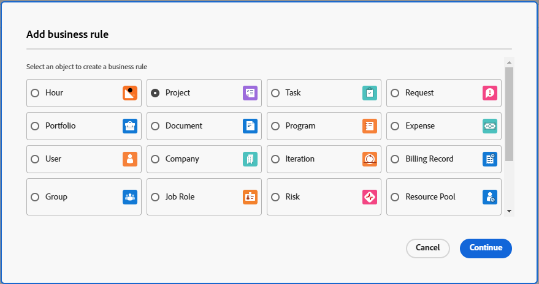

# ビジネスルールを作成および編集

ビジネスルールを使用すると、Workfront オブジェクトに検証を適用し、特定の条件が満たされた場合にオブジェクトを作成、編集または削除できないようにすることができます。 ビジネスルールは、データの整合性を損なう可能性のあるアクションを防ぐことで、データ品質と業務効率の向上に役立ちます。

1つのビジネスルールは、1つのオブジェクトにのみ割り当てることができます。 例えば、特定の条件でプロジェクトを編集しないビジネスルールを作成した場合、同じルールをタスクに適用することはできません。 タスクに対して同じ条件を持つ別のビジネスルールを作成する必要があります。

アクセスレベルとオブジェクト共有は、ユーザーがオブジェクトとやり取りする際のビジネスルールよりも優先されます。 例えば、ユーザーがプロジェクトの編集を許可しないアクセスレベルまたは権限を持っている場合、特定の条件でプロジェクトの編集を許可するビジネスルールよりも優先されます。

1つのオブジェクトに複数のビジネスルールが適用される場合、ルールはすべてフォローされますが、特定の順序で適用されません。 例えば、2つのビジネスルールがあります。 2月の月に費用を作成することを制限します。 2つ目は、プロジェクトのステータスが「完了」の場合に、プロジェクトを編集できないようにします。 ユーザーが6月に完了したプロジェクトに費用を追加しようとすると、2つ目のルールがトリガーされたため、費用を追加できません。

ビジネスルールは、APIおよびWorkfront インターフェイスを使用したオブジェクトの作成、編集、削除に適用されます。

>[!NOTE]
>
>ビジネスルールは特定のアクションをブロックするため、実稼動環境で有効にする前に、必ずサンドボックスまたはプレビュー環境でビジネスルールを最初に設定し、徹底的にテストする必要があります。

## アクセス要件

+++ 展開すると、この記事の機能のアクセス要件が表示されます。

<table style="table-layout:auto"> 
 <col> 
 <col> 
 <tbody> 
  <tr>
   <td>Adobe Workfront パッケージ
   </td>
   <td> <p>Ultimate</p>
    <p>ワークフロー Ultimate</p>
   </td>
  </tr> 
  <tr> 
   <td>Adobe Workfront プラン</td> 
   <td>標準</td> 
  </tr> 
  <tr> 
   <td>アクセスレベル設定</td> 
   <td>システム管理者</td> 
  </tr>  
 </tbody> 
</table>

詳しくは、[Workfront ドキュメントのアクセス要件](/help/quicksilver/administration-and-setup/add-users/access-levels-and-object-permissions/access-level-requirements-in-documentation.md)を参照してください。

+++

## ビジネスルールのシナリオ

ビジネスルールの形式は、「定義された条件が満たされた場合、ユーザーはオブジェクトに対するアクションを禁止され、メッセージが表示されます」です。

ビジネスルールのプロパティおよびその他の関数の構文は、カスタムフォームの計算フィールドの構文と同じです。 構文について詳しくは、[&#x200B; フォームデザイナーで計算フィールドを追加する](/help/quicksilver/administration-and-setup/customize-workfront/create-manage-custom-forms/form-designer/design-a-form/add-a-calculated-field.md)を参照してください。

IF ステートメントについて詳しくは、[&quot;IF&quot; ステートメントの概要](/help/quicksilver/reports-and-dashboards/reports/calc-cstm-data-reports/if-statements-overview.md)および[計算カスタムフィールドの条件演算子](/help/quicksilver/reports-and-dashboards/reports/calc-cstm-data-reports/condition-operators-calculated-custom-expressions.md)を参照してください。

ユーザーベースのワイルドカードについて詳しくは、[&#x200B; ユーザーベースのワイルドカードを使用してレポートを一般化する](/help/quicksilver/reports-and-dashboards/reports/reporting-elements/use-user-based-wildcards-generalize-reports.md)を参照してください。

日付ベースのワイルドカードについて詳しくは、[日付ベースのワイルドカードを使用してレポートを一般化する](/help/quicksilver/reports-and-dashboards/reports/reporting-elements/use-date-based-wildcards-generalize-reports.md)を参照してください。

API ワイルドカードは、ビジネスルールでも使用できます。 `$$ISAPI`を使用して、API内でのみルールをトリガーします。 `!$$ISAPI`を使用して、ユーザーインターフェイスでのみルールを適用し、ユーザーがAPIを通じてルールをバイパスできるようにします。

* 例えば、このルールは、ユーザーがAPIを介して完了したプロジェクトを編集することを禁止します。 ワイルドカードが使用されていない場合、ルールはユーザーインターフェイスとAPIの両方でアクションをブロックします。

  ```
  IF({status} = "CPL" && $$ISAPI, "You cannot edit completed projects through the API.")
  ```

式では、`$$BEFORE_STATE`および`$$AFTER_STATE`のワイルドカードを使用して、編集前後にオブジェクトのフィールド値にアクセスします。

* これらのワイルドカードは、どちらも編集トリガーで使用できます。 編集トリガーのデフォルトのステート（ステートがエクスプレッションに含まれていない場合）は`$$AFTER_STATE`です。
* オブジェクト作成トリガーでは、before ステートが存在しないため、`$$AFTER_STATE`のみが許可されます。
* オブジェクト削除トリガーでは、後のステートが存在しないため、`$$BEFORE_STATE`のみが許可されます。

ビジネスルールのシナリオには、次のようなものがあります。

* ユーザーは2月の最後の週に新しい費用を追加することはできません。 この式は、次のように記述できます。

  ```
  IF(MONTH($$TODAY) = 2 && DAYOFMONTH($$TODAY) >= 22, "You cannot add new expenses during the last week of February.")
  ```

* ユーザーは、プロジェクトのプロジェクト名を「完了」ステータスで編集することはできません。 この式は、次のように記述できます。

  ```
  IF({status} = "CPL" && {name} != $$BEFORE_STATE.{name}, "You cannot edit the project name.")
  ```

トリガーごとにオブジェクトごとに1つのビジネスルールを許可します。 例えば、1つのトリガールールを編集して問題を解決できます。 ただし、ネストされたIF ステートメントを使用して、数式に複数のルールを含めることができます。

ネストされたIF ステートメントを持つシナリオは次のとおりです。

ユーザーは完了したプロジェクトを編集できず、3月に完了予定日が設定されているプロジェクトを編集することはできません。 この式は、次のように記述できます。

```
IF(
    $$AFTER_STATE.{status}="CPL",
    "You cannot edit a completed project",
    IF(
        MONTH({plannedCompletionDate})=3,
        "You cannot edit a project with a planned completion date in March")
)
```

## 新しいビジネスルールの追加

{{step-1-to-setup}}

1. 左側のパネルで「**ビジネスルール**」をクリックします。
1. 「**新しいビジネスルール**」をクリックします。
1. ビジネスルールを割り当てるオブジェクトタイプを選択し、**続行**&#x200B;をクリックします。

   

   ビジネスルールは、次のオブジェクトに適用できます。

   * プロジェクト
   * タスク
   * イシュー/リクエスト
   * ポートフォリオ
   * ドキュメント
   * プログラム
   * 費用
   * 会社
   * イテレーション
   * 請求記録
   * グループ
   * 労力以外のリソース
   * リスク
   * レートカード
   * 割り当て
   * ユーザー
   * 役割
   * 時間
   * テンプレート
   * 休暇
   * リソースプール

1. ルールビルダーダイアログで、ビジネスルールの&#x200B;**名前**&#x200B;を入力します。
1. 「**はアクティブです**」フィールドで、ルールを保存するときにルールをアクティブにするかどうかを選択します。

   **No**&#x200B;を選択すると、ルールは非アクティブとして保存され、後でアクティブ化できます。

1. ビジネス ルールの&#x200B;**トリガー**&#x200B;を選択します。 オプションは次のとおりです。

   * **オブジェクト作成時：** ユーザーがオブジェクトを作成しようとすると、ルールが適用されます。
   * **オブジェクトの編集時：** ユーザーがオブジェクトを編集しようとすると、ルールが適用されます。
   * **オブジェクトの削除時：** ユーザーがオブジェクトを削除しようとすると、ルールが適用されます。

1. （オプション）ビジネスルールの&#x200B;**説明**&#x200B;と、それが適用されたときの処理を入力します。
1. ビジネスルールダイアログの中央にある数式エディターで、数式を作成します。

   ビジネスルールの形式は、「定義された条件が満たされた場合、ユーザーはオブジェクトに対するアクションを禁止され、メッセージが表示されます」です。

   数式領域では、作成するビジネスルールの部分が条件であり、条件が満たされたときにWorkfrontに表示されるメッセージです。

   * 「オブジェクト」は、ビジネスルールの作成時に選択したオブジェクトタイプです。 ダイアログの見出しに表示されます。
   * 「アクション」は、ルールに対して選択したトリガー（オブジェクトの作成、編集、削除）です。
   * オブジェクトとアクションは既に定義されているため、数式に含めることはできません。
   * ビジネスルールをトリガーすると、カスタムエラーメッセージがユーザーに表示されます。 問題の原因と修正方法について明確な指示を与える必要があります。

     エラーメッセージに静的URLを含めることで、ドキュメントやその他の便利なページにリンクし、ルールの制約の中でユーザーがアクションを変更する方法をガイドできます。

     この例では、「詳細情報」がURLにリンクされます。 `"You are not allowed to add a new project in November.[Learn more](http://url)"` URLは括弧で囲む必要がありますが、括弧内のリンクテキストは必要ありません。 完全なURLを表示することができ、クリック可能なリンクになります。

   

   この例は、プロジェクトのビジネスルールです。 現在の月が11月の場合、ユーザーは新しいプロジェクトを作成できません。このメッセージは、これを説明しています。

   ビジネスルールの詳細な例については、この記事の「[&#x200B; ビジネスルールのシナリオ &#x200B;](#scenarios-for-business-rules)」を参照してください。

1. （オプション）右側のパネルの式&#x200B;**式**&#x200B;と&#x200B;**フィールド**&#x200B;を使用して、ルールの作成を支援します。

   使用可能なアイテムのリストを絞り込む式またはフィールドを検索します。

   使用可能なフィールドのリストは、ビジネスルールのオブジェクトタイプに関連するフィールドに限定されます。

1. ビジネスルールの作成が完了したら、**保存**&#x200B;をクリックします。

>[!NOTE]
>
>ビジネスルールを追加したら、関連するオブジェクトを追加、編集、または削除してルールが適切に適用されていることを確認して、ルールをテストする必要があります。

## ビジネスルールをアクティブ化

ビジネスルールが非アクティブの場合、ビジネスルールのリストの「アクティブです」フィールドに「False」と表示されます。 リスト ビューでルールのステータスを更新することはできません。

ビジネスルールをアクティブ化するには：

1. ルールのリストでビジネスルールを選択し、編集アイコンをクリックします。
1. ビジネスルールダイアログで「**はアクティブです**」の「**はい**」を選択します。
1. 「**保存**」をクリックします。
