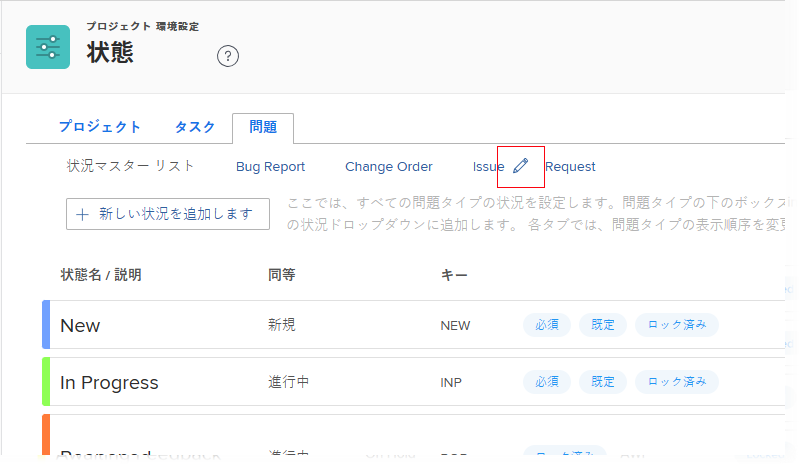

# リクエストタイプを設定

プロジェクトに取り組んでいると、予期しないイベントが発生することがあります。これらの予期しないイベントは、特定のプロジェクトやタスクに対するイシューとして記録できます。リクエストを送信することもできます。リクエストは、リクエストキューとして指定されたプロジェクトのイシューとして記録されます。Adobe Workfront では、イシューとリクエストは互換性があると見なします。

[!DNL Workfront] でのイシューの作成については、[イシューの作成](../../../manage-work/issues/manage-issues/create-issues.md)を参照してください。[!DNL Workfront] でのリクエストの作成については、[ [!DNL Adobe Workfront] リクエストの作成と送信](../../../manage-work/requests/create-requests/create-submit-requests.md)を参照してください。リクエストタイプとプロジェクトの関連付けについては、[プロジェクトのリクエストタイプの定義](../../../manage-work/requests/create-and-manage-request-queues/define-request-types-for-project.md)を参照してください。

## アクセス要件

この記事の手順を実行するには、次のアクセス権が必要です。

<table style="table-layout:auto"> 
 <col> 
 <col> 
 <tbody> 
  <tr> 
   <td role="rowheader">[!DNL Adobe Workfront] プラン</td> 
   <td>任意</td> 
  </tr> 
  <tr> 
   <td role="rowheader">[!DNL Adobe Workfront] ライセンス</td> 
   <td>[!UICONTROL Plan]</td> 
  </tr> 
  <tr> 
   <td role="rowheader">アクセスレベル設定</td> 
   <td> 
[!DNL Workfront] 管理者である必要があります。
 
<b>メモ</b>：まだアクセス権がない場合は、アクセスレベルに追加の制限が設定されていないかどうか [!DNL Workfront] 管理者にお問い合わせください。[!DNL Workfront] 管理者がアクセスレベルを変更する方法について詳しくは、<a href="../../../administration-and-setup/add-users/configure-and-grant-access/create-modify-access-levels.md" class="MCXref xref">カスタムアクセスレベルの作成または変更</a>を参照してください。
 </td> 
  </tr> 
 </tbody> 
</table>

<!--
THIS IS DRAFTED IN FLARE
<h2>Set what issue or request types are allowed for a project</h2>

You can organize the kind of issues or requests that are logged in Workfront by Request Types. This organization is useful for reporting reasons and for helping users understand what kind of unexpected work might occur during the lifetime of a project.

You can specify the type of requests that can be logged on a project when you configure the <strong>Queue Details</strong> area for the project. 

<ol>
<li value="1"> 
 Click <strong>Projects</strong> in the Main Menu.  
 </li>
<li value="2">Click the name of the project to open it.</li>
<li value="3"> In the left panel, click <strong>Queue Details</strong>. </li>
<li value="4"> 
In the <strong>Queue Properties</strong> section, select the <strong>Request Types</strong> you want for the project.
 <note type="note">
You must have at least one request type selected. You can select multiple request types.
</note> </li>
<li value="5"> 
Click <strong>Save</strong>.
 
The request types you specified will be available to select when you enter a new issue on a task or a project, or when you submit a new request to the project.
 </li>
</ol>

-->

## リクエストタイプ名のカスタマイズ

[!DNL Workfront] 管理者は、システム内でのリクエストタイプ名を設定できます。新しい名前は、**[!UICONTROL イシュータイプ]**&#x200B;または&#x200B;**[!UICONTROL リクエストタイプ]**&#x200B;のフィールドが表示される [!DNL Workfront] のエリアに表示されます。

* イシューまたはリクエストを受け取るプロジェクトの&#x200B;**[!UICONTROL キューの詳細]**&#x200B;エリア。
* 新しいイシューを作成するか、新しいリクエストを送信するときに、**[!UICONTROL イシュータイプ]**&#x200B;フィールドの&#x200B;**[!UICONTROL 新しいイシュー]フォーム**&#x200B;でリクエストキューに対して複数のリクエストタイプが選択されている場合。

  [!DNL Workfront] でのイシューの作成について詳しくは、[イシューを作成](../../../manage-work/issues/manage-issues/create-issues.md)を参照してください。

  [!DNL Workfront] でのリクエストの作成について詳しくは、[ [!DNL Adobe Workfront]  リクエストの作成と送信](../../../manage-work/requests/create-requests/create-submit-requests.md)を参照してください。

* キューのトピックを設定するとき、**[!UICONTROL キューのトピックの詳細]**&#x200B;フォーム。\
   キューのトピックの作成について詳しくは、[キューのトピックの作成](../../../manage-work/requests/create-and-manage-request-queues/create-queue-topics.md)を参照してください。

リクエストタイプ名をカスタマイズするには：

1. [!DNL Adobe Workfront] の右上隅にある&#x200B;**[!UICONTROL メインメニュー]**&#x200B;アイコン  をクリックし、**[!UICONTROL 設定]**  をクリックします。

1. **[!UICONTROL プロジェクト環境設定]**／**[!UICONTROL ステータス]**&#x200B;をクリックします。

1. 「**[!UICONTROL イシュー]**」タブをクリックします。
1. 「**[!UICONTROL イシュー]**」タブの上部で、リクエストタイプ名にカーソルを合わせ、表示される&#x200B;**[!UICONTROL 編集]**&#x200B;アイコンをクリックします。

   

1. 表示されるボックスに新しい名前を入力し、**[!UICONTROL Enter]** を押します。

## 異なるリクエストタイプ内でのイシューステータスの設定

各リクエストタイプを異なるイシューステータスに関連付けることができます。また、イシューのタイプに応じて、イシューに対するステータスの表示順を変更することもできます。

イシューステータスのデフォルトの順序の変更とイシューステータスの設定について詳しくは、[ステータスの作成と編集](../../../administration-and-setup/customize-workfront/creating-custom-status-and-priority-labels/create-or-edit-a-status.md)の[ステータスの作成と編集](../../../administration-and-setup/customize-workfront/creating-custom-status-and-priority-labels/create-or-edit-a-status.md)の節を参照してください。
