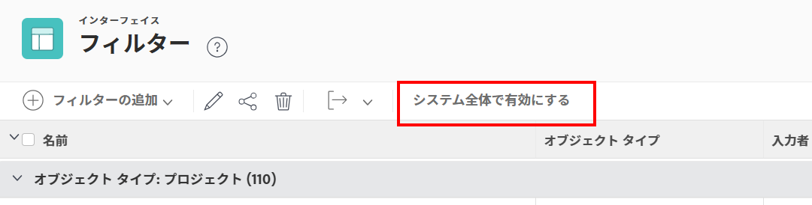

# デフォルトのフィルター、ビュー、グループを作成、編集および共有します

<!--

***DON'T DELETE, DRAFT OR HIDE THIS ARTICLE. IT IS LINKED TO THE PRODUCT, THROUGH THE CONTEXT SENSITIVE HELP LINKS. **

-->

デフォルトのフィルター、ビューおよびグループを作成して、組織内のユーザーが使用できるようにすることができます。

この記事で説明するように、デフォルトのフィルター、ビューおよびグループを作成すると、共有相手のユーザーは、リストを表示する際にそれらを活用できます。 ユーザーは、作成したフィルター、ビューおよびグループに基づいて独自のフィルター、ビューおよびグループを作成できますが、作成したフィルター、ビューおよびグループを直接変更することはできません。

## アクセス要件

この記事の手順を実行するには、次のアクセス権が必要です。

<table style="table-layout:auto"> 
 <col> 
 <col> 
 <tbody> 
  <tr> 
   <td role="rowheader">[!DNL Adobe Workfront] 計画</td> 
   <td>任意</td> 
  </tr> 
  <tr> 
   <td role="rowheader">[!DNL Adobe Workfront] ライセンス</td> 
   <td>[!UICONTROL プラン ]</td> 
  </tr> 
  <tr> 
   <td role="rowheader">アクセスレベル設定</td> 
   <td> 
次の条件を満たす必要があります。 [!DNL Workfront] 管理者。
 
<b>注意</b>:まだアクセス権がない場合は、 [!DNL Workfront] 管理者（アクセスレベルに追加の制限を設定している場合） を参照してください。 [!DNL Workfront] 管理者はアクセスレベルを変更できます。詳しくは、 <a href="../../../administration-and-setup/add-users/configure-and-grant-access/create-modify-access-levels.md" class="MCXref xref">カスタムアクセスレベルの作成または変更</a>.
 </td> 
  </tr> 
 </tbody> 
</table>

## デフォルトのフィルター、ビューまたはグループを作成する

{{step-1-to-setup}}

1. フィルター、表示またはグループ化を作成または編集するかどうかに応じて、次のいずれかの操作を実行します。

   * クリック **[!UICONTROL インターフェイス]** > **[!UICONTROL フィルター]**.

   * クリック **[!UICONTROL インターフェイス] >** **[!UICONTROL 件数]**.

   * クリック **[!UICONTROL インターフェイス]** > **[!UICONTROL グループ化]**.

1. フィルター、表示またはグループ化を作成する場合は、 **[!UICONTROL フィルターを追加]**, **[!UICONTROL ビューを追加]**&#x200B;または **[!UICONTROL グループを追加]**&#x200B;をクリックし、新しいフィルター、ビューまたはグループ化を関連付けるオブジェクトタイプを選択します。

   または

   既存のフィルター、表示またはグループ化を編集する場合は、そのフィルターを選択し、 **[!UICONTROL 編集]** アイコン .

1. フィルター、表示またはグループ化を設定します。

   使用可能なオプションについて詳しくは、次の記事の 1 つを参照してください。

   * [フィルターの概要 ( [!DNL Adobe Workfront]](../../../reports-and-dashboards/reports/reporting-elements/filters-overview.md)
   * [表示の概要 ( [!UICONTROL Adobe Workfront]](../../../reports-and-dashboards/reports/reporting-elements/views-overview.md)
   * [でのグループ化の概要 [!UICONTROL Adobe Workfront]](../../../reports-and-dashboards/reports/reporting-elements/groupings-overview.md)

1. クリック **[!UICONTROL 保存]** 左下隅付近に

システム内のユーザーがフィルター、表示またはグループ化を使用できるようにします。 他のユーザーとのフィルター、表示、またはグループの共有について詳しくは、「 [フィルター、ビュー、またはグループをユーザーが使用できるようにする](#make-filters-views-or-groupings-available-to-users) 」を参照してください。

## レイアウトテンプレートから使用できるフィルター、ビュー、グループの表示/非表示を切り替えます

レイアウトテンプレートから、フィルター、ビュー、グループの表示と非表示を切り替えることができます。 表示されるフィルターは、すべてのユーザーがシステム全体で使用できます。 レイアウトテンプレートを使用して、特定のユーザーまたはグループの表示可能なフィルターを非表示にできます。

>[!NOTE]
>
>ユーザーがアクティブにフィルタ、ビュー、またはグループ化を使用していて、管理者が無効にした場合、ユーザーは新しいフィルタ、ビュー、またはグループ化を選択するまでアクセスできます。 新しいフィルター、表示またはグループ化を選択した後は、非表示のフィルター、表示またはグループ化に戻せなくなります。

レイアウトテンプレートから使用できるフィルター、ビューまたはグループの表示/非表示を切り替えるには：

1. クリック **[!UICONTROL インターフェイス]**&#x200B;をクリックし、次のいずれかをクリックします。 **[!UICONTROL フィルター]**, **[!UICONTROL 件数]**&#x200B;または **[!UICONTROL グループ化]**.

1. （条件付き）ユーザーが使用できるようにするフィルター、表示またはグループを選択し、 **[!UICONTROL システム全体を有効にする]**.

   

   >[!TIP]
   >
   >ほとんどのユーザーがフィルター、表示またはグループ化を使用でき、他のユーザーに対しては非表示にしたい場合は、レイアウトテンプレートを使用できます。 詳しくは、 [レイアウトテンプレートを使用したフィルター、ビューおよびグループのカスタマイズ](/help/quicksilver/administration-and-setup/customize-workfront/use-layout-templates/customize-fvg-list-controls-layout-template.md).

1. （条件付き）ユーザーに対して非表示にするフィルター、表示またはグループを選択し、「 **[!UICONTROL システム全体を無効にする]**. 無効にすると、フィルター、表示またはグループ化がレイアウトテンプレートやシステム全体のユーザーで非表示になります。

## フィルター、ビュー、またはグループをすべてのユーザーが使用できるようにする {#make-filters-views-or-groupings-available-to-users}

次の手順では、フィルター、ビューおよびグループを [!UICONTROL 共有] ダイアログ [!UICONTROL インターフェイス] 領域 [!UICONTROL 設定]. この設定は、レイアウトテンプレートを含むシステム全体のオン/オフスイッチのように機能します。

{{step-1-to-setup}}

1. クリック **[!UICONTROL インターフェイス]**&#x200B;をクリックし、次のいずれかをクリックします。 **[!UICONTROL フィルター]**, **[!UICONTROL 件数]**&#x200B;または **[!UICONTROL グループ化]**.

1. ユーザーが使用できるようにするフィルター、表示またはグループを選択し、 **[!UICONTROL 共有]** アイコン  開く [!UICONTROL アクセスをフィルター], [!UICONTROL アクセスを表示]または [!UICONTROL グループ化アクセス] フォーム。
1. （条件付き）フィルター、表示またはグループ化をシステム内のすべてのユーザーが使用できるようにするには、 **[!UICONTROL ギア]** ドロップダウンメニュー を選択し、「 **[!UICONTROL この機能をシステム全体で表示]**. システム内のすべてのユーザーが、フィルター、表示またはグループ化を表示できるようになりました。

   または

   フィルター、表示またはグループ化を共有する特定のユーザー、チーム、役割、グループまたは会社の名前を入力し、ドロップダウンリストに表示されたら名前をクリックします。

   共有について詳しくは、 [オブジェクトに対する共有権限の概要](../../../workfront-basics/grant-and-request-access-to-objects/sharing-permissions-on-objects-overview.md).

1. 「**[!UICONTROL 保存]**」をクリックします。

   指定したユーザーは、関連付けたオブジェクトタイプを表示する際に、既定のフィルタ、表示、またはグループを表示できます。

## フィルター、ビュー、およびグループの削除

{{step-1-to-setup}}

1. 削除するフィルター、表示、グループ化のいずれを選択するかに応じて、次のいずれかの操作を実行します。

   * クリック **[!UICONTROL インターフェイス]** > **[!UICONTROL フィルター]**

   * クリック **[!UICONTROL インターフェイス]** > **[!UICONTROL 件数]**

   * クリック **[!UICONTROL インターフェイス]** > **[!UICONTROL グループ化]**

1. リスト内の 1 つ以上の項目を選択し、 **[!UICONTROL 削除]** アイコン .
1. フィルター、表示またはグループ化の設定について詳しくは、次の記事のいずれかを参照してください。

   * [フィルターの概要 ( [!DNL Adobe Workfront]](../../../reports-and-dashboards/reports/reporting-elements/filters-overview.md)
   * [表示の概要 ( [!DNL Adobe Workfront]](../../../reports-and-dashboards/reports/reporting-elements/views-overview.md)
   * [でのグループ化の概要 [!DNL Adobe Workfront]](../../../reports-and-dashboards/reports/reporting-elements/groupings-overview.md)
