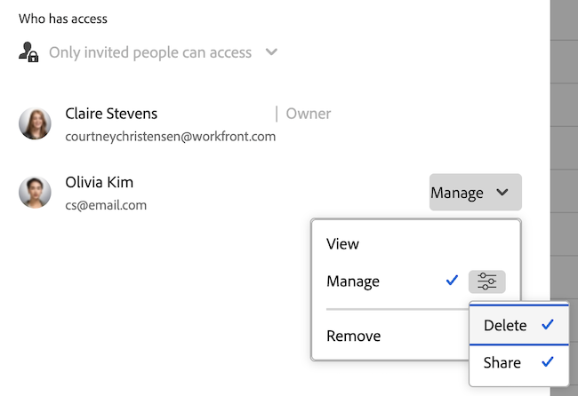

# システム全体のフィルター、ビュー、グループ化の作成、編集、共有

<!-- Audited: 5/2025 -->

<!--

***DON'T DELETE, DRAFT OR HIDE THIS ARTICLE. IT IS LINKED TO THE PRODUCT, THROUGH THE CONTEXT SENSITIVE HELP LINKS. **

-->

フィルター、ビュー、グループ化を作成し、組織内のシステム全体でユーザーが使用できるようにします。

この記事で説明するようにシステム全体のフィルター、ビュー、およびグループ化を作成すると、それらを共有するユーザーは、リストを表示する際にそれらを活用できます。 ユーザーは、作成したフィルター、ビュー、グループに基づいて独自に作成できますが、直接変更することはできません。

システム全体で作成するフィルター、ビュー、グループ化は、Adobe Workfrontがシステム内で自動的に作成するデフォルトのフィルター、ビュー、グループ化とは異なることに注意してください。 これらのデフォルトのフィルター、ビュー、グループ化は、編集または削除できません。

## アクセス要件

+++ 展開すると、この記事の機能のアクセス要件が表示されます。

<table style="table-layout:auto"> 
 <col> 
 <col> 
 <tbody> 
  <tr> 
   <td>[!DNL Adobe Workfront] package</td> 
   <td>
任意
</td> 
  </tr> 
  <tr> 
   <td>[!DNL Adobe Workfront] ライセンス</td> 
   <td>
[!UICONTROL Standard]

       
[!UICONTROL Plan]
</td>
  </tr> 
  <tr> 
   <td>アクセスレベル設定</td> 
   <td>[!UICONTROL System Administrator]</td> 
  </tr> 
 </tbody> 
</table>

詳しくは、[Workfront ドキュメントのアクセス要件](/help/quicksilver/administration-and-setup/add-users/access-levels-and-object-permissions/access-level-requirements-in-documentation.md)を参照してください。

+++

## フィルター、ビュー、グループの作成

{{step-1-to-setup}}

1. 「**[!UICONTROL インターフェース]**」をクリックし、「**[!UICONTROL フィルター]**」、「**[!UICONTROL ビュー]**」または「**[!UICONTROL グループ化]**」のいずれかをクリックします。

1. フィルター、ビューまたはグループ化を作成する場合は、「**[!UICONTROL フィルターを追加]**」、「**[!UICONTROL ビューを追加]**」または「**[!UICONTROL グループ化を追加]**」をクリックして、新しいフィルター、ビューまたはグループ化を関連付けるオブジェクトタイプを選択します。

   または

   既存のフィルター、ビューまたはグループ化を編集する場合は、そのフィルターを選択し、**[!UICONTROL 編集]**&#x200B;アイコンをクリックします。

1. フィルター、ビューまたはグループ化を設定します。

   使用可能なオプションについて詳しくは、次の記事の 1 つを参照してください。

   * [フィルターの概要](../../../reports-and-dashboards/reports/reporting-elements/filters-overview.md)
   * [[!UICONTROL Adobe Workfront]](../../../reports-and-dashboards/reports/reporting-elements/views-overview.md) のビューの概要
   * [[!UICONTROL Adobe Workfront] のグループ化の概要](../../../reports-and-dashboards/reports/reporting-elements/groupings-overview.md)

1. 左下隅付近にある「**[!UICONTROL 保存]**」をクリックします。

システム内のユーザーがフィルター、ビューまたはグループ化を使用できるようにします。他のユーザーとのフィルター、ビューまたはグループ化の共有について詳しくは、この記事の[フィルター、ビューまたはグループをユーザーに使用可能にする](#make-filters-views-or-groupings-available-to-users)を参照してください。

## フィルター、ビューまたはグループ化をすべてのユーザーに使用可能にする {#make-filters-views-or-groupings-available-to-users}

システム内のフィルター、ビュー、またはグループ化の表示/非表示を選択できます。 表示されるフィルターは、システム全体のすべてのユーザーが使用できます。 この設定は、レイアウトテンプレートを含む、システム全体のオン／オフスイッチのように機能します。

特定のユーザーからフィルター、ビュー、またはグループ化を非表示にする場合は、システム全体でオフにするのではなく、レイアウトテンプレートを使用することをお勧めします。

>[!NOTE]
>
>* ユーザーがアクティブに使用しているフィルター、ビューまたはグループ化を管理者が無効にした場合、ユーザーは新しいフィルター、ビューまたはグループ化を選択するまでアクセスできます。新しいテンプレートを選択すると、非表示のテンプレートに戻すことはできません。
>* レイアウトテンプレートを使用してすべてのフィルター、ビュー、グループ化を制限している場合、またはシステム全体で無効になっている場合、システムが何かを表示する必要があるので、デフォルトのオプションが表示されます。

フィルター、ビュー、グループ化の表示/非表示を切り替えるには：

{{step-1-to-setup}}

1. 「**[!UICONTROL インターフェース]**」をクリックし、「**[!UICONTROL フィルター]**」、「**[!UICONTROL ビュー]**」または「**[!UICONTROL グループ化]**」のいずれかをクリックします。

1. （条件付き）ユーザーが使用できるフィルター、ビューまたはグループ化を選択し、「**[!UICONTROL システム全体で有効にする]**」をクリックします。

   

   >[!TIP]
   >
   >ほとんどのユーザーが使用できるフィルター、表示、グループ化を保持し、他のユーザーには非表示にする場合は、レイアウトテンプレートを使用できます。 詳しくは、[レイアウトテンプレートを使用したフィルター、ビューおよびグループ化のカスタマイズ](/help/quicksilver/administration-and-setup/customize-workfront/use-layout-templates/customize-fvg-list-controls-layout-template.md)を参照してください。

1. （条件付き）ユーザーに非表示にするフィルター、ビュー、またはグループ化を選択して、「**[!UICONTROL システム全体で無効にする]**」をクリックします。 フィルター、ビュー、グループ化が、システム全体でレイアウトテンプレートとユーザーの両方で非表示になりました。

## 特定のユーザーとカスタムフィルター、ビュー、またはグループ化を共有

以下の手順では、「設定 [!UICONTROL &#x200B; の &#x200B;] インターフェイス [!UICONTROL &#x200B; 領域の共有ダイアログを使用して、カスタムフィルター、ビュー、グループ化を特定のユーザーと共有する方法について説明 &#x200B;] ます。 自分または他のユーザーが作成したフィルター、ビュー、グループ化に対する表示アクセスまたは管理アクセスを許可できます。 システムのデフォルトをユーザーと共有することはできません。

{{step-1-to-setup}}

1. 「**[!UICONTROL インターフェース]**」をクリックし、「**[!UICONTROL フィルター]**」、「**[!UICONTROL ビュー]**」または「**[!UICONTROL グループ化]**」のいずれかをクリックします。

1. 共有するフィルター、ビュー、またはグループ化を選択して、**[!UICONTROL 共有]** アイコン  をクリックします。
1. フィルター、ビューまたはグループ化を共有する特定のユーザー、チーム、役割、グループまたは会社の名前を入力し、ドロップダウンリストに表示されたら名前をクリックします。

   共有について詳しくは、[オブジェクトに対する共有権限の概要](../../../workfront-basics/grant-and-request-access-to-objects/sharing-permissions-on-objects-overview.md)を参照してください。

1. ユーザー **チーム、役割、グループまたは会社の名前の横にある「** 表示 **または** 管理」を選択します。 権限を微調整するには、スライダーアイコンをクリックし、権限を調整します。

   

1. 「**[!UICONTROL 保存]**」をクリックします。指定したユーザーは、関連付けたオブジェクト タイプを表示するときに、フィルタ、表示、グループ化を操作できるようになりました。

## フィルター、ビュー、グループ化の削除

{{step-1-to-setup}}

1. 「**[!UICONTROL インターフェース]**」をクリックし、「**[!UICONTROL フィルター]**」、「**[!UICONTROL ビュー]**」または「**[!UICONTROL グループ化]**」のいずれかをクリックします。

1. リスト内の 1 つ以上の項目を選択し、**[!UICONTROL 削除]**&#x200B;アイコン  をクリックします。

1. 表示される **削除** ダイアログボックスで、「はい、削除 **をクリックし** す。
