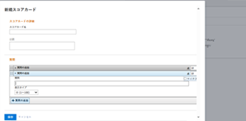

# スコアカードを作成

<!--Audited: 05/2025-->

<!--DON'T DELETE, DRAFT OR HIDE THIS ARTICLE. IT IS LINKED TO THE PRODUCT, THROUGH THE CONTEXT SENSITIVE HELP LINKS.-->

<!--The highlighted information on this page refers to functionality not yet generally available. It is available only in the Preview environment for all customers. The same features will also be available in the Production environment for all customers after a week from the Preview release.    

For more information, see [Interface modernization](/help/quicksilver/product-announcements/product-releases/interface-modernization/interface-modernization.md). -->

スコアカードは、プロジェクトが以前に確立されたポートフォリオの条件にどの程度適合するかを測定します。スコアカードは、多くの場合、組織の使命、価値、戦略的目標を反映しています。

ポートフォリオマネージャーは、スコアカードの質問と回答を定義して、プロジェクトの優先順位付けと選択時に有意義で価値のあるものにすることができます。

[!DNL Adobe Workfront] 管理者は、ポートフォリオマネージャーのレコメンデーションに基づいてスコアカードを作成できます。

スコアカードに対して選択した質問と回答は、異なるプロジェクトを比較するための整合値を提供するために、定量化可能である必要があります。

次の方法でスコアカードを作成できます。

* 最初から
* 既存のコピー

## アクセス要件

+++ 展開すると、この記事の機能のアクセス要件が表示されます。

<table style="table-layout:auto"> 
 <col> 
 <col> 
 <tbody> 
  <tr> 
   <td role="rowheader">Workfront パッケージ</td> 
   <td>
任意
</td> 
  </tr> 
  <tr> 
   <td role="rowheader">Adobe Workfront プラン</td> 
   <td>
標準
 
プラン
</td> 
  </tr> 
  <tr> 
   <td role="rowheader">アクセスレベル設定</td> 
   <td>Workfront 管理者である必要があります。 </td> 
  </tr> 
 </tbody> 
</table>

詳しくは、[Workfront ドキュメントのアクセス要件](/help/quicksilver/administration-and-setup/add-users/access-levels-and-object-permissions/access-level-requirements-in-documentation.md)を参照してください。

+++

## スコアカードをゼロから作成する

{{step-1-to-setup}}

1. 「**[!UICONTROL スコアカード]**」をクリックし、「**[!UICONTROL 新規スコアカード]**」をクリックします。

   「**新規スコアカード**」ボックスが開きます。

   

1. **[!UICONTROL スコアカード名]**&#x200B;および&#x200B;**[!UICONTROL 説明]**&#x200B;を指定します。

   スコアカードをプロジェクトに関連付ける際に、名前が表示されます。説明は、スコアカードリストのスコアカード名の横に表示されます。

1. **[!UICONTROL 質問を追加]**&#x200B;ドロップダウンメニューをクリックして、[!UICONTROL スコアカードの質問]セクションを開き、質問に関する次の情報を指定します。

   <table style="table-layout:auto"> 
    <col> 
    <col> 
    <tbody> 
     <tr> 
      <td role="rowheader">[!UICONTROL Question]</td> 
      <td>スコアカードに含める質問を入力します。</td> 
     </tr> 
     <tr> 
      <td role="rowheader">[!UICONTROL Points]</td> 
      <td>この質問に対して可能な最大ポイントを入力します。</td> 
     </tr> 
     <tr> 
      <td role="rowheader">[!UICONTROL Negative Points]</td> 
      <td>このオプションを選択して、[!DNL Workfront] は、可能なポイントの合計から減算する必要があることを示します。スコアカードの最大可能ポイント数に負のスコアを追加することはできません。</td> 
     </tr> 
     <tr> 
      <td role="rowheader">[!UICONTROL Display Type]</td> 
      <td>ユーザーが 0 ～ 100 の任意の値を指定できるスコアカードに数値フィールドを表示する場合、「<strong>[!UICONTROL Value(0-100)]</strong>」を選択します。
または、ユーザーがこのコントロールを使用して指定できる回答を作成するには、「<strong>[!UICONTROL Drop Down]</strong>」または「<strong>[!UICONTROL Radio Buttons]</strong>」を選択します。<strong>[!UICONTROL Add Answer]</strong>をクリックし、満たされた場合に、この回答に対する割合ポイントの<strong>[!UICONTROL Value]</strong>を入力します。100％を選択すると、この質問に割り当てられたポイント数が完全に達成されます。この回答が、この質問に割り当てられたポイントの総数の一部のみを占めることを示す場合は、割合（％）の値を低くします。例えば、質問が 10 ポイントで評価され、この回答で 5 ポイントを獲得したい場合、値として 50％を選択します。

      
この回答がデフォルトの回答であることを示す場合、「<strong>[!UICONTROL Default]</strong>」を選択します。</strong>

     </tr> 
    </tbody> 
   </table>

1. 「**[!UICONTROL 質問の追加]**」をクリックして、スコアカードに質問や回答を追加するには、同じ手順に従います。

   >[!NOTE]
   >
   >スコアカード内の質問を正しい順序でドラッグ＆ドロップすることで並べ替えることができます。

1. 「**[!UICONTROL 保存]**」をクリックします。

   これによりスコアカードが作成され、プロジェクト管理者がプロジェクトのビジネス ケースに添付できるようになります。

## 既存のスコアカードのコピー

既存のスコアカードをコピーして編集することで、スコアカードを作成できます。

{{step-1-to-setup}}

1. 左側のパネルで **[!UICONTROL スコアカード]** をクリックします。
1. リストでスコアカードを選択し、スコアカードリストの上部にある **コピー** アイコン  アイコンをクリックします。

   「**スコアカードをコピー** ボックスが開きます。

   

1. 次の情報を指定します。

   * **スコアカード**：スコアカードの名前を更新します。  デフォルトでは、名前は次の形式に従って自動的に更新されます。

     `Original scorecard name (Copy)`
   * **説明**: スコアカードに関する追加情報を入力します。
1. 「**保存**」をクリックします。

   元のスコアカードと同じ情報を持つ新しいスコアカードが作成されます。 プロジェクトマネージャーは、プロジェクトのビジネスケースに添付できるようになりました。

## プロジェクトへのスコアカードの適用

スコアカードが [!DNL Workfront] 管理者によって作成された後に、プロジェクトへの[!UICONTROL 管理]権限を持つユーザーは、プロジェクトにスコアカードを適用することができます。

プロジェクトのビジネスケースを作成する際に、スコアカードをプロジェクトに追加します。プロジェクトへのスコアカードの追加について詳しくは、[プロジェクトへのスコアカードの適用およびアラインメントスコアの生成](../../../manage-work/projects/define-a-business-case/apply-scorecard-to-project-to-generate-alignment-score.md)を参照してください。

プロジェクト権限について詳しくは、[&#x200B; [!DNL Adobe Workfront]](../../../workfront-basics/grant-and-request-access-to-objects/share-a-project.md) でのプロジェクトの共有を参照してください。

