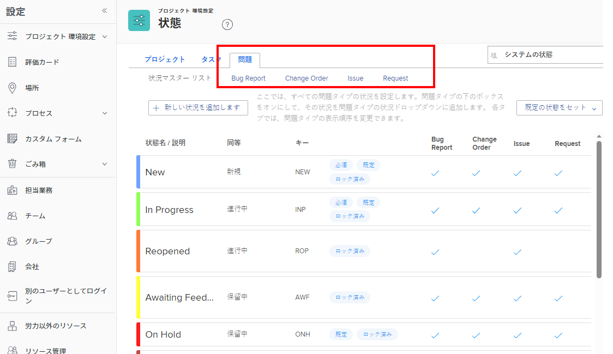
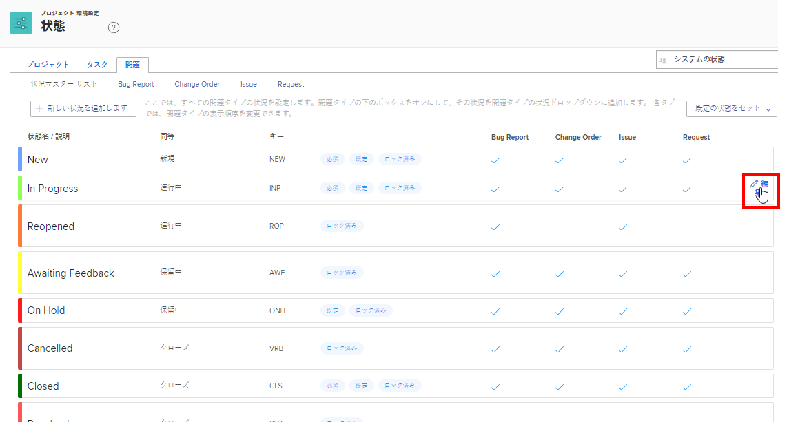

# デフォルトの問題タイプをカスタマイズ

問題のタイプは、次の状況で役立ちます。

* 問題ステータスをカスタマイズする場合 (「 [ステータスの作成または編集](../../../administration-and-setup/customize-workfront/creating-custom-status-and-priority-labels/create-or-edit-a-status.md).
* リクエストキューを作成する際に使用します。詳しくは、 [リクエストキューの作成](../../../manage-work/requests/create-and-manage-request-queues/create-request-queue.md).

デフォルトの問題タイプごとにラベルをカスタマイズして、組織で使用される用語に合わせることができます。

## アクセス要件

この記事の手順を実行するには、次のアクセス権が必要です。

<table style="table-layout:auto"> 
 <col> 
 <col> 
 <tbody> 
  <tr> 
   <td role="rowheader">[!DNL Adobe Workfront] 計画</td> 
   <td>任意</td> 
  </tr> 
  <tr> 
   <td role="rowheader">[!DNL Adobe Workfront] ライセンス</td> 
   <td>[!UICONTROL プラン ]</td> 
  </tr> 
  <tr> 
   <td role="rowheader">アクセスレベル設定</td> 
   <td> 
次の条件を満たす必要があります。 [!DNL Workfront] 管理者。
 
<b>注意</b>:まだアクセス権がない場合は、 [!DNL Workfront] 管理者（アクセスレベルに追加の制限を設定している場合） を参照してください。 [!DNL Workfront] 管理者はアクセスレベルを変更できます。詳しくは、 <a href="../../../administration-and-setup/add-users/configure-and-grant-access/create-modify-access-levels.md" class="MCXref xref">カスタムアクセスレベルの作成または変更</a>.
 </td> 
  </tr> 
 </tbody> 
</table>

## デフォルトの問題タイプ

次の場合： [!DNL Adobe Workfront] [!UICONTROL administrator] access には、設定および名前を変更できるデフォルトの問題タイプが 4 つあります。

* **[!UICONTROL バグレポート]** システムで報告されたバグを追跡するために使用されます。
* **[!UICONTROL 変更管理]** 更新または修正が必要な問題を追跡するために使用します。
* **[!UICONTROL 問題]** のオブジェクト [!DNL Workfront] これは、予期しない作業、発生した問題、またはタスクを続行するために解決する必要のある何かを伝えます。
* **[!UICONTROL リクエスト]** Workfrontでユーザーがリクエストをおこなうリクエストキューに適用される問題タイプです。

## 問題タイプのカスタマイズ

問題タイプのカスタマイズについて、次の点を考慮してください。

* 問題タイプのラベルは変更できますが、関数は変更できません。
* 追加のイシュータイプは作成できません。
* イシュータイプの名前に対してフィルター値を変更することはできません。 したがって、問題レポートでフィルターを作成した場合、フィルター（キー）の値は問題タイプのカスタム名を反映しません。
* 各問題タイプには、3 つのデフォルトのステータスが関連付けられています。 [!UICONTROL 新規], [!UICONTROL 処理中]、および [!UICONTROL クローズ]. これらのステータスは、イシュータイプから削除することはできませんが、名前を変更することはできます。
* 各問題タイプのドロップダウンメニューに表示されるオプションの順序を変更できます。

問題タイプをカスタマイズするには：

1. 次をクリック： **[!UICONTROL メインメニュー]** アイコン  右上隅に [!DNL Adobe Workfront]を選択し、「 **[!UICONTROL 設定]** .

1. クリック **[!UICONTROL プロジェクト環境設定]** > **[!UICONTROL ステータス]**.

1. 次をクリック： **[!UICONTROL 問題]** タブをクリックします。
1. 次のいずれかの操作を行います。

   * カスタマイズする問題のタイプの上にマウスポインターを置いて、 [!UICONTROL 編集] アイコン  が右端に表示されたら、問題のタイプの新しい名前を入力します。

      

   * 次をクリック： [!UICONTROL 問題タイプ] 関連するステータスをリストするには、ハンドルにカーソルを合わせたときに表示されるハンドルをドラッグし、ユーザーの問題に表示する順序でドロップします **[!UICONTROL ステータス]** ドロップダウンメニュー。
