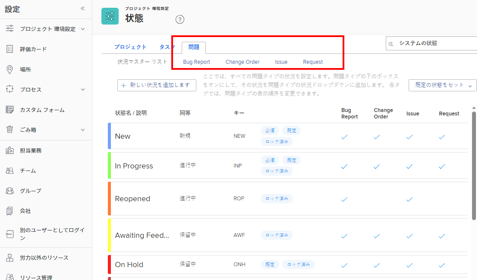
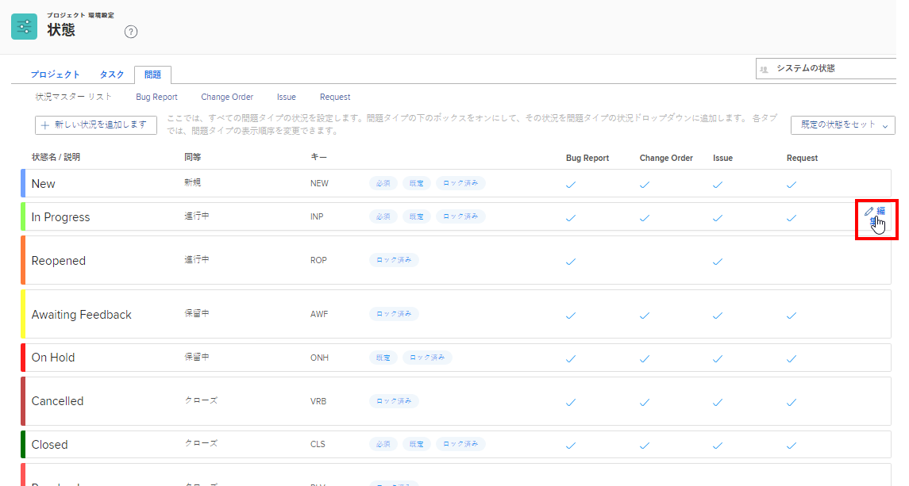

# デフォルトのイシュータイプをカスタマイズ

イシュータイプは、次の状況で役立ちます。

* イシューステータスをカスタマイズする場合（[ステータスの作成または編集](../../../administration-and-setup/customize-workfront/creating-custom-status-and-priority-labels/create-or-edit-a-status.md)を参照）
* リクエストキューを作成する場合（[リクエストキューの作成](../../../manage-work/requests/create-and-manage-request-queues/create-request-queue.md)を参照）

デフォルトのイシュータイプごとにラベルをカスタマイズして、組織で使用される用語に合わせることができます。

## アクセス要件

+++ 展開すると、この記事の機能のアクセス要件が表示されます。

<table style="table-layout:auto"> 
 <col> 
 <col> 
 <tbody> 
  <tr> 
   <td>[!DNL Adobe Workfront] パッケージ</td> 
   <td>
任意
</td> 
  </tr> 
  <tr> 
   <td>[!DNL Adobe Workfront] ライセンス</td> 
   <td>
[!UICONTROL Standard]

       
[!UICONTROL Plan]
</td>
  </tr> 
  <tr> 
   <td>アクセスレベル設定</td> 
   <td>[!UICONTROL System Administrator]</td> 
  </tr> 
 </tbody> 
</table>

詳しくは、[Workfront ドキュメントのアクセス要件](/help/quicksilver/administration-and-setup/add-users/access-levels-and-object-permissions/access-level-requirements-in-documentation.md)を参照してください。

+++

## デフォルトのイシュータイプ

[!DNL Adobe Workfront] [!UICONTROL 管理者]アクセス権を持つ場合、4 つのデフォルトのイシュータイプを設定して名前変更できます。

* **[!UICONTROL バグレポート]**：システムで報告されたバグをトラックするために使用されます。
* **[!UICONTROL 変更依頼]**：更新または修正が必要な問題をトラックするために使用します。
* **[!UICONTROL イシュー]**：計画外の作業、発生した問題、またはタスクを続行するために解決する必要があるものを伝達する [!DNL Workfront] 内のオブジェクト。
* **[!UICONTROL リクエスト]**： Workfront でユーザーがリクエストを行うリクエストキューに適用されるイシュータイプ。

## イシュータイプのカスタマイズ

イシュータイプのカスタマイズについて、次の点を考慮してください。

* イシュータイプのラベルは変更できますが、関数は変更できません。
* これ以上のイシュータイプは作成できません。
* イシュータイプの名前に対してフィルター値を変更することはできません。 したがって、イシューレポートでフィルターを作成した場合、フィルター（キー）の値はイシュータイプのカスタム名を反映しません。
* 各イシュータイプには、3 つのデフォルトのステータス（[!UICONTROL 新規]、[!UICONTROL 処理中]、[!UICONTROL 閉じる]）が関連付けられています。 これらのステータスは、イシュータイプから削除することはできませんが、名前を変更することはできます。
* 各イシュータイプのドロップダウンメニューに表示されるオプションの順序を変更できます。

イシュータイプをカスタマイズするには：

{{step-1-to-setup}}

1. **[!UICONTROL プロジェクト環境設定]**／**[!UICONTROL ステータス]**&#x200B;をクリックします。

1. 「**[!UICONTROL イシュー]**」タブを選択します。
1. 次のいずれかの操作を行います。

   * カスタマイズする問題タイプにカーソルを合わせ、右端に表示される[!UICONTROL 編集] アイコン をクリックし、問題タイプの新しい名前を入力します。

     

   * [!UICONTROL イシューの種類]をクリックして関連するステータスをリストし、ポインタを合わせると表示されるハンドルをドラッグし、ユーザーのイシュー&#x200B;**[!UICONTROL ステータス]**&#x200B;ドロップダウンメニューに表示する順序でドロップします。
