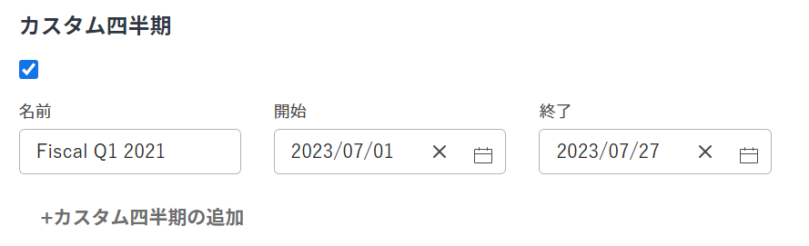
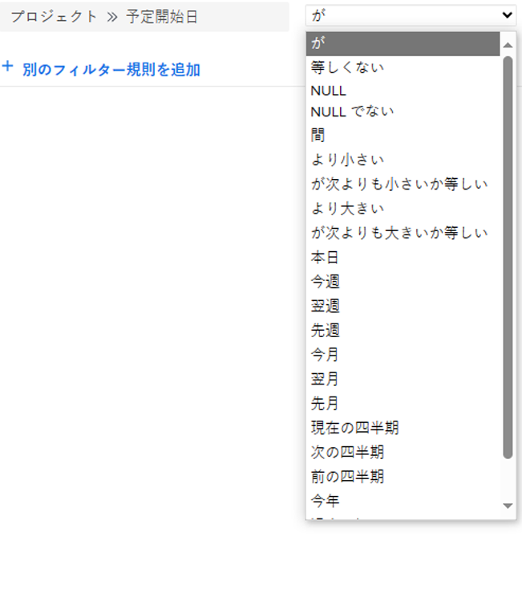

# プロジェクトのカスタム四半期を有効にする

レポートの目的で、組織の四半期がカレンダーの日付（営業日や買い物日など）以外の特定の条件に基づいている場合は、カスタム四半期を作成できます。

最大 8 つのカスタム四半期を [!DNL Adobe Workfront] システム。

## アクセス要件

この記事の手順を実行するには、次のアクセス権が必要です。

<table style="table-layout:auto"> 
 <col> 
 <col> 
 <tbody> 
  <tr> 
   <td role="rowheader">[!DNL Adobe Workfront] 計画</td> 
   <td>任意</td> 
  </tr> 
  <tr> 
   <td role="rowheader">[!DNL Adobe Workfront] ライセンス</td> 
   <td>[!UICONTROL プラン ]</td> 
  </tr> 
  <tr> 
   <td role="rowheader">アクセスレベル設定</td> 
   <td> 
次の条件を満たす必要があります。 [!DNL Workfront] 管理者。
 
<b>注意</b>:まだアクセス権がない場合は、 [!DNL Workfront] 管理者（アクセスレベルに追加の制限を設定している場合） を参照してください。 [!DNL Workfront] 管理者はアクセスレベルを変更できます。詳しくは、 <a href="../../../administration-and-setup/add-users/configure-and-grant-access/create-modify-access-levels.md" class="MCXref xref">カスタムアクセスレベルの作成または変更</a>.
 </td> 
  </tr> 
 </tbody> 
</table>

## のカスタム四半期を設定します [!DNL Workfront] システム

1. 次をクリック： **[!UICONTROL メインメニュー]** アイコン  右上隅に [!DNL Adobe Workfront]を選択し、「 **[!UICONTROL 設定]** .

1. クリック **[!UICONTROL プロジェクト環境設定]** > **[!UICONTROL プロジェクト].**

1. 内 **[!UICONTROL タイムライン]** セクション、選択 **[!UICONTROL カスタム四半期の有効化]**.

1. カスタム四半期の名前を入力します（「2021 年度第 1 四半期」など）。
1. カスタム四半期の開始日と終了日を選択します。

   

1. （オプション）「 **[!UICONTROL カスタム四半期の追加]** をクリックして、システムにカスタム四半期を追加します。
1. （オプション）会計四半期を参照するレポート要素を作成します。

   **例：** フィルターの作成 [!UICONTROL プロジェクト] カスタム四半期を参照するプロジェクトの計画完了日をリストし、含めます。

   

   「今四半期」、「次の四半期」、「前の四半期」への参照は、カスタム四半期の新しい参照に置き換えられます。

   レポート要素について詳しくは、 [レポート要素：フィルター、ビュー、グループ化](../../../reports-and-dashboards/reports/reporting-elements/reporting-elements-filters-views-groupings.md).

   フィルターの作成について詳しくは、 [でフィルターを作成または編集 [!DNL Adobe Workfront]](../../../reports-and-dashboards/reports/reporting-elements/create-filters.md).
