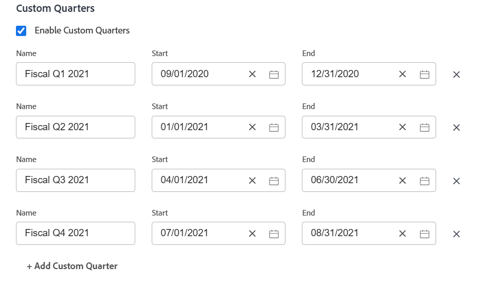

# カスタム四半期の有効化

<!--Audited: 03/2026-->

<!--
The highlighted information on this page refers to functionality not yet generally available. It is available only in the Preview environment for all customers. After the monthly releases to Production, the same features are also available in the Production environment for customers who enabled fast releases.    

For information about fast releases, see [Enable or disable fast releases for your organization](/help/quicksilver/administration-and-setup/set-up-workfront/configure-system-defaults/enable-fast-release-process.md). 
-->

レポートの目的で、組織の四半期がカレンダーの日付（営業日や買い物日など）以外の特定の条件に基づいている場合は、カスタム四半期を作成できます。

会社が購入した商品に応じて、Workfrontの設定領域で次の数の四半期を設定できます。

* [!DNL Workfront]のみを購入したお客様は、[!DNL Adobe Workfront] システムに対して最大8つのカスタム四半期を設定できます。
* [!DNL Workfront]および[!DNL Workfront Planning]を購入したお客様は、ご使用の[!DNL Workfront] システムに対して最大100 クォーターを設定できます。このクォーターは[!DNL Planning]でも利用できます。

<!--

* Customers who purchased [!DNL Workfront] and [!DNL Workfront Planning], can configure custom weeks for each custom quarter which are visible in the [!DNL Planning] timeline views. 

-->

## アクセス要件

+++ 展開すると、この記事の機能のアクセス要件が表示されます。

<table style="table-layout:auto"> 
 <col> 
 <col> 
 <tbody> 
  <tr> 
   <td>[!DNL Adobe Workfront] パッケージ</td> 
   <td>
任意
</td> 
  </tr> 
  <tr> 
   <td>[!DNL Adobe Workfront] ライセンス</td> 
   <td>
[!UICONTROL Workflow Standard]または[!UICONTROL Workfront プラン &#x200B;] ライセンス

       

</td>
  </tr> 
  <tr> 
   <td>アクセスレベル設定</td> 
   <td>[!UICONTROL System Administrator]</td> 
  </tr> 
 </tbody> 
</table>

詳しくは、[Workfront ドキュメントのアクセス要件](/help/quicksilver/administration-and-setup/add-users/access-levels-and-object-permissions/access-level-requirements-in-documentation.md)を参照してください。

+++

<!--
When we release fiscal weeks, replace the table above with this:

<table style="table-layout:auto"> 
 <col> 
 <col> 
 <tbody> 
  <tr> 
   <td>[!DNL Adobe Workfront] package</td> 
   <td>
   <ul>
   <li>
To configure custom quarters:

   
Any Workfront or Workflow package
</li>
   <li>
   

   
To configure custom weeks:

   
Any Planning package, including Planning as a standalone product

   

   </li>
   </ul>
   </td> 
  </tr> 
  <tr> 
   <td>[!DNL Adobe Workfront] license</td> 
   <td>
   
   <ul>
   <li>
To configure custom quarters:

   
[!UICONTROL Workflow Standard] or [!UICONTROL Workfront Plan] license
</li>
   <li>
   

   
To configure custom weeks:

   
A [!UICONTROL Planning Standard] license, in addition to a Workfront or a Workflow license

   

   </li>
   </ul>
    </td>
  </tr> 
  <tr> 
   <td>Access level configurations</td> 
   <td>[!UICONTROL System Administrator]</td> 
  </tr> 
 </tbody> 
</table>

-->

## [!DNL Workfront] システムのカスタム四半期を設定する

<!--
Setting up custom quarters differs depending on which environment you use. 

### Set up custom quarters for your [!DNL Workfront] system in the Production environment
-->

{{step-1-to-setup}}

1. **[!UICONTROL カスタム四半期]**&#x200B;をクリックします。

1. 「**[!UICONTROL カスタム四半期を有効にする]**」を選択します。

1. 「2021 年度第 1 四半期」などのカスタム四半期の名前を入力します。
1. カスタム四半期の開始日と終了日を選択します。

   

1. （オプション）「**[!UICONTROL カスタム四半期を追加]**」をクリックして、システムにカスタム四半期を追加します。

   >[!IMPORTANT]
   >
   > 会社が[!DNL Workfront Planning]を購入した場合、四半期の間にギャップまたは重複がある場合は、カスタム四半期を保存できません。
   >
   >四半期間のギャップと重複は、[!DNL Workfront]人のお客様に対してのみ許可されます。

1. （オプションおよび条件付き）会社が[!DNL Workfront Planning]なしで[!DNL Workfront]のみを購入した場合は、会計四半期を参照するレポート要素を作成します。

   **例：**&#x200B;[!UICONTROL プロジェクト]リストのフィルターを作成し、カスタム四半期を参照するプロジェクトの予定完了日を含めます。

   

   「今四半期」、「次四半期」、「前四半期」の参照は、カスタム四半期の新しい参照に置き換えられます。

   レポート要素について詳しくは、[レポート要素：フィルター、ビュー、およびグループ化](../../../reports-and-dashboards/reports/reporting-elements/reporting-elements-filters-views-groupings.md)を参照してください。

   フィルターの作成について詳しくは、[フィルターを作成または編集 [!DNL Adobe Workfront]](../../../reports-and-dashboards/reports/reporting-elements/create-filters.md)を参照してください。
1. （オプションおよび条件付き）会社がWorkfront Planningを購入し、[!DNL Workfront Planning]にアクセスできる場合は、レコードタイプページに移動してタイムラインビューを開きます。 ビューには、新しいカスタム四半期が表示されます。
詳しくは、[タイムラインビューの管理](/help/quicksilver/planning/views/manage-the-timeline-view.md)を参照してください。

<!--

### Set up custom quarters for your [!DNL Workfront] system in the Preview environment

>[!NOTE]
>
>If your organization purchased a Planning package in addition to a Workflow package, or if they purchased  Workfront Planning as a standalone package, you can configure custom weeks, in addition to custom quarters. 
> 
>Custom weeks are not available for Workfront reports and lists. 

{{step-1-to-setup}}

1. Click **[!UICONTROL Custom Quarters]**.

1. Select **[!UICONTROL Enable Custom Quarters]**.

1. Type a name for the custom quarter. For example, "Fiscal Q1 2021."
1. Select start and end dates for the custom quarter.

1. (Optional) Select the **Starts a new custom week sequence** option. 

    When selected, this option sets the start of the custom quarter as the start of the first custom week of the quarter in the Planning timeline view. 
1. (Optional) In the **Custom week label format** area, choose the **Format** for the custom week labels. Choose from the following options:

    * **W1, W2, W3 ...** . This is the default format.
    * **FW1, FW2, FW3 ...**
    * **Week1, Week 2, Week 3, ...**
    * **Custom**

1. (Conditional) If you selected **Custom** for the **Format** field, type a **Custom label** to identify the custom weeks.  

    Custom weeks display in Planning timeline views. 

    >[!TIP]
    >
    >When adding a custom label, you can type up to 100 characters. 
    >
    >You may indicate the name of the first week, and the following weeks will use the same label followed by a sequential number. 
    >
    >For example, a **Custom label** of "Fiscal week" will add the labels of "Fiscal week 1, Fiscal week 2, Fiscal week 3 ..." to the rest of the weeks in the sequence. 

1. (Optional) Click **[!UICONTROL Add Custom Quarter]** to add additional custom quarters to the system.

      >[!IMPORTANT]
      >
      > If your company purchased [!DNL Workfront Planning], you cannot save your custom quarters if there are gaps or overlaps between the quarters. 
      >
      >Gaps and overlaps between the quarters are allowed for [!DNL Workfront] only customers. 

1. (Optional and conditional) To view the custom quarters in Workfront, create a reporting element that refers to the custom quarters.

   **Example:** Create a filter for a [!UICONTROL project] list and include the Planned Completion Date of a project referencing the custom quarters.

   

   The references to "This Quarter", "Next Quarter", and "Last Quarter" are replaced with new references to the custom quarters.

   For information about reporting elements, see [Reporting elements: filters, views, and groupings](../../../reports-and-dashboards/reports/reporting-elements/reporting-elements-filters-views-groupings.md).

   For information about creating filters, see [Create or edit filters in [!DNL Adobe Workfront]](../../../reports-and-dashboards/reports/reporting-elements/create-filters.md).
1. (Optional and conditional) To view custom quarters and weeks in Workfront Planning, go to a record type page and open a timeline view. The view displays the new custom quarters and weeks. 

For information, see [Manage the timeline view](/help/quicksilver/planning/views/manage-the-timeline-view.md). 

-->