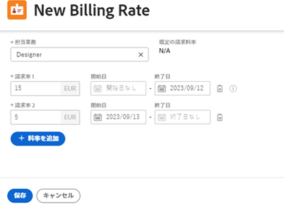

# レートカードの管理

{{highlighted-preview-article-level}}

料金カードを使用すると、場所に基づいて、役割ごとに複数の請求率を定義できます。 それぞれ異なる請求率を持つ、パリに拠点を置く Designer と、ニューヨークに拠点を置く 2 人目の Designer という職務を持つことができます。 ただし、レートカードのジョブロールに場所は必要ありません。 レートカード上のジョブロール（場所など）の請求レートには、有効日も含まれる場合があります。

## アクセス要件

この記事の手順を実行するには、次のアクセス権が必要です。

<table style="table-layout:auto"> 
 <col> 
 <col> 
 <tbody> 
  <tr> 
   <td role="rowheader">[!DNL Adobe Workfront] 計画</td> 
   <td>任意</td> 
  </tr> 
  <tr> 
   <td role="rowheader">[!DNL Adobe Workfront] ライセンス</td> 
   <td>
従来のプラン： [!UICONTROL プラン ]

       
現在のプラン： [!UICONTROL Standard]
</td> 
  </tr> 
  <tr> 
   <td role="rowheader">アクセスレベル設定</td> 
   <td> 
[!UICONTROL Financial Data] へのアクセスの編集
 
<b>注意</b>：まだアクセス権がない場合は、 [!DNL Workfront] 管理者（アクセスレベルに追加の制限を設定している場合） を参照してください。 [!DNL Workfront] 管理者はアクセスレベルを変更できます。詳しくは、 <a href="../../../administration-and-setup/add-users/configure-and-grant-access/create-modify-access-levels.md" class="MCXref xref">カスタムアクセスレベルの作成または変更</a>.
 </td> 
  </tr> 
  <tr> 
   <td role="rowheader">オブジェクトの権限</td> 
   <td>自分と共有している料金カードを編集するには、料金カードに対する管理権限が必要です。</td> 
  </tr> 
 </tbody> 
</table>

## レートカードの追加

{{step-1-to-setup}}

1. 左側のパネルで、 [!UICONTROL **レートカード**].
1. クリック [!UICONTROL **新しい料金カード**]」をクリックし、 [!UICONTROL **料金カード**] フィールドに貼り付け、「無題レートカード」に置き換えます。
1. カード画面で、 [!UICONTROL **ジョブの役割を追加**].
1. ダイアログで、 [!UICONTROL **ジョブの役割**] ：請求率を定義します。

   「デフォルト請求レート」には、このジョブ・ロールが定義されている場合に、システム・レベルのレートが表示されます。

   

1. を選択します。 [!UICONTROL **通貨**] ジョブの役割用。
1. （オプション） [!UICONTROL **場所**] ジョブの役割用。
1. Adobe Analytics の [!UICONTROL **請求率 1**] 「 」フィールドに、この場所の請求率を入力します。 次に、「 [!UICONTROL **保存**] ：請求率を 1 回だけ上書きします。

   または

   クリック [!UICONTROL **追加率**] をクリックして、有効日を含む場所固有の請求率をさらに追加します。

1. （条件付き）この場所に複数の請求率を追加する場合は、次の情報を入力します。

   * **[!UICONTROL 請求率 1]、2 など:** 期間の請求率の値。
   * **[!UICONTROL 開始日]:** レートの上書きが開始される日付。
   * **[!UICONTROL 終了日]:** レートの上書きが終了する日付。

     請求レート 1 には開始日が設定されず、最後の請求レートには終了日が設定されません。 一部の日付は自動的に追加されます。 たとえば、請求レート 1 に終了日がなく、開始日が 2023 年 5 月 1 日の請求レート 2 を追加した場合、ギャップが生じないように、2023 年 4 月 30 日の終了日が請求レート 1 に追加されます。

1. 「[!UICONTROL **保存**]」をクリックします。
1. （オプション）別の場所の同じジョブの役割または別のジョブの役割に対して、別の請求率を追加するには、 [!UICONTROL **ジョブの役割を追加**].
1. （オプション）請求率を編集するには、料金カードで料金を選択し、 **編集** アイコン。

## 料金カードのコピー

{{step-1-to-setup}}

1. 左側のパネルで、 [!UICONTROL **レートカード**].
1. リスト内の料金カードの横にあるチェックボックスを選択し、 **コピー** アイコン .

   重複料金カードが追加されます。 リスト内のレートカード名をクリックして、名前を変更します。

## レートカード全体を削除する

{{step-1-to-setup}}

1. 左側のパネルで、 [!UICONTROL **レートカード**].
1. リスト内の料金カードの横にあるチェックボックスを選択し、 **削除** アイコン .

   >[!NOTE]
   >
   >プロジェクトに添付されている料金カードがプロジェクトから削除されます。
