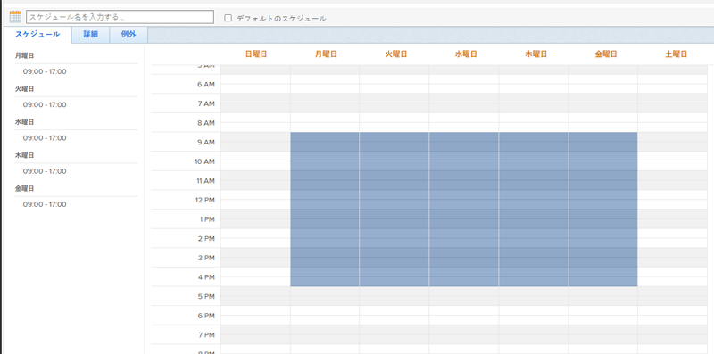
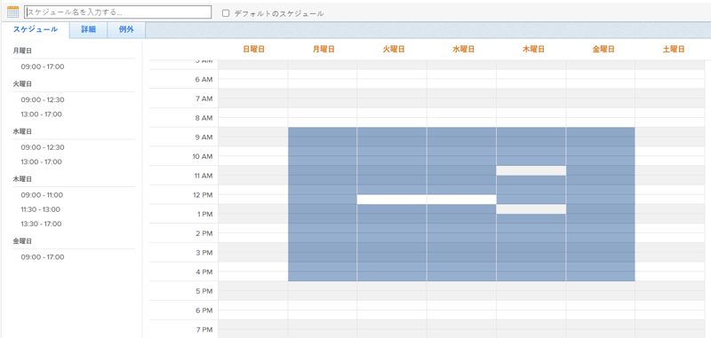
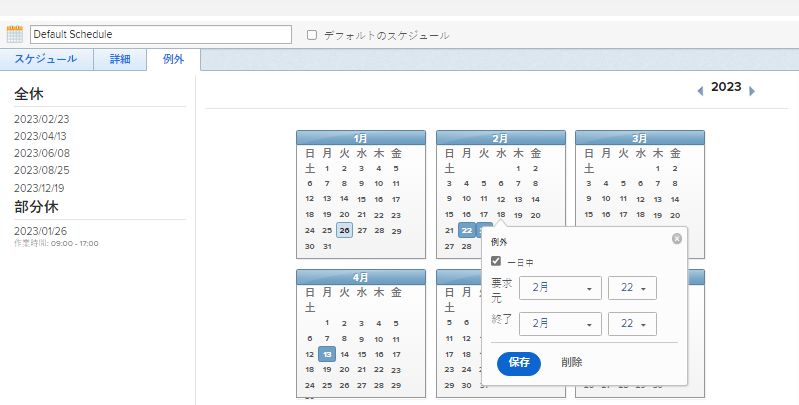
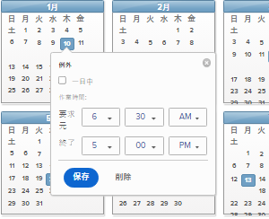

# スケジュールの作成

<!--DON'T DELETE, DRAFT OR HIDE THIS ARTICLE. IT IS LINKED TO THE PRODUCT, THROUGH THE CONTEXT SENSITIVE HELP LINKS. 
Linked to Editing Users, Editing Projects, Creating and managing groups
-->

As a [!DNL Adobe Workfront] 管理者は、スケジュールを使用して週単位の作業を定義できます。 スケジュールは、ユーザーまたはプロジェクトに関連付けることができます。 これにより、 [!DNL Workfront] をクリックして、タイムラインとユーザーの可用性を計算します。

異なるタイムゾーンで作業するユーザーがいる場合、各タイムゾーンでスケジュールを作成し、それらのユーザーに関連付けると、作業が必ず次の場所に記録されます。 [!DNL Workfront] リアルタイムで実行でき、動作するタイミングに応じて常に正確に使用できること。

スケジュールをユーザーおよびプロジェクトに関連付ける方法については、次の記事を参照してください。

* [ユーザーのプロファイルの編集](../../../administration-and-setup/add-users/create-and-manage-users/edit-a-users-profile.md)
* [プロジェクトを編集](../../../manage-work/projects/manage-projects/edit-projects.md)

また、グループ管理者は、管理するグループに関連付けられたスケジュールを作成することもできます。 詳しくは、 [グループのスケジュールの作成と変更](../../../administration-and-setup/manage-groups/work-with-group-objects/create-and-modify-a-groups-schedules.md).

スケジュールを使用して、 [!DNL Workfront] タイムゾーンの詳細は、 [タイムゾーンをまたいでの作業](../../../workfront-basics/tips-tricks-and-troubleshooting/working-across-timezones.md).

生産資源計画でのスケジュールの使用方法の詳細は、 [スケジュールの概要](/help/quicksilver/administration-and-setup/set-up-workfront/configure-timesheets-schedules/schedules-overview.md) および [リソースプランナーの概要](/help/quicksilver/resource-mgmt/resource-planning/get-started-resource-planner.md).

## アクセス要件

この記事の手順を実行するには、次のアクセス権が必要です。

<table style="table-layout:auto"> 
 <col> 
 <col> 
 <tbody> 
  <tr> 
   <td role="rowheader">[!UICONTROL Adobe Workfront] プラン</td> 
   <td>任意</td> 
  </tr> 
  <tr> 
   <td role="rowheader">[!DNL Adobe Workfront] ライセンス</td> 
   <td>[!UICONTROL プラン ]</td> 
  </tr> 
  <tr> 
   <td role="rowheader">アクセスレベル設定</td> 
   <td> 
次の条件を満たす必要があります。 [!DNL Workfront] 管理者。
 
<b>注意</b>:まだアクセス権がない場合は、 [!DNL Workfront] 管理者（アクセスレベルに追加の制限を設定している場合） を参照してください。 [!DNL Workfront] 管理者はアクセスレベルを変更できます。詳しくは、 <a href="../../../administration-and-setup/add-users/configure-and-grant-access/create-modify-access-levels.md" class="MCXref xref">カスタムアクセスレベルの作成または変更</a>.
 </td> 
  </tr> 
 </tbody> 
</table>

## スケジュールの作成

1. 次をクリック： **[!UICONTROL メインメニュー]** アイコン  右上隅に [!DNL Adobe] Workfront、 **[!UICONTROL 設定]** .
1. クリック **[!UICONTROL スケジュール]**.
1. クリック **[!UICONTROL 新しいスケジュール]**.
1. スケジュールの名前を指定します。
1. （オプション）「 」を選択します。 **[!UICONTROL デフォルトのスケジュール]** をクリックして、このスケジュールをデフォルトとして指定します。

   では、複数のスケジュールを設定できます [!DNL Workfront]デフォルトのスケジュールは 1 つだけ指定できます。

   に少なくとも 1 つのスケジュールを設定する必要があります [!DNL Workfront]. 1 つのみの場合は、それがデフォルトのスケジュールに指定されます。

   >[!NOTE]
   >
   >グループ管理者は、スケジュールをデフォルトのスケジュールとして指定できません。 a のみ [!DNL Workfront] 管理者は、スケジュールをシステムのデフォルトとして指定できます。

   

1. 内 **[!UICONTROL スケジュール]** 「 」タブで、時間ブロック間の青いアウトラインをドラッグしてハイライト表示し、日次スケジュールを選択します。

   9 時間の期間に 8 つの 1 時間ブロックを選択することをお勧めします。 ランチや休憩に対応。

   

1. の **[!UICONTROL 詳細]** 「 」タブで、次の情報を指定します。

   <table style="table-layout:auto">
    <tr>
     <td>[!UICONTROL 管理アクセス権を持つグループ ]</td>
     <td>
このスケジュールを編集する権限を持つ管理者のグループを指定します。

     
<b>重要</b>:

      <ul>
       <li>
       
スケジュールを作成するグループ管理者の場合、このフィールドは必須です。

       
グループ管理者は、自分が管理者として指定されているグループまたはサブグループに対して指定されている場合にのみ、スケジュールを作成できます。

       
1 つのグループのみを管理する場合、このフィールドではそのグループがデフォルトで選択されます。

       
複数のグループを管理する場合は、スケジュールを保存する前に、このフィールドでグループを選択する必要があります。
</li>
       <li>次の場合、 [!DNL Workfront] 管理者がスケジュールを作成する場合、このフィールドはオプションです。 スケジュールをグループに関連付けずに作成すると、そのスケジュールはシステムレベルのスケジュールとして保存され、どのグループのグループ管理者でも管理できなくなります。
       
アカウントまたはプロジェクトに割り当てられたスケジュールは、これらのオブジェクトを編集できるすべてのユーザーに表示されます。 これは、システムレベルのスケジュールとグループレベルのスケジュールの両方に当てはまります。

       </li>
       
スケジュールに対して管理アクセス権を持つグループを指定しても、そのスケジュールはグループ内のユーザーに割り当てられません。グループ内のグループ管理者は、スケジュールの編集、削除、コピーのみ実行できます。

       
グループ管理者は、システムレベルのスケジュールを編集、削除、またはコピーできません。 詳しくは、 <a href="../../../administration-and-setup/manage-groups/group-roles/group-administrators.md" class="MCXref xref">グループ管理者</a>.
     </td>
    </tr>
    <tr>
     <td>[!UICONTROL 表示アクセス権を持つグループ ]</td>
     <td>
このスケジュールを表示する [!UICONTROL 表示 ] アクセス権を持つグループを選択します。

     
ここで指定したグループのユーザーのみが、ユーザーまたはプロジェクトに割り当てる際に、ドロップダウンメニューでスケジュールを検索できます。
</tr>
    <tr>
     <td>[!UICONTROL タイムゾーン ]</td>
     <td>
スケジュールのタイムゾーンを選択します。

     
スケジュールをユーザーに関連付ける場合は、スケジュールのタイムゾーンをユーザーのタイムゾーンと一致させることをお勧めします。ユーザーのタイムゾーンについて詳しくは、 <a href="../../../administration-and-setup/add-users/create-and-manage-users/edit-a-users-profile.md" class="MCXref xref">ユーザーのプロファイルを編集します。
     </td>
    </tr>
   </table>

1. の **[!UICONTROL 例外]** タブで、スケジュールに対する例外を指定します。

   例外は、休日や会社のイベントなど、スケジュールから除外する必要がある完全な日数または半日数です。

   >[!NOTE]
   >
   >定期スケジュールの例外が何かが既にわかっている場合は、将来の何年間もスケジュールの例外を定義できます。

   全日または一部の日は、作業スケジュールから除外できます。 日付をクリックして例外として選択し、「 **[!UICONTROL 終日]** フィールドを使用して、例外が 1 日であるかどうかを指定します。

   

1. 日の一部例外の開始および終了時間を指定します。

   

1. クリック **[!UICONTROL 保存]**&#x200B;を選択し、「 **[!UICONTROL 保存] 変更点**.

1. （オプション）スケジュールをユーザーに関連付けます。

   詳しくは、 [ユーザーのプロファイルの編集](../../../administration-and-setup/add-users/create-and-manage-users/edit-a-users-profile.md).

1. （オプション）スケジュールをプロジェクトに関連付けます。

   詳しくは、 [プロジェクトを編集](../../../manage-work/projects/manage-projects/edit-projects.md).
