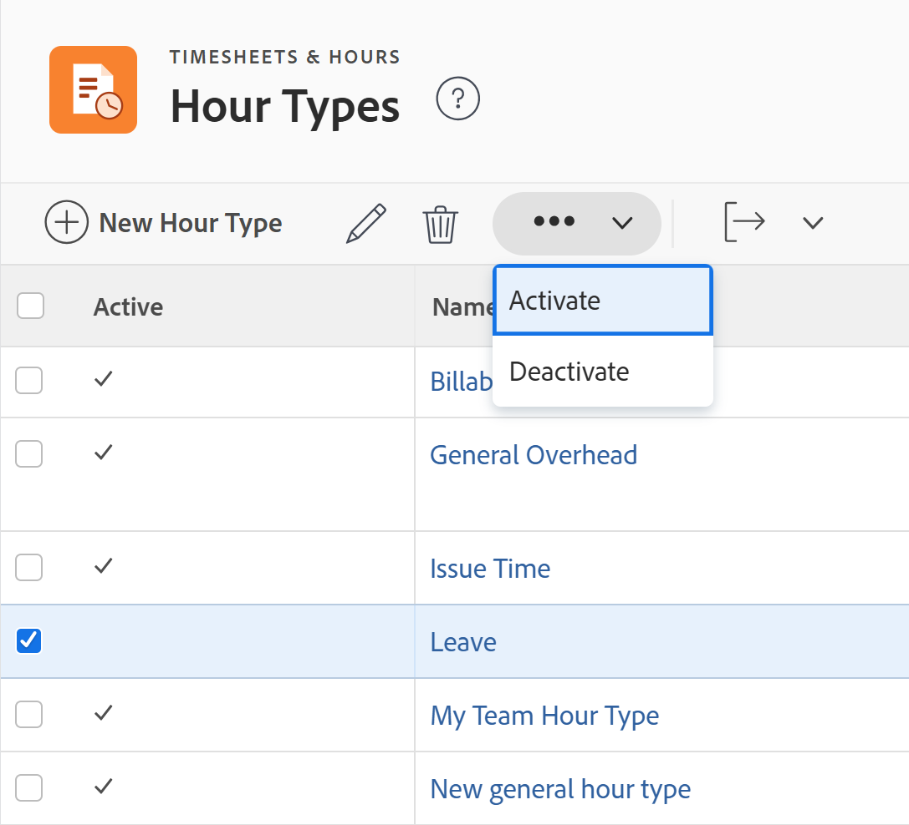

# 時間タイプを管理

<!--Audited: 05/2025-->

<!--
DON'T DELETE, DRAFT OR HIDE THIS ARTICLE. IT IS LINKED TO THE PRODUCT, THROUGH THE CONTEXT SENSITIVE HELP LINKS. 
**Linked to Creating Billing Record
-->

<!--

The highlighted information on this page refers to functionality not yet generally available. It is available only in the Preview environment for all customers. The same features will also be available in the Production environment for all customers after a week from the Preview release.     

For more information, see [Interface modernization](/help/quicksilver/product-announcements/product-releases/interface-modernization/interface-modernization.md). 

-->

時間タイプは、時間エントリを定義するために使用するラベルです。 時間タイプを時間エントリに関連付けることができます。

時間タイプには2つのカテゴリがあります。

* **プロジェクト固有の時間タイプ**：プロジェクト、タスクおよびイシューのログ時間です。プロジェクト固有の時間タイプは、プロジェクト、タスク、イシューの時間を記録できる、[!DNL Adobe Workfront] 内の任意の場所で時間エントリに関連付けることができます。

  [!DNL Workfront]で時間を記録する場合、使用できるプロジェクト固有の時間タイプは、システムレベル、プロジェクトレベルおよびユーザーレベルで設定された設定オプションによって異なります。

  以下のデフォルトのプロジェクト固有の時間タイプは、常に使用できます。

   * プロジェクト時間
   * タスク時間
   * イシュー時間

  [!DNL Workfront]管理者は、[時間タイプと可用性の定義](../../../timesheets/create-and-manage-timesheets/define-hour-types-and-availability.md)で説明されているように、どのプロジェクト固有の時間タイプを使用できるかを決定します。

  >[!NOTE]
  >
  >[!DNL Workfront] システムでプロジェクト固有の時間タイプを有効にする場合は、システム内の各プロジェクトで、1 つ以上のプロジェクト固有の時間タイプを有効にする必要があります。システム レベルでプロジェクト固有の時間タイプを有効にすることはできず、プロジェクト レベルで使用できるプロジェクト固有の時間タイプはありません。

* **一般時間タイプ**：一般時間は、プロジェクト、タスク、イシューに関連付けることはできず、タイムシートに直接ログに記録されます。

時間のログ記録と時間タイプへの関連付けについて詳しくは、[時間のログ記録](/help/quicksilver/timesheets/create-and-manage-timesheets/log-time.md)を参照してください。

## アクセス要件

+++ 展開すると、この記事の機能のアクセス要件が表示されます。

<table style="table-layout:auto"> 
 <col> 
 <col> 
 <tbody> 
  <tr> 
   <td>[!DNL Adobe Workfront] パッケージ</td> 
   <td>
任意
</td> 
  </tr> 
  <tr> 
   <td>[!DNL Adobe Workfront] ライセンス</td> 
   <td>
[!UICONTROL Standard]

       
[!UICONTROL Plan]
</td>
  </tr> 
  <tr> 
   <td>アクセスレベル設定</td> 
   <td>[!UICONTROL System Administrator]</td> 
  </tr> 
 </tbody> 
</table>

詳しくは、[Workfront ドキュメントのアクセス要件](/help/quicksilver/administration-and-setup/add-users/access-levels-and-object-permissions/access-level-requirements-in-documentation.md)を参照してください。

+++

## ビルトインの時間タイプ

Workfront には、一連のビルトインの時間タイプが付属しています。これらの時間タイプは編集または非表示にできません。

[!DNL Workfront] に付属する時間タイプは以下のとおりです。

* **[!UICONTROL シックタイム]**：プロジェクト、タスク、またはイシューの時間エントリに関連付けられない、一般的な時間タイプ。 病気時間は収益としてカウントできません。
* **[!UICONTROL 休暇時間]**: プロジェクト、タスク、または問題の時間エントリに関連付けられない一般的な時間タイプ。 休暇時間は収益としてカウントできません。
* **[!UICONTROL 一般間接費]**：プロジェクト、タスク、またはイシューの時間エントリに関連付けられない一般的な時間タイプ。 これは、プロジェクト計画プロセスでの売上としてカウントされます。
* **[!UICONTROL プロジェクト時間]**: プロジェクトの時間エントリにのみ関連付けることができる一般的な時間タイプ。
* **[!UICONTROL タスク時間]**: タスクの時間エントリにのみ関連付けることができる一般的な時間タイプ。
* **[!UICONTROL 問題時間]**：問題の時間エントリにのみ関連付けることができる一般的な時間タイプ。

## 時間タイプを作成

[!DNL Workfront]管理者は、組織の時間タイプをシステム レベルおよびプロジェクト レベルで作成できます。

システムレベルで時間タイプを定義すると、特定のプロジェクトまたは特定のユーザーに使用できる時間タイプを定義できます。

詳しくは、[時間タイプと利用可能時間の定義](../../../timesheets/create-and-manage-timesheets/define-hour-types-and-availability.md)を参照してください

時間タイプを作成するには：

{{step-1-to-setup}}

1. 左側のパネルで、**タイムシートと時間**&#x200B;をクリックし、**時間タイプ**&#x200B;をクリックします。

1. **時間タイプ** セクションで、**新しい時間タイプ**&#x200B;をクリックします。
1. **新しい時間タイプ** ダイアログボックスで、次の情報を指定します。

   <table style="table-layout:auto"> 
    <col> 
    <col> 
    <tbody> 
     <tr> 
      <td role="rowheader">[!UICONTROL Name]</td> 
      <td>システムで簡単に認識できる時間タイプ名を入力します。</td> 
     </tr> 
     <tr> 
      <td role="rowheader">[!UICONTROL Description]</td> 
      <td>時間タイプの説明を追加します。</td> 
     </tr> 
     <tr> 
      <td role="rowheader">[!UICONTROL Scope]</td> 
      <td> 
<strong> スコープ </strong> ドロップダウンメニューで、時間タイプが一般的な時間タイプかプロジェクト固有の時間タイプかを選択します。
 
一般的な時間タイプはタイムシートでのみ表示され、プロジェクト、タスク、イシューに関連付けることはできません。
 
<b>重要</b>

 [!UICONTROL プロジェクト固有]のカスタム時間タイプがあり、それを[!UICONTROL General]に変更した場合、既存のすべてのタスク、イシュー、プロジェクト時間がシステムの既定のタイプに設定されます。
 </td> 
     </tr> 
     <tr> 
      <td role="rowheader">[!UICONTROL収益としてカウント ]</td> 
      <td>
この時間タイプに関連付けられた時間エントリを収益の計算に反映させたい場合は、このオプションを選択します。

      
病気時間と休暇時間は収益としてカウントできません。

      
<b>メモ</b>

      
一般的な時間タイプが収益としてカウントされる場合、時間を記録しているユーザーのプロファイルに関連付けられたコスト率は、時間コストに関連付けられます。  
      </td> 
     </tr> 
    </tbody> 
   </table>

1. **保存**&#x200B;をクリックします。

   時間タイプはWorkfront システムに追加され、デフォルトでアクティブ化されます。

## 時間タイプの編集

[!DNL Workfront]管理者は、組織の時間タイプをシステム レベルおよびプロジェクト レベルで編集できます。

>[!NOTE]
>
>* 組み込みの時間タイプは編集できません。
>* 時間タイプを一括で編集することはできません。

{{step-1-to-setup}}

1. 左側のパネルで、**タイムシートと時間**&#x200B;をクリックし、**時間タイプ**&#x200B;をクリックします。

1. 時間タイプ名をクリックするか、時間タイプを選択してから、リストの上部にある&#x200B;**編集** アイコン をクリックします。
1. **時間タイプを編集** ダイアログボックスで、次の情報を指定します。

   <table style="table-layout:auto"> 
    <col> 
    <col> 
    <tbody> 
     <tr> 
      <td role="rowheader">[!UICONTROL Name]</td> 
      <td>システムで簡単に認識できる時間タイプ名を入力します。</td> 
     </tr> 
     <tr> 
      <td role="rowheader">[!UICONTROL Description]</td> 
      <td>時間タイプの説明を追加します。</td> 
     </tr> 
     <tr> 
      <td role="rowheader">[!UICONTROL Scope]</td> 
      <td> 
<strong> スコープ </strong> ドロップダウンメニューで、時間タイプが一般的な時間タイプかプロジェクト固有の時間タイプかを選択します。
 
一般的な時間タイプはタイムシートでのみ表示され、プロジェクト、タスク、イシューに関連付けることはできません。
 
<b>重要</b>
 
[!UICONTROL プロジェクト固有]のカスタム時間タイプがあり、それを[!UICONTROL General]に変更した場合、既存のすべてのタスク、イシュー、プロジェクト時間がシステムの既定のタイプに設定されます。
 </td> 
     </tr> 
     <tr> 
      <td role="rowheader">[!UICONTROL収益としてカウント ]</td> 
      <td>
この時間タイプに関連付けられた時間エントリを収益の計算に反映させたい場合は、このオプションを選択します。

      
病気時間と休暇時間は収益としてカウントできません。

      
<b>メモ</b>

      
一般的な時間タイプが収益としてカウントされる場合、時間を記録しているユーザーのプロファイルに関連付けられたコスト率は、時間コストに関連付けられます。  
      </td> 
     </tr> 
    </tbody> 
   </table>

1. 「**保存**」をクリックします。

   変更が保存され、時間タイプが編集されます。

## 時間タイプの非アクティブ化

ユーザーに時間を関連付けたくない場合は、時間タイプを無効にすることができます。 時間タイプを非アクティブ化すると、時間タイプが表示されている[!DNL Workfront]内の任意の場所から時間タイプが非表示になります。

>[!NOTE]
>
>* 組み込みの時間タイプを無効にすることはできません。
>* 時間タイプを一括で非アクティブ化できます。
>* プロジェクト固有の時間タイプを非アクティブ化すると、そのタイプに対してログに記録されたすべての時間が、組み込みのプロジェクト固有の時間タイプに自動的にデフォルトで設定されます。 例えば、プロジェクトに記録された時間のデフォルト値はプロジェクト時間タイプです。タスクに記録された時間のデフォルト値はタスク時間タイプです。
>* 一般的な時間タイプを無効にすると、ログに記録された時間はタイムシートに残りますが、ユーザーは後でその時間タイプの時間をログに記録できなくなります。

時間タイプを非アクティブ化するには、次の手順に従います。

{{step-1-to-setup}}

1. 左側のパネルで、**[!UICONTROL タイムシートと時間]**&#x200B;をクリックし、**[!UICONTROL 時間タイプ]**&#x200B;をクリックします。

1. 無効にする時間タイプを選択します。 複数の時間タイプを選択できます。

1. 「**詳細**」をクリックし、「**非アクティブ化**」をクリックします。

   

   時間タイプは非アクティブ化され、時間をログに記録する際にユーザーが見つけられなくなりました。

1. （オプション）時間タイプを再アクティブ化するには、**時間タイプ** リストで時間タイプを選択し、**詳細** > **アクティブ化**&#x200B;をクリックします。

