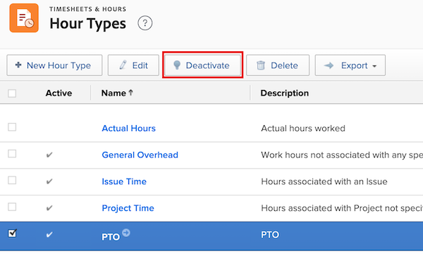

# 時間タイプを管理

<!--Audited: 05/2025-->

<!--Audited: 07/2024-->

<!--DON'T DELETE, DRAFT OR HIDE THIS ARTICLE. IT IS LINKED TO THE PRODUCT, THROUGH THE CONTEXT SENSITIVE HELP LINKS. 
**Linked to Creating Billing Record-->

時間タイプは、時間エントリの定義に使用するラベルです。 時間タイプを時間エントリに関連付けることができます。

以下の 2 つの時間タイプがあります。

* プロジェクト固有の時間タイプ：プロジェクト、タスク、問題について記録された時間です。 プロジェクト固有の時間タイプは、プロジェクト、タスク、イシューの時間を記録できる、[!DNL Adobe Workfront] 内の任意の場所で時間エントリに関連付けることができます。

  [!DNL Workfront]で時間を記録する場合、使用できるプロジェクト固有の時間タイプは、システムレベル、プロジェクトレベルおよびユーザーレベルで設定された設定オプションによって異なります。

  以下のデフォルトのプロジェクト固有の時間タイプは、常に使用できます。

   * プロジェクト時間
   * タスク時間
   * イシュー時間

  [ 時間タイプと空き時間の定義 ](../../../timesheets/create-and-manage-timesheets/define-hour-types-and-availability.md) で説明されているように、[!DNL Workfront] 管理者は、プロジェクト固有の時間タイプを使用可能にすることを決定します。

  >[!NOTE]
  >
  >[!DNL Workfront] システムでプロジェクト固有の時間タイプを有効にする場合は、システム内の各プロジェクトで、1 つ以上のプロジェクト固有の時間タイプを有効にする必要があります。システムレベルではプロジェクト固有の時間タイプを有効にできず、プロジェクトレベルではプロジェクト固有の時間タイプを利用できません。

* 一般的な時間タイプ：一般的な時間は、プロジェクト、タスク、または問題に関連付けることはできず、タイムシートに直接記録されます。

時間の記録および時間タイプとの関連付けについて詳しくは、[ 時間の記録 ](/help/quicksilver/timesheets/create-and-manage-timesheets/log-time.md) を参照してください。

## アクセス要件

+++ 展開すると、この記事の機能のアクセス要件が表示されます。

この記事の手順を実行するには、次のアクセス権が必要です。

<table style="table-layout:auto"> 
 <col> 
 <col> 
 <tbody> 
  <tr> 
   <td role="rowheader">Adobe Workfront プラン</td> 
   <td>任意</td> 
  </tr> 
  <tr> 
   <td role="rowheader">Adobe Workfront プラン</td> 
   <td> 
新規：標準

   
または

   
現在：プラン
</td> 
  </tr> 
  <tr> 
   <td role="rowheader">アクセスレベル設定</td> 
   <td>システム管理者</td>
  </tr> 
 </tbody> 
</table>

この表の情報について詳しくは、[Workfront ドキュメントのアクセス要件](/help/quicksilver/administration-and-setup/add-users/access-levels-and-object-permissions/access-level-requirements-in-documentation.md)を参照してください。

+++

## 組み込みの時間タイプ

Workfront には、一連の組み込みの時間タイプが付属しています。これらの時間タイプは、編集または非表示にできません。

[!DNL Workfront] に付属する時間タイプは以下のとおりです。

* **[!UICONTROL 病欠時間]**: プロジェクト、タスク、または問題の時間エントリに関連付けることができない一般的な時間タイプ。 病欠時間は、収益としてカウントできません。
* **[!UICONTROL 休暇]**: プロジェクト、タスク、または問題の時間エントリに関連付けることはできない一般的な時間タイプ。 休暇を収益としてカウントすることはできません。
* **[!UICONTROL 一般的なオーバーヘッド]**：プロジェクト、タスク、または問題の時間エントリに関連付けることができない一般的な時間タイプ。 プロジェクト計画プロセスでは、収益としてカウントできます。
* **[!UICONTROL プロジェクト時間]**: プロジェクトの時間エントリにのみ関連付けることができる一般的な時間タイプ。
* **[!UICONTROL タスク時間]**: タスクの時間エントリにのみ関連付けることができる一般的な時間タイプ。
* **[!UICONTROL 問題時間]**：問題の時間エントリにのみ関連付けることができる一般的な時間タイプ。

## 時間タイプを作成

[!DNL Workfront] 管理者は、システムレベルとプロジェクトレベルの両方で、組織の新しい時間タイプを作成できます。その後、ユーザーは、特定のプロジェクトおよびユーザーが使用できる時間タイプを定義できます。 詳しくは、[ 時間タイプと可用性の定義 ](../../../timesheets/create-and-manage-timesheets/define-hour-types-and-availability.md) を参照してください

新しい時間タイプを作成するには、以下のように行います。

{{step-1-to-setup}}

1. 左側のパネルで **タイムシートと時間** をクリックし、**時間タイプ** をクリックします。

1. 「**時間タイプ**」セクションで、「**+新しい時間タイプ**」をクリックします。
1. **新しい時間タイプ** ダイアログボックスで、次の情報を指定します。

   <table style="table-layout:auto"> 
    <col> 
    <col> 
    <tbody> 
     <tr> 
      <td role="rowheader">[!UICONTROL Name]</td> 
      <td>システムで簡単に認識できる時間タイプ名を入力します。</td> 
     </tr> 
     <tr> 
      <td role="rowheader">[!UICONTROL Description]</td> 
      <td>時間タイプの説明を追加します。</td> 
     </tr> 
     <tr> 
      <td role="rowheader">[!UICONTROL Scope]</td> 
      <td> 
<strong> 範囲 </strong> ドロップダウンメニューで、時間タイプが一般的な時間タイプかプロジェクト固有の時間タイプかを選択します。
 
一般的な時間タイプは、タイムシートにのみ表示され、プロジェクト、タスク、または問題に関連付けることはできません。
 
<b> 重要 </b>: [!UICONTROL プロジェクト固有 ] のカスタム時間タイプがある場合、それを [!UICONTROL 一般 ] に変更すると、既存のタスク、問題、およびプロジェクト時間はすべて、システムの既定のタイプに設定されます。
 </td> 
     </tr> 
     <tr> 
      <td role="rowheader">[!UICONTROL Count As Revenue]</td> 
      <td>
この時間タイプに関連付けられた時間エントリを収益の計算に反映させたい場合は、このオプションを選択します。

      
病欠時間と休暇時間は、収益としてカウントできません。

      
<b>メモ</b>

      
一般的な時間タイプが収益としてカウントされる場合、時間を記録しているユーザーのプロファイルに関連付けられたコスト率は、時間コストに関連付けられます。  
      </td> 
     </tr> 
    </tbody> 
   </table>

1. 「**[!UICONTROL 時間タイプを作成]」をクリックします。**

## 時間タイプの非アクティブ化

ユーザーに時間を関連付けさせたくない場合、時間タイプをディアクティベートできます。 時間タイプを非アクティブ化すると、時間タイプが表示される [!DNL Workfront] のどこからでも非表示になります。

時間タイプを非アクティブ化するには、次の手順に従います。

{{step-1-to-setup}}

1. 左側のパネルで **[!UICONTROL タイムシートと時間]** をクリックし、**[!UICONTROL 時間タイプ]** をクリックします。

1. 非アクティブ化する時間タイプを選択します。

1. 「**[!UICONTROL 非アクティブ化]**」をクリックします。

   
