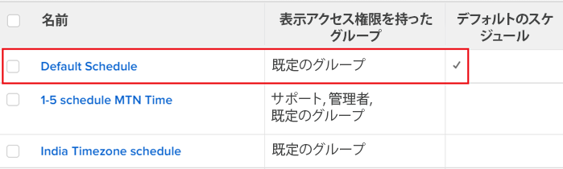

# スケジュールの概要

スケジュールを使用して作業週を定義し、スケジュールをユーザーまたはプロジェクトに関連付けることができます。 これにより、 [!DNL Adobe Workfront] をクリックして、タイムラインとユーザーの可用性を計算します。 手順については、 [スケジュールの作成](../../../administration-and-setup/set-up-workfront/configure-timesheets-schedules/create-schedules.md).

Workfrontでスケジュールを使用する際は、次の点に注意してください。

* The [!DNL Workfront] 管理者は、組織の営業時間をスケジュールで識別します。

  同様に、グループ管理者は、管理するグループが管理するスケジュールの操作時間を特定できます。

  グループ管理者の詳細については、 [グループ管理者](../../../administration-and-setup/manage-groups/group-roles/group-administrators.md).

  例えば、スケジュールを月～金、午前 8 時～午後 5 時（昼食は休み）と定義できます。

* [!DNL Workfront] はスケジュールを使用して、稼働日の開始と終了を決定します。

  これにより、ユーザーがで作業をしたり、作業を完了したりできるようになります。 [!DNL Workfront] 通常の営業時間外に 一般に、新しいスケジュールやスケジュールの例外を作成して、夕方に予定された作業に焦点を当てる必要はありません。

  同様に、勤務日の到着時間が柔軟になる場合があります。 午前 8 時に到着する従業員と、午前 9 時に到着する従業員のセットが存在する場合があります。 グループのスケジュールが同じか同じの場合は、各グループに対して個別のスケジュールを作成する必要はありません。 ただし、グループのスケジュールが大幅に異なる場合は、ユーザーを一意のスケジュールに関連付ける必要があります。 従業員は、割り当てが午後 5 時に完了する予定かどうかを理解します。これは、仕事に就く時間に関係なく、営業日の終わりまでに作業を行う必要があることを意味します。

* 組織に関連付けられたタイムゾーンごとに個別のスケジュールを作成することをお勧めします。

  異なるタイムゾーンで作業するユーザーに対して、作業が適切にスケジュールされるように、各スケジュールに特定のタイムゾーンを割り当てることができます。

* The [!DNL Workfront] デフォルトのスケジュールは、ユーザーやプロジェクトがスケジュールに関連付けられていない場合に、タイムラインの計算で使用されます。

  デフォルトのスケジュールには、 [!DNL Workfront] システムを削除することはできません。

* タイムラインの計算に加えて、 [!DNL Workfront] はスケジュールを使用してユーザーの可用性を計算します。

  >[!IMPORTANT]
  >
  >[!DNL Workfront] は、ユーザーまたはプロジェクト・スケジュールを使用して、リソース・プランナでの生産資源の可用性を決定します。 どのスケジュールを使用するかは、 [!DNL Workfront] に対して選択された管理者 [!UICONTROL 次を使用してリソースの可用性を計算] 設定。 リソース管理の設定については、 [リソース管理環境設定の指定](../../../administration-and-setup/set-up-workfront/configure-system-defaults/configure-resource-mgmt-preferences.md).

## スケジュールの階層

2 番目のスケジュールに関連付けられたプロジェクトにタスクが割り当てられ、スケジュールに関連付けられたユーザーに割り当てられている場合、少なくとも 2 つのスケジュールがタイムライン計算に適用される可能性があります。

>[!IMPORTANT]
>
>[!DNL Workfront] は、 [!UICONTROL 次を使用してリソースの可用性を計算] 設定は次のように設定されています： [!UICONTROL ユーザーのスケジュール] （内） [!UICONTROL リソース管理] ～の面積 [!UICONTROL 設定]. 詳しくは、 [!UICONTROL 次を使用してリソースの可用性を計算] 設定は、リソース管理に使用するスケジュールに影響します。詳しくは、 [リソース管理環境設定の指定](../../../administration-and-setup/set-up-workfront/configure-system-defaults/configure-resource-mgmt-preferences.md).

複数のスケジュールが存在する場合に、システムでスケジュールが使用される順序は次のとおりです。

* ユーザーがタスクに割り当てられたとき、 [!DNL Workfront] は、ユーザーのスケジュールを使用してタスクのタイムラインを計算します。 これには、ユーザーの個人的な時間も含まれます。 プロジェクトのスケジュールは無視されます。

  個人の時間について詳しくは、 [個人の休日を設定](../../../workfront-basics/manage-your-account-and-profile/configuring-your-user-profile/personal-time-overview.md).

* 複数のユーザーが 1 つのタスクに割り当てられ、タスクの期間中に異なるスケジュールを持つ場合、 [!DNL Workfront] は、 [!UICONTROL プロジェクト環境設定] ～の面積 [!UICONTROL 設定]:

   * プライマリ担当者に指定されたユーザーのスケジュール
   * プロジェクトに関連付けられたスケジュール。

     プロジェクトの環境設定の詳細については、 [システム全体のプロジェクト環境設定の指定](../../../administration-and-setup/set-up-workfront/configure-system-defaults/set-project-preferences.md).

* タスクに割り当てられたユーザーにスケジュールがない場合、またはタスクがジョブロール、チーム、または割り当てられていない場合は、次の手順を実行します。 [!DNL Workfront] は、タイムラインの計算にプロジェクトスケジュールを使用します。
* タスクに割り当てられたユーザーにスケジュールがない場合、またはタスクがジョブロール、チーム、または割り当てられていない場合に、プロジェクトにスケジュールがない場合は、 [!DNL Workfront] は、タイムラインの計算にデフォルトのスケジュールとして指定されたシステム内のスケジュールを使用します。

  

## での共同作業 [!DNL Workfront] タイムゾーンを超えて

スケジュールを使用して、 [!DNL Workfront] タイムゾーンを超える場合： [タイムゾーンをまたいでの作業](../../../workfront-basics/tips-tricks-and-troubleshooting/working-across-timezones.md).
