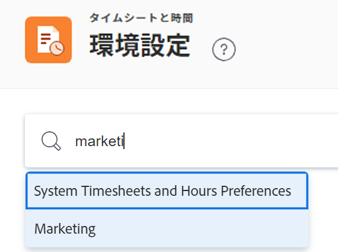

# タイムシートと時間の基本設定を構成する

<!--Audited: 01/2024-->

<!--DON'T DELETE, DRAFT OR HIDE THIS ARTICLE. IT IS LINKED TO THE PRODUCT, THROUGH THE CONTEXT SENSITIVE HELP LINKS.-->

As an [!DNL Adobe Workfront] 管理者は、タイムシートと時間の基本設定を次の場所で指定できます： [!DNL Workfront] を使用して、タイムシートに事前入力できる項目と、ユーザーが時間を記録できる項目を定義します。

>[!IMPORTANT]
>
>この記事で説明した条件に従ってタイムシートに事前入力される項目に加えて、次の項目もタイムシートに既定で表示されます。
>
>* タイムシートの期間内に時間を記録した項目
>* タイムシートに固定された項目
>* 検索し、タイムシートに手動で追加する項目。 手動で追加した項目は、デフォルトでピン留めされます。
>
>詳しくは、 [ログ時間](../../../timesheets/create-and-manage-timesheets/log-time.md).

タイムシートに加えた変更は、今後作成されるすべてのタイムシートに影響を与えます。

## アクセス要件

この記事の手順を実行するには、次のアクセス権が必要です。

<table style="table-layout:auto"> 
 <col> 
 <col> 
 <tbody> 
  <tr> 
   <td role="rowheader">[!DNL Adobe Workfront] 計画</td> 
   <td>任意</td> 
  </tr> 
  <tr> 
   <td role="rowheader">[!DNL Adobe Workfront] ライセンス</td> 
   <td>
現在：[!UICONTROL プラン ]

   または
   
新規：標準

   </td> 
  </tr> 
  <tr> 
   <td role="rowheader">アクセスレベル設定</td> 
   <td> 
次の条件を満たす必要があります。 [!DNL Workfront] 管理者。
  </td>
</tr> 
 </tbody> 
</table>

*詳しくは、 [Workfrontドキュメントのアクセス要件](/help/quicksilver/administration-and-setup/add-users/access-levels-and-object-permissions/access-level-requirements-in-documentation.md).

## タイムシートと時間の基本設定を設定する

{{step-1-to-setup}}

1. クリック **[!UICONTROL タイムシートと時間]** > **[!UICONTROL 環境設定]**.

   [ タイムシートと時間の基本設定 ] ページが表示されます。

1. （オプション） **システムタイムシートと時間の基本設定** 検索ボックスにグループの名前を入力し、リストに表示されたら選択します。

   

   [ タイムシートと時間の基本設定 ] ページは、選択したグループの基本設定で更新されます。 グループレベルの環境設定を変更するには、システムレベルの環境設定をロック解除する必要があります。 詳しくは、 [グループのタイムシートと時間の基本設定をロック解除する](#unlock-timesheet-and-hour-preferences-for-groups) 」を参照してください。

1. Adobe Analytics の **[!UICONTROL 一般環境設定]** セクションで、次のいずれかのオプションを設定します。

   <table style="table-layout:auto"> 
    <col> 
    <col> 
    <tbody> 
     <tr> 
      <td role="rowheader">[!UICONTROL 未来の日付のログ時間 ]</td> 
      <td> 
ユーザーがシステム全体の将来の日付の時刻を次の場所に記録できるようにします。
 
       <ul> 
        <li>ログ時間にアクセスできるプロジェクト、タスクおよび問題</li> 
        <li>一般時間としてのタイムシート</li> 
       </ul> 
これは、ユーザーがオフィスを離れる予定で、事前にその時間をログに記録したい場合に便利です。
 
<b>注意</b>:
 
       
ユーザーが終了またはキャンセルしたタスクや問題に対して時間を記録するのを防ぐことはできません。 ユーザーが完了または無効なプロジェクトで時間をログに記録するのを防ぐことができます。 タスクやタスクのリストでフィルターを使用して、完了またはキャンセルしたタスクをユーザーに表示しないようにすることをお勧めします。
 </td> 
     </tr>

   <tr> 
      <td role="rowheader">[!UICONTROL ジョブの役割を時間エントリに手動で割り当て ]</td> 
      <td> 
ユーザープロファイルに割り当てられたジョブロールまたはオブジェクトに割り当てられたジョブロールを、ユーザーが手動で選択できるようにします。
 
<b>重要</b>:  
        <ul> 
         <li>時間エントリにジョブの役割を割り当てた後にこの設定を無効にした場合、ユーザーは、プロジェクト、タスクまたはイシューの [!UICONTROL 時間 ] タブで、様々な役割の下に記録される時間を調整する必要があります。</li> 
         <li>ユーザーのプロファイルにジョブの役割が割り当てられていない場合、[!UICONTROL タスク所有者 ] ダイアログボックスで [!UICONTROL タスクの所有者 ] として割り当てられたタスクがあると、そのジョブの役割はユーザーがタスクのタイムログを記録する際に表示されます。</li> 
        </ul> 
 </td> 
     </tr> 
     <tr data-mc-conditions=""> 
      <td role="rowheader">[!UICONTROL タイムシートの編集を所有者と管理者に制限する ]</td> 
      <td> 
タイムシートの所有者に編集を制限し、 [!DNL Workfront] 管理者。 このオプションを無効にした場合、タイムシートは次のユーザーも編集できます。
 
       <ul> 
        <li> 
タイムシートおよびアクセスレベルの時間に管理アクセス権を持つユーザー
 </li> 
        <li> 
タイムシートで [ 時間の編集が可能 ] が有効になっている場合のタイムシートの承認者
 </li> 
        <li> 
タイムシート所有者の管理者
 </li> 
       </ul> </td> 
     </tr> 
     <tr data-mc-conditions=""> 
      <td role="rowheader">[!UICONTROL 時間の編集を所有者と管理者に制限 ]</td> 
      <td>時間を入力したユーザーに対して編集を制限し、 [!DNL Workfront] 管理者。 この設定は、プロジェクトの [!UICONTROL 時間 ] タブまたは時間レポートに適用されます。</td> 
     </tr> 
    </tbody> 
   </table>

1. Adobe Analytics の **[!UICONTROL ユーザーが時間を記録できる場所]** セクションで、次のいずれかのオプションを設定します。

   <table style="table-layout:auto">
    <tr>
        <td>[!UICONTROL 直接プロジェクトに移動 ]</td>
        <td>ユーザーがプロジェクトの時間を [!UICONTROL 更新 ] タブとタイムシートの両方で記録できるようにします。 ユーザーがプロジェクトレベルで時間を記録しない場合、このオプションはオフのままにする必要があります。</td>
    </tr>
    <tr>
        <td>[!UICONTROL 完了したプロジェクトの場合 ]</td>
        <td>完了とマークされたプロジェクトの時間を記録できます。 このオプションを無効にした場合、ユーザーは [!UICONTROL 完了 ] ステータスのプロジェクトで完了した作業の時間を記録できません。</td>
    </tr>
    <tr>
        <td>[!UICONTROL 無効になったプロジェクトで ]</td>
        <td>このオプションを有効にすると、ユーザーは [!UICONTROL 無効 ] ステータスのプロジェクトに数時間を記録できます。</td>
    </tr>
   </table>

1. Adobe Analytics の **[!UICONTROL タイムシートの事前入力]** セクションで、次のいずれかのオプションを設定します。

   <table style="table-layout:auto"> 
    <col> 
    <col> 
    <tbody> 
     <tr> 
      <td role="rowheader">[!UICONTROL 内の作業 ] &lt;number of="" weeks=""&gt; [!UICONTROL タイムシートの作業範囲 ]</td> 
      <td> 
ユーザーに割り当てられたタスクとタスクの日付が含まれるタイムシートの日付範囲の前後の週数を定義します。
 
      
デフォルト設定は 1 週間で、この範囲を 4 週間に延長できます。
 
      
つまり、タイムシートには、タイムシートの日付範囲の 4 週間前からタイムシートの日付範囲の 4 週間後までの間の日付があるタスクと問題が事前に設定されています。期間に 4 週間を選択した場合。 
 </td> 
     </tr> 
     <tr> 
      <td role="rowheader">[!UICONTROL タスクと完了した問題 ]</td> 
      <td>通常、1 つのタスクに複数のリソースが割り当てられる場合は、この設定をお勧めします。 つまり、あるリソースがタスクに対する時間を記録し、完了とマークした場合でも、タスクに割り当てられた他のリソースは、タイムシートでタスクや問題を見つけて、時間を記録できます。</td> 
     </tr> 
     <tr> 
      <td role="rowheader">[!UICONTROL タイムシートの日付範囲で予定日が設定されたタスクと問題 ]</td> 
      <td> 
選択すると、タイムシートには、タイムシートの日付範囲に含まれる予定開始日または完了日のタスクとタスクが含まれます。
 </td> 
     </tr> 
     <tr> 
      <td role="rowheader"> [!UICONTROL タイムシートの日付範囲に予測日付が含まれるタスク ]</td> 
      <td> 
選択すると、タイムシートには、発行またはタスクの予定日がタイムシートの日付範囲外にある場合でも、プロジェクトの期間内に [ 予定開始日 ] または [ 完了日 ] が設定されたタスクが含まれます。
 </td> 
     </tr> 
    </tbody> 
   </table>

1. Adobe Analytics の **[!UICONTROL 削除されたプロジェクト、タスクおよび問題]** 「 」セクションで、次の情報を指定します。

   <table style="table-layout:auto"> 
    <col> 
    <col> 
    <tbody> 
     <tr> 
      <td role="rowheader"> プロジェクトを削除する場合</td> 
      <td> 
       <ul> 
        <li><strong>[!UICONTROL タイムシートに既に追加されているログ記録時間を一般時間として保持 ]</strong>：このプロジェクトが後で復元された場合、時間はタイムシートに残ります。</li> 
        <li><strong>[!UICONTROL ログに記録された時間を削除する ]</strong>：このプロジェクトが後で復元されると、既にログに記録されている時間がプロジェクトに復元されます。</li> 
       </ul> </td> 
     </tr> 
     <tr> 
      <td role="rowheader">タスクまたは問題を削除する場合</td> 
      <td> 
       <ul> 
        <li><strong>[!UICONTROL ログに記録された時間をプロジェクトに移動します ]</strong> タスクまたはイシューが存在する場所：このタスクまたはイシューが後で復元された場合、時間はプロジェクトに残ります。 </li> 
        <li> 
<strong>[!UICONTROL ログに記録された時間を削除する ]</strong>：このタスクまたは問題が後で復元された場合、ログに記録された時間がタスクまたは問題に復元されます。
 
これらのオプションについて詳しくは、 <a href="../../../administration-and-setup/manage-workfront/manage-deleted-items/configure-how-hours-affected-when-obj-deleted-restored.md" class="MCXref xref">[!UICONTROL オブジェクトが削除され、復元された時間に対する [!UICONTROL Affect] の設定</a>.
 </li> 
       </ul> </td> 
     </tr> 
    </tbody> 
   </table>

1. 「**[!UICONTROL 保存]**」をクリックします。

## グループのタイムシートと時間の基本設定をロック解除する

組織内のグループには、固有のワークフローに対して異なる構成のタイムシートまたは時間の基本設定が必要になる場合があります。 組織全体のすべてのグループの環境設定のロックを解除して、グループが自分で設定できるようにすることができます。

優先度がロック解除され、グループ管理者が変更すると、グループがホームグループの場合は、タイムシートの所有者に影響します。

グループ管理者がグループに対してタイムシートと時間の基本設定を構成する方法の詳細については、「 [グループのタイムシートと時間の基本設定を構成する](../../../administration-and-setup/manage-groups/create-and-manage-groups/configure-timesheet-hour-preferences-group.md).

>[!NOTE]
>
>次の後： [!DNL Workfront] 管理者は、システムレベルでプリファレンスのロックを解除し、任意のグループ管理者が設定を行い、そのグループと以下のサブグループの全員が同じ設定を使用するようにロックできます。 これは、 [!DNL Workfront] 管理者は、システム内のすべてのユーザーに対して環境設定を設定およびロックする必要があります。 詳しくは、 [グループのタイムシートと時間の優先順位をロックまたはロック解除する](../../../administration-and-setup/manage-groups/create-and-manage-groups/lock-or-unlock-a-group-timesheet-hour-preference.md).

プロジェクトの環境設定をロック解除して、グループが設定できるようにするには、次の手順を実行します。

{{step-1-to-setup}}

1. 左側のパネルで、 **[!UICONTROL タイムシートと時間]**&#x200B;を選択し、次に **[!UICONTROL 環境設定]**.

1. 次のいずれかの操作を行います。

   * グループ管理者がグループの環境設定を構成できるようにするには、 **ロック解除** トグル  をクリックしてロックを解除します。
   * すべてのグループで環境設定を使用する場合は、切り替えがロックされていることを確認します。  （これはデフォルト）。

     >[!IMPORTANT]
     >
     >ロックされた環境設定を構成する際にすべてのニーズが考慮されるように、システム全体の管理者やグループ内のユーザーとコミュニケーションを取ることをお勧めします。
     >
     >ロックすると、その設定がシステム内のすべてのグループに継承されます。 また、環境設定のロックが一定期間解除されている場合は、グループ管理者が行った設定がその設定に置き換えられます。

1. 「**[!UICONTROL 保存]**」をクリックします。
