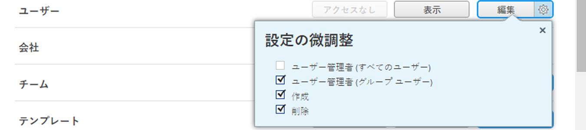

# 会社の作成と編集

<!--DON'T DELETE, DRAFT OR HIDE THIS ARTICLE. IT IS LINKED TO THE PRODUCT, THROUGH THE CONTEXT SENSITIVE HELP LINKS.-->

会社は、 [!DNL Adobe Workfront] 組織、組織内の部門、または連携するクライアントを表すことができます。 会社を [!DNL Workfront] また、財務計画やレポート作成の目的で使用し、オブジェクトに対する権限を定義し、情報を機密に保ちます。

## アクセス要件

で会社を管理するには、次が必要です。 [!DNL Workfront]:

<table style="table-layout:auto"> 
 <col data-mc-conditions=""> 
 <col data-mc-conditions=""> 
 <tbody> 
  <tr> 
   <td role="rowheader"> 
[!DNL Workfront] 計画*
 </td> 
   <td>[!UICONTROL チーム ] 以降</td> 
  </tr> 
  <tr> 
   <td role="rowheader"> 
[!DNL Adobe Workfront] ライセンス*
 </td> 
   <td>[!UICONTROL プラン ]</td> 
  </tr> 
  <tr data-mc-conditions=""> 
   <td role="rowheader">アクセスレベル設定*</td> 
   <td> 
次のいずれかを実行します。
 
    <ul> 
     <li> 
[!UICONTROL システム管理者 ] のアクセスレベル。システム内の任意の会社を編集できます。 詳しくは、 <a href="../../../administration-and-setup/add-users/configure-and-grant-access/grant-a-user-full-administrative-access.md" class="MCXref xref">ユーザーに完全な管理アクセス権を付与する</a>. 
 </li> 
     <li> 
会社を管理するための管理者アクセス。システム内の任意の会社を編集できます。 詳しくは、 <a href="../../../administration-and-setup/add-users/configure-and-grant-access/grant-users-admin-access-certain-areas.md" class="MCXref xref">特定の領域に対する管理者アクセス権をユーザーに付与する</a>.
 </li> 
    </ul> 
<b>メモ</b>:  
     <ul> 
      <li> 
また、グループ管理者として割り当てられている任意のグループに関連する会社を管理することもできます。
 </li> 
      <li> 
ユーザーを [!DNL Workfront] システムには、次のいずれかが必要です。
 
       <ul> 
        <li> 
[!UICONTROL System Administrator] アクセスレベル。 詳しくは、 <a href="../../../administration-and-setup/add-users/configure-and-grant-access/grant-a-user-full-administrative-access.md" class="MCXref xref">ユーザーに完全な管理アクセス権を付与する</a>. 
 </li> 
        <li> 
アクセスレベルで、[!UICONTROL Users] 設定で [!UICONTROL Edit] が選択されている必要があります。 また、[!UICONTROL Users] 設定の場合は、[!UICONTROL 設定の微調整 ]  に設定されている場合は、[!UICONTROL 作成 ] オプションと、2 つの [!UICONTROL ユーザー管理 ] オプションのうち少なくとも 1 つを有効にする必要があります。 
 
  
 
[!UICONTROL ユーザー管理（グループユーザー）] オプションを使用している場合は、ユーザーがメンバーとなっているグループのグループ管理者である必要があります。
 </li> 
       </ul> 
アクセスレベルでのユーザー設定について詳しくは、 <a href="../../../administration-and-setup/add-users/configure-and-grant-access/grant-access-other-users.md" class="MCXref xref">ユーザーへのアクセス権の付与</a>.
 </li> 
     </ul> 
 </td> 
  </tr> 
 </tbody> 
</table>

&#42;保有するプラン、ライセンスの種類、アクセスレベルの設定を確認するには、 [!DNL Workfront] 管理者。

## ユーザーを会社に追加するメリット {#benefits-of-adding-users-to-a-company}

* ユーザーを直属の部下に関連付けることで、会社の組織図を作成できます。 同じ会社のユーザーのみを、その会社の別のユーザーの直属のレポートとして追加できます。
* プロジェクトマネージャーは、同じ会社内で使用可能なリソースを識別できます。
* 次の設定の 1 つまたはすべてを選択して、企業間で情報を非公開にすることができます。

   * 同じ会社のユーザーは、他のユーザーのリクエストを確認できます。

      詳しくは、 [!DNL Workfront] 管理者は、ユーザーの会社に基づくリクエストに対して同様のアクセス権を付与できます。詳しくは、 [の全員にタスクとタスクの環境設定を指定 [!DNL Workfront]](../../../administration-and-setup/set-up-workfront/configure-system-defaults/set-task-issue-preferences.md#changing-task-and-issue-preferences) 記事内 [システム全体のタスクと問題の環境設定を構成](../../../administration-and-setup/set-up-workfront/configure-system-defaults/set-task-issue-preferences.md).

      グループ管理者がユーザーの会社に基づいてリクエストに類似したアクセス権を付与する方法について詳しくは、 [グループのタスクと問題の環境設定を設定する](../../../administration-and-setup/manage-groups/create-and-manage-groups/configure-task-issue-preferences-group.md).

   * ユーザーは、会社に関連付けられたリクエストキューのみを表示できます。 リクエストキューの表示を制限する方法について詳しくは、 [リクエストキューへのアクセスを提供](../../../manage-work/requests/create-and-manage-request-queues/provide-access-to-request-queues.md).
   * ユーザーに対して、自分の会社または自分の会社と主な会社のユーザーのみを表示するように制限できます。 ユーザーのプライバシーに関する主な企業機能について詳しくは、 [カスタムアクセスレベルの作成または変更](../../../administration-and-setup/add-users/configure-and-grant-access/create-modify-access-levels.md).
   * ユーザーは、会社のユーザーのみが表示できるように、品目に対しておこなった更新を制限できます。 会社で更新を非公開にする方法について詳しくは、 [作業を更新](../../../workfront-basics/updating-work-items-and-viewing-updates/update-work.md).

## での会社の作成または編集 [!DNL Workfront] {#create-or-edit-a-company-in-workfront}

追加できる会社の数に制限はありません。 ただし、オブジェクトの権限で発生する可能性のある問題のため、使用する会社の数を制限することをお勧めします。断片化が多すぎると、ユーザーが作業項目を表示できなくなる場合があります。

デフォルトでは、のインスタンスに関連付けられた会社 [!DNL Workfront] は [!DNL Workfront] システムおよびは、組織のプライマリ会社です。 顧客名と同じ名前を持ちます。 詳しくは、 [!DNL Workfront]を参照してください。 [システムの基本情報を設定する](../../../administration-and-setup/get-started-wf-administration/configure-basic-info.md).

会社を追加または編集するには：

1. 次をクリック： **[!UICONTROL メインメニュー]** アイコン  右上隅に [!DNL Adobe Workfront]を選択し、「 **[!UICONTROL 設定]** .

1. クリック **[!UICONTROL 会社]**.
1. 会社を追加する場合は、 **[!UICONTROL 新しい会社]**.

   または

   既存の会社を編集する場合は、会社を選択し、 **[!UICONTROL 編集]**.

1. 表示されるオプションを使用して、次の情報を設定します。

   <table style="table-layout:auto"> 
    <col> 
    <col> 
    <tbody> 
     <tr> 
      <td role="rowheader">[!UICONTROL 基本情報 ] セクション</td> 
      <td> 
       <ul> 
        <li> 
<b>[!UICONTROL 会社名 ]</b>:会社名を入力します。
 </li> 
        <li> 
<b>[!UICONTROL がアクティブです ]</b>:このオプションを有効にすると、ユーザーは会社を検索し、作成および編集するプロジェクトに会社を添付できます。 非アクティブな会社はプロジェクトに添付できません。 このオプションは、デフォルトで有効になっています。
 </li> 
        <li> 
<b>[!UICONTROL これはプライマリ会社です ]</b>:会社を組織の主要会社として割り当てます。 通常、プライマリ会社は、 [!DNL Workfront] のほとんどのユーザーが作業するアカウント。
 
1 つの会社を持つことも、1 つの会社を 1 つの主要な会社として指定することもできませんが、複数の会社を主要な会社として指定することはできません。 詳しくは、 <a href="../../../administration-and-setup/add-users/configure-and-grant-access/create-modify-access-levels.md" class="MCXref xref">カスタムアクセスレベルの作成または変更</a>.
 
<b>注意</b>:ユーザーのアクセスレベルを変更すると、ユーザーに対して他のユーザーの表示を制限できます。その会社のみ、または関連会社と主要会社でのみ。 主な会社がユーザーのアクセスレベルでどのように機能するかについて詳しくは、 <a href="../../../administration-and-setup/add-users/configure-and-grant-access/create-modify-access-levels.md" class="MCXref xref">カスタムアクセスレベルの作成または変更</a>.
 </li> 
        <li> 
<b>[!UICONTROL グループ ]</b>:会社と取引を行うグループがある場合は、ここにグループの名前を追加できます。 これは、グループがビジネスを展開するすべての会社に関するレポートおよび管理を必要とするグループ管理者に役立ちます。
 
<b>重要</b>:この会社と連携するグループを関連付けない場合、グループの管理者は、自分のアクセスレベルで会社に対する管理者アクセス権を持っていないと、アクセスできません。 このアクセス権の付与方法については、 <a href="../../../administration-and-setup/add-users/configure-and-grant-access/grant-users-admin-access-certain-areas.md" class="MCXref xref">特定の領域に対する管理者アクセス権をユーザーに付与する</a>.
 
グループ名を入力し、 <strong>[!UICONTROL Enter]</strong> 表示されたとき。
 
グループを会社に割り当てると、そのグループの管理者は会社への [!UICONTROL 管理 ] アクセス権を取得します。 詳しくは、 <a href="#group-administrators-and-companies" class="MCXref xref">グループ管理者と会社</a> 」を参照してください。
 </li> 
        <li> 
<b>[!UICONTROL 会社メンバー ]</b>:会社に既存のユーザーを追加します。 これにより、これらのユーザーをこの会社に関連付けます。
 
1 つの会社と関連付けるユーザー数に制限はありませんが、1 人のユーザーを複数の会社と関連付けることはできません。
 </li> 
       </ul> </td> 
     </tr> 
     <tr> 
      <td role="rowheader">[!UICONTROL 請求率 ] セクション</td> 
      <td> 
会社レベルで、ジョブロールに関連付けられた請求率を上書きできます。 ジョブの役割の作成と請求率との関連付けについて詳しくは、 <a href="../../../administration-and-setup/set-up-workfront/organizational-setup/create-manage-job-roles.md" class="MCXref xref">ジョブの役割の作成と管理</a>.
 
会社レベルでの請求率の上書きの詳細は、 <a href="../../../administration-and-setup/set-up-workfront/organizational-setup/override-job-role-billing-rates-company-level.md" class="MCXref xref">会社レベルでのジョブロール請求率の上書き</a>.
 </td> 
     </tr> 
     <tr> 
      <td role="rowheader">[!UICONTROL カスタムForms] セクション</td> 
      <td> 
会社に追加するフィールドが次の場所にない場合： [!DNL Workfront]を使用すると、カスタムフォームを作成して会社に関連付けることができます。 このフォームは、ドロップダウンメニューから選択して会社に添付できます。 アクティブな会社のみがドロップダウンメニューに表示されます。 カスタムFormsの作成について詳しくは、 <a href="../../../administration-and-setup/customize-workfront/create-manage-custom-forms/create-or-edit-a-custom-form.md" class="MCXref xref">カスタムフォームの作成または編集</a>. 
 </td> 
     </tr> 
    </tbody> 
   </table>

1. 新しい会社を作成する場合は、 **[!UICONTROL 会社を作成]**.

   または

   既存の会社を編集している場合は、 **[!UICONTROL 変更を保存]**.

## 会社メンバーシップの管理

既存の会社のメンバーシップの管理について詳しくは、 [会社メンバーシップの管理](../../../administration-and-setup/set-up-workfront/organizational-setup/manage-company-memberships.md).

## オブジェクトの会社との共有について

会社に関連付けられているユーザーは、特定の権限を使用できます。詳しくは、 [ユーザーを会社に追加するメリット](#benefits-of-adding-users-to-a-company). これらの権限に加えて、ユーザー権限でオブジェクトの表示、投稿、編集を行うことができます。 [!DNL Workfront] オブジェクトを会社と共有することで

一度に 1 人のユーザーとオブジェクトを共有する代わりに、そのオブジェクトを会社全体と共有することができます。 会社の各ユーザーは、そのオブジェクトに対して同じ権限を持っています。

オブジェクトの共有の詳細については、 [オブジェクトに対する共有権限の概要](../../../workfront-basics/grant-and-request-access-to-objects/sharing-permissions-on-objects-overview.md).

## グループ管理者と会社 {#group-administrators-and-companies}

When a [!DNL Workfront] 管理者が会社にグループを割り当て、グループの管理者がグループを獲得する [!UICONTROL 管理] 次の会社にアクセス [!UICONTROL 設定]. これには、 [!UICONTROL 会社] ページ内 [!UICONTROL 設定]を使用して、グループに関連付けられた会社を表示および管理できます。

こので、 [!UICONTROL 会社] ページでは、グループ管理者が会社にグループを割り当てることができますが、グループ管理者が作成した会社である必要があります。 グループ管理者のアクセスレベルが会社への管理アクセス権を持つように設定されていない場合、 [!UICONTROL グループ] グループ管理者が会社を作成する際には、フィールドが必須です。太字のタイトルは次のことを示します。

ユーザーがアクセスレベルで会社に対して管理者アクセス権を取得する方法について詳しくは、 [特定の領域に対する管理者アクセス権をユーザーに付与する](../../../administration-and-setup/add-users/configure-and-grant-access/grant-users-admin-access-certain-areas.md).

での会社管理の詳細 [!UICONTROL 設定] 領域： [での会社の作成または編集 [!DNL Workfront]](#create-or-edit-a-company-in-workfront) 」を参照してください。
