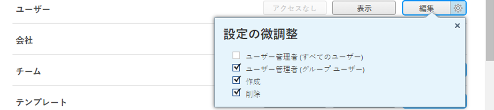

# 会社を非アクティブ化または再アクティブ化

<!--The highlighted information on this page refers to functionality not yet generally available. It is available only in the Preview Sandbox environment, and is being released in a phased rollout to Production.-->

関連する履歴データをすべて保持したまま、使用しなくなった会社を非アクティブ化できます。 既にシステム内のどこかで使用されている会社を非アクティブ化しても、その会社は常に使用されていたのと同じように機能し続けます。 削除もブロックもされません。

## アクセス要件

+++ 展開すると、この記事の機能のアクセス要件が表示されます。

<table style="table-layout:auto">
 <tbody> 
  <tr> 
   <td> 
[!DNL Workfront] パッケージ
 </td> 
   <td>
任意

   </td> 
  </tr> 
  <tr> 
   <td> 
[!DNL Adobe Workfront] ライセンス
 </td> 
   <td>
[!UICONTROL Plan]

   
[!UICONTROL Standard]

   </td> 
  </tr>
  <tr> 
   <td>アクセスレベル設定</td> 
  <td> 
次のいずれかが必要です。
 
    <ul> 
     <li> 
[!UICONTROL システム管理者] アクセス レベル。システム内の任意の会社を編集できます。
 </li> 
     <li> 
会社を管理するための管理アクセス。システム内の任意の会社を編集できます。
 </li> 
    </ul> 
<b>メモ</b>：
     <ul> 
      <li> 
また、自分がグループ管理者として割り当てられている任意のグループに関連する会社を管理することもできます。
 </li> 
      <li> 
ユーザーを[!DNL Workfront] システムから追加および削除するには、次のいずれかの操作を行う必要があります。
 
       <ul> 
        <li> 
[!UICONTROL System Administrator] アクセスレベル。 
 </li> 
        <li> 
<b>[!UICONTROL Users]</b>設定をアクセスレベルで<b>[!UICONTROL Edit]</b> アクセスに設定し、<b>[!UICONTROL Create]</b>と、2つの<b>[!UICONTROL User Admin]</b> オプションのうち1つ以上を<b>[!UICONTROL Fine-tune your settings]</b>で有効にします。 
 
  
 
これらの2つのオプションのうち、<b>[!UICONTROL User Admin （Group Users） ]</b>が有効になっている場合は、ユーザーがメンバーであるグループのグループ管理者である必要があります。
 </li> 
       </ul>
       </li> 
     </ul> 
 </td>
  </tr> 
 </tbody> 
</table>

詳しくは、[Workfront ドキュメントのアクセス要件](/help/quicksilver/administration-and-setup/add-users/access-levels-and-object-permissions/access-level-requirements-in-documentation.md)を参照してください。

+++

## 会社を非アクティブ化または再アクティブ化

{{step-1-to-setup}}

1. 左側のパネルで、**[!UICONTROL 会社]** をクリックします。

1. 非アクティブ化または再アクティブ化する会社を 1 つ以上選択します。
1. **[!UICONTROL 編集]**.<!--MAKE THIS A SEPARATE NUMBERED LINE(Conditional) In the Preview environment, disable the **[!UICONTROL Is Active]** option to deactivate it, or enable the option to activate it.-->をクリックします
1. 単一の会社の場合、**[!UICONTROL はアクティブです]** オプションを無効にして非アクティブにするか、オプションを有効にしてアクティブにします。<!--ADD TO THE FRONT OF THIS SENTENCE In the Production environment, -->

   または

   複数の会社の場合、**[!UICONTROL アクティブ]**&#x200B;ドロップダウンメニューから「**[!UICONTROL いいえ]**」を選択して、非アクティブ化するか、「**[!UICONTROL はい]**」を選択してアクティブ化します。

1. 「**[!UICONTROL 変更を保存]**」をクリックします。
