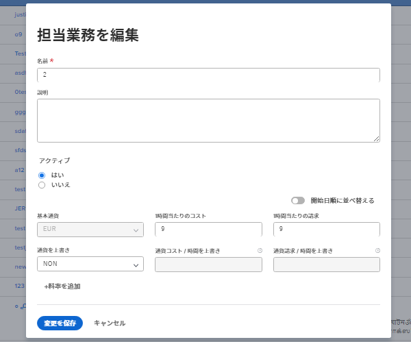

# 担当業務の非アクティブ化

[!DNL Adobe Workfront] 管理者または担当業務への管理アクセス権を持つユーザーは、システム内で古くなった担当業務を非アクティブ化できます。担当業務を削除するのではなく非アクティブ化すると、その担当業務に関連付けられている履歴情報を保持できます。

以前に非アクティブ化した担当業務をもう一度アクティブ化することもできます。

## アクセス要件

以下が必要です。

<table style="table-layout:auto"> 
 <col> 
 <col> 
 <tbody> 
  <tr> 
   <td role="rowheader">[!UICONTROL Adobe Workfront] プラン*</td> 
   <td> 
任意 
 </td> 
  </tr> 
  <tr> 
   <td role="rowheader">[!UICONTROL Adobe Workfront] ライセンス*</td> 
   <td>[!UICONTROL Plan]</td> 
  </tr> 
  <tr> 
   <td role="rowheader">アクセスレベル設定*</td> 
   <td> 
担当業務の管理アクセス権
 
<b>メモ</b>：それでもアクセスできない場合は、アクセスレベルに追加の制限が設定されていないかどうかを [!DNL Workfront] 管理者にお問い合わせください。[!DNL Workfront] 管理者がアクセスレベルを変更する方法について詳しくは、<a href="../../../administration-and-setup/add-users/configure-and-grant-access/create-modify-access-levels.md" class="MCXref xref">カスタムアクセスレベルの作成または変更</a>を参照してください。
 </td> 
  </tr> 
 </tbody> 
</table>

&#42;ご利用のプラン、ライセンスタイプまたはアクセス権を確認するには、[!DNL Workfront] 管理者にお問い合わせください。

## 担当業務を非アクティブ化した場合の影響

非アクティブ化された担当業務は、次の領域で表示されなくなります。

* [!UICONTROL 割り当て]先行入力フィールド（タスク、テンプレートタスク、イシュー、承認およびルーティングルール用）
* リストとレポートの[!UICONTROL 割り当て]フィールド
* ユーザープロファイル

  >[!NOTE]
  >
  >新しい担当業務をユーザーに追加しても、非アクティブ化された担当業務は表示されません。ただし、担当業務が非アクティブ化される前にユーザーに関連付けられていた場合は、引き続き[!UICONTROL 主要役割]フィールドと[!UICONTROL その他の役割]フィールドに表示されます。

* レイアウトテンプレート割り当てを含む、オブジェクトの[!UICONTROL 共有]ダイアログボックス
* カスタムフォームの先行入力フィールド
* [!UICONTROL リソースプール]の[!UICONTROL プールのメンバー]フィールド
* [!UICONTROL 請求レート]編集画面の[!UICONTROL 担当業務]フィールド（ユーザーがプロジェクトの請求レートを上書きする場合）
* プロジェクトの[!UICONTROL 割り当てをかんばんボードに追加]ダイアログボックス
* 計画またはイニシアチブの[!UICONTROL 担当業務]フィールド（[!DNL Adobe Workfront Scenario Planner] を使用しているユーザーがいる場合）。

  [!DNL Scenario Planner] は新バージョンの [!DNL Adobe Workfront] でのみ使用可能であり、使用するには追加のライセンスが必要です。[!DNL Workfront Scenario Planner] については、[ [!DNL Scenario Planner] の概要](../../../scenario-planner/scenario-planner-overview.md)を参照してください。

>[!TIP]
>
>非アクティブ化された担当業務は、リスト、レポートおよびその他のツール（[!UICONTROL ワークロードバランサー]など）のフィルターに常に表示されます。

## 担当業務を非アクティブ化する際の考慮事項

古くなった担当業務は、削除するよりも非アクティブ化することをお勧めします。これにより、過去の担当業務に関連する履歴情報をすべて保持できます。

>[!NOTE]
>
>担当業務に割り当てられた作業は、担当業務を非アクティブ化しても割り当てられたままになります。

未使用の担当業務を非アクティブ化する場合は、その前に以下を実施することをお勧めします。

* 非アクティブ化する担当業務に割り当てられているあらゆるオブジェクトのレポートを作成し、それらのオブジェクトをアクティブな担当業務に再割り当てします。レポートの作成については、[レポートの作成](../../../reports-and-dashboards/reports/creating-and-managing-reports/create-report.md)を参照してください。

  >[!TIP]
  >
  >非アクティブ化された担当業務が割り当てられているタスクやイシューをフィルタリングして特定するレポートを作成できます。そのレポートを使用して、未処理のタスクやイシューをアクティブな担当業務に再割り当てします。

* 非アクティブ化する担当業務に割り当てられている、すべての承認プロセス、現在の承認パスおよびルーティングルールなどのオブジェクトの棚卸しを行い、それらをアクティブなロールに再割り当てします。

  >[!TIP]
  >
  >リクエストキューを使用している場合、ルーティングルールでデフォルトの担当者として割り当てられている担当業務を非アクティブ化しても、その担当業務は残ったままになり、非アクティブ化された担当業務にリクエストが引き続きルーティングされます。チームを非アクティブ化する前に、ルーティングルールを更新してアクティブな担当業務を反映させることをお勧めします。

  承認プロセスとルーティングルールの作成については、次の記事を参照してください。

   * [作業項目の承認プロセスの作成](../../../administration-and-setup/customize-workfront/configure-approval-milestone-processes/create-approval-processes.md)
   * [ルーティングルールの作成](../../../manage-work/requests/create-and-manage-request-queues/create-routing-rules.md)

## 担当業務の非アクティブ化

1. [!DNL Adobe Workfront] の右上隅にある&#x200B;**[!UICONTROL メインメニュー]**&#x200B;アイコン  をクリックしてから、**[!UICONTROL 設定]**&#x200B;アイコン  をクリックします。

1. 左パネルで「**[!UICONTROL 担当業務]」をクリックします。**
1. （オプション）**[!UICONTROL フィルター]**&#x200B;ドロップダウンメニューで、「**[!UICONTROL アクティブ]**」を選択して、アクティブの担当業務のみを表示します。
1. 非アクティブ化する担当業務の名前をクリックします。
1. **[!UICONTROL アクティブ]**&#x200B;ドロップダウンメニューで、「**[!UICONTROL いいえ]**」を選択します。

   

1. 「**[!UICONTROL 変更を保存]**」をクリックします。

   担当業務が非アクティブ化され、作業に割り当てたり、レイアウトテンプレートに関連付けたりできなくなります。[!DNL Workfront] における担当業務のすべての用途については、[担当業務の概要](../../../administration-and-setup/set-up-workfront/organizational-setup/job-role-overview.md)を参照してください。
