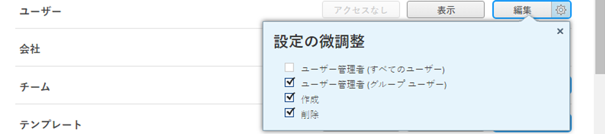

# 会社メンバーシップの管理

内 [!UICONTROL 会社] 領域 [!UICONTROL 設定]を使用して、会社のメンバーを追加および削除できます。 また、ユーザープロファイルを編集して、ユーザーに登録を促すこともできます [!DNL Workfront]、で非アクティブ化します。 [!DNL Workfront]をクリックし、 [!DNL Workfront] システム。

新しい会社の作成について詳しくは、 [会社の作成と編集](../../../administration-and-setup/set-up-workfront/organizational-setup/create-and-edit-companies.md).

## アクセス要件

で会社を管理するには、次が必要です。 [!DNL Workfront]:

<table style="table-layout:auto"> 
 <col data-mc-conditions=""> 
 <col data-mc-conditions=""> 
 <tbody> 
  <tr> 
   <td role="rowheader"> 
[!DNL Workfront] 計画*
 </td> 
   <td>[!UICONTROL チーム ] 以降</td> 
  </tr> 
  <tr> 
   <td role="rowheader"> 
[!DNL Adobe Workfront] ライセンス*
 </td> 
   <td>[!UICONTROL プラン ]</td> 
  </tr> 
  <tr data-mc-conditions=""> 
   <td role="rowheader"><strong>アクセスレベル設定*</strong> </td> 
   <td> 
次のいずれかを実行します。
 
    <ul> 
     <li> 
[!UICONTROL システム管理者 ] のアクセスレベル。システム内の任意の会社を編集できます。 詳しくは、 <a href="../../../administration-and-setup/add-users/configure-and-grant-access/grant-a-user-full-administrative-access.md" class="MCXref xref">ユーザーに完全な管理アクセス権を付与する</a>. 
 </li> 
     <li> 
会社を管理するための管理者アクセス。システム内の任意の会社を編集できます。 詳しくは、 <a href="../../../administration-and-setup/add-users/configure-and-grant-access/grant-users-admin-access-certain-areas.md" class="MCXref xref">特定の領域に対する管理者アクセス権をユーザーに付与する</a>.
 </li> 
    </ul> 
<b>メモ</b>:  
     <ul> 
      <li> 
また、グループ管理者として割り当てられている任意のグループに関連する会社を管理することもできます。
 </li> 
      <li> 
ユーザーを [!DNL Workfront] システムには、次のいずれかが必要です。
 
       <ul> 
        <li> 
[!UICONTROL System Administrator] アクセスレベル。 詳しくは、 <a href="../../../administration-and-setup/add-users/configure-and-grant-access/grant-a-user-full-administrative-access.md" class="MCXref xref">ユーザーに完全な管理アクセス権を付与する</a>. 
 </li> 
        <li> 
アクセスレベルで、[!UICONTROL Users] 設定で [!UICONTROL Edit] が選択されている必要があります。 また、[!UICONTROL Users] 設定の場合は、[!UICONTROL 設定の微調整 ]  に設定されている場合は、[!UICONTROL 作成 ] オプションと、2 つの [!UICONTROL ユーザー管理 ] オプションのうち少なくとも 1 つを有効にする必要があります。 
 
  
 
[!UICONTROL ユーザー管理（グループユーザー）] オプションを使用している場合は、ユーザーがメンバーとなっているグループのグループ管理者である必要があります。
 </li> 
       </ul> 
アクセスレベルでのユーザー設定について詳しくは、 <a href="../../../administration-and-setup/add-users/configure-and-grant-access/grant-access-other-users.md" class="MCXref xref">ユーザーへのアクセス権の付与</a>.
 </li> 
     </ul> 
 </td> 
  </tr> 
 </tbody> 
</table>

&#42;保有するプラン、ライセンスの種類、アクセスレベルの設定を確認するには、 [!DNL Workfront] 管理者。

## 会社メンバーシップの管理

1. 次をクリック： **[!UICONTROL メインメニュー]** アイコン  右上隅に [!DNL Adobe Workfront]を選択し、「 **[!UICONTROL 設定]** .

1. クリック **[!UICONTROL 会社]**.
1. 会社の名前をクリックします。
1. を使用 **[!UICONTROL 会社メンバー]** セクションを左のパネルで選択し、次のいずれかの操作を行います。

   <table style="table-layout:auto"> 
    <col> 
    <col> 
    <tbody> 
     <tr data-mc-conditions=""> 
      <td role="rowheader">メンバーを追加</td> 
      <td> 
クリック <b>[!UICONTROL メンバーを追加 ]</b>をクリックし、表示されるドロップダウンメニューで次のいずれかのオプションを選択します。
 
       <ul> 
        <li> 
<b>[!UICONTROL 新規ユーザー ]</b>:まだにに追加されていないユーザーを追加する [!DNL Workfront].
 
ユーザーを [!DNL Workfront]を参照してください。 <a href="../../../administration-and-setup/add-users/create-and-manage-users/add-users.md" class="MCXref xref">ユーザーを追加</a> および <a href="../../../administration-and-setup/add-users/create-and-manage-users/edit-a-users-profile.md" class="MCXref xref">ユーザーのプロファイルの編集</a>.
 </li> 
        <li> 
<b>[!DNL Existing user]</b>:編集するアクセス権を持つユーザーをシステム内に既に追加します。
 
<b>重要</b>:ユーザーが既に別の会社のメンバーになっている場合、新しい割り当てが古い割り当てを上書きします。 ユーザーは、以前の会社と共有された項目へのアクセス権を失い、この会社と共有された項目へのアクセス権を取得します。
 </li> 
        <li> 
<b>[!UICONTROL ユーザーの読み込み ]</b>:スプレッドシートインポートファイルをアップロードして、ユーザーをインポートします。 詳しくは、 <a href="../../../administration-and-setup/add-users/create-and-manage-users/import-users.md" class="MCXref xref">ユーザーの読み込み</a>.
 </li> 
       </ul> </td> 
     </tr> 
     <tr> 
      <td role="rowheader">メンバーを編集</td> 
      <td> 
       <ol> 
        <li value="1"> 
少なくとも 1 人のユーザーを選択して、[!UICONTROL 編集 ] アイコンをクリックしてください  」と入力します。
 </li> 
        <li value="2"> 
以下のオプションを設定します。 <b>[!UICONTROL ユーザーを編集 ]</b> ボックスが表示されます。
 
これらのオプションについて詳しくは、 <a href="../../../administration-and-setup/add-users/create-and-manage-users/edit-a-users-profile.md" class="MCXref xref">ユーザーのプロファイルの編集</a>.
 </li> 
       </ol> </td> 
     </tr> 
     <tr> 
      <td role="rowheader">メンバーをコピー</td> 
      <td> 
既存のメンバーをコピーして、会社メンバーを作成できます。 
 
<b>メモ</b>:  
この方法でユーザーを作成する場合、次の場合を除き、すべての情報が元のユーザーから新しく作成されたユーザーにコピーされます。
 
        <ul> 
         <li>[!UICONTROL 個人情報 ] セクションの情報。</li> 
         <li>[!UICONTROL ログイン時に表示 ]:このボックスでは、アクセスレベルのデフォルトのランディングタブが選択されています。</li> 
         <li>[!UICONTROL 直属のレポート ]</li> 
        </ul> 
 
       <ol> 
        <li value="1"> 
ユーザーを選択して、[!UICONTROL コピー ] アイコンをクリックします。 . 
 </li> 
        <li value="2"> 
内 <b>[!UICONTROL 新規ユーザー ]</b> 表示されるボックスで、新しいユーザーが使用できるフィールドを編集します。
 
ユーザーに関連付けられているすべてのフィールドについて詳しくは、 <a href="../../../administration-and-setup/add-users/create-and-manage-users/edit-a-users-profile.md" class="MCXref xref">ユーザーのプロファイルの編集</a>.
 </li> 
        <li value="3"> 
クリック <strong>[!UICONTROL このユーザーを追加 ]</strong>.
 
または
 
クリック <strong>[!UICONTROL 担当者ユーザーを追加して別のユーザーを開始 ]</strong> をクリックして、新しいユーザーを保存し、別のユーザーを追加します。
 </li> 
       </ol> 
これにより、に新しいアカウントが作成されます。 [!DNL Workfront] を設定します。
 
招待をユーザーに送信するオプションを選択した場合は、そのユーザーがメールを受け取り、ユーザーがリンクをたどって招待を作成できるようになります [!DNL Workfront] パスワード。
 </td> 
     </tr> 
     <tr> 
      <td role="rowheader">ユーザーの削除</td> 
      <td> 
       
 
        
少なくとも 1 人のユーザーを選択し、 <b>[!UICONTROL ユーザーを削除 ]</b>を選択し、表示されるドロップダウンメニューで次のいずれかのオプションを選択します。
 
        <ul> 
         <li> 
<b>[!UICONTROL 会社から削除 ]</b>:ユーザーを会社から削除します。
 </li> 
         <li> 
<b>[!UICONTROL 削除 ]</b>:ユーザーを [!DNL Workfront] システム。
 
<b>重要</b>:システムからユーザを削除すると、保持したいユーザに関連付けられた情報も削除されます。 ユーザーを削除する代わりに非アクティブ化することをお勧めします。 詳しくは、 <a href="../../../administration-and-setup/add-users/create-and-manage-users/deactivate-a-user.md" class="MCXref xref">ユーザーを非アクティブ化または再アクティブ化する</a>.
 </li> 
        </ul> 
       
 </td> 
     </tr> 
     <tr> 
      <td role="rowheader">ユーザーおよび [!UICONTROL 更新 ] 領域にコメントを送信</td> 
      <td> 
       <ol> 
        <li value="1"> 
少なくとも 1 人のユーザーを選択して、[!UICONTROL コメント ] アイコンをクリックしてください  」と入力します。
 </li> 
        <li value="2"> 
ユーザープロファイルの [!UICONTROL 更新 ] 領域と [!UICONTROL 更新 ] 領域に送信するコメントを入力します。
 </li> 
       </ol> </td> 
     </tr> 
     <tr> 
      <td role="rowheader">会社メンバーのリストをエクスポート</td> 
      <td> 
[!UICONTROL 書き出し ] アイコンをクリックします。  ツールバーで、書き出したファイルの形式を選択します。
 </td> 
     </tr> 
     <tr> 
      <td role="rowheader">システム内のメンバーを非アクティブ化します</td> 
      <td> 
少なくとも 1 人のユーザーを選択し、[!UICONTROL 詳細 ] アイコンをクリックしてください  ツールバーで、 <b>[!UICONTROL 非アクティブ化 ]</b>.
 
詳しくは、 <a href="../../../administration-and-setup/add-users/create-and-manage-users/deactivate-a-user.md" class="MCXref xref">ユーザーを非アクティブ化または再アクティブ化する</a>.
 </td> 
     </tr> 
     <tr data-mc-conditions=""> 
      <td role="rowheader">ユーザーにシステムへの登録を促す</td> 
      <td> 
 内 <b>[!UICONTROL 名前 ]</b> 列 <b>[!UICONTROL 未登録 ]</b> 未登録の各ユーザーの名前の横にが表示されます。 これらのユーザーにシステムへの登録を促すには、ユーザーを選択して、[!UICONTROL 詳細 ] アイコンをクリックします  ツールバーで、 <b>[!UICONTROL ユーザーに登録を促す</b>.
 </td> 
     </tr> 
    </tbody> 
   </table>
