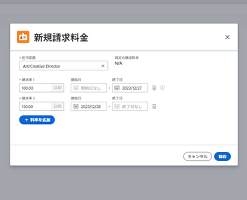

# 会社レベルでのジョブロール請求率の上書き

{{highlighted-preview}}

ジョブの役割を作成する際に、その役割の時間別請求率を選択することもできます。 会社に固有の時間別請求率を複数作成できます。 各請求率は、特定の日付範囲に対して有効です。

プロジェクトレベルでは、会社レベルの請求率でプロジェクトレベルのレートを上書きするオプションを有効にできます。 詳しくは、 [プロジェクト・レベルの請求率を会社レベルの請求率で上書き](../../../manage-work/projects/project-finances/override-project-level-with-company-level-billing-rates.md).

## アクセス要件

以下が必要です。

<table style="table-layout:auto"> 
 <col> 
 <col> 
 <tbody> 
  <tr> 
   <td role="rowheader">[!DNL Adobe Workfront] 計画*</td> 
   <td> 
任意 
 </td> 
  </tr> 
  <tr> 
   <td role="rowheader">[!DNL Adobe Workfront] ライセンス*</td> 
   <td>計画</td> 
  </tr> 
  <tr> 
   <td role="rowheader">アクセスレベル設定*</td> 
   <td> 
システム管理者でない場合の会社への管理者アクセス
 
[!UICONTROL 編集 ] による金融データへのアクセス
 
<b>注意</b>:まだアクセス権がない場合は、 [!DNL Workfront] 管理者（アクセスレベルに追加の制限を設定している場合） を参照してください。 [!DNL Workfront] 管理者はアクセスレベルを変更できます。詳しくは、 <a href="../../../administration-and-setup/add-users/configure-and-grant-access/create-modify-access-levels.md" class="MCXref xref">カスタムアクセスレベルの作成または変更</a>.
 </td> 
  </tr> 
 </tbody> 
</table>

&#42;ご利用のプラン、ライセンスの種類、アクセス権を確認するには、 [!DNL Workfront] 管理者。

## 特定のジョブの役割に使用される確定済みの請求率を上書きまたは変更する

1. 次をクリック： **[!UICONTROL メインメニュー]** アイコン  右上隅に [!DNL Adobe] Workfront、 **[!UICONTROL 設定]** .

1. クリック **[!UICONTROL 会社]**.
1. ジョブの役割が割り当てられている会社を見つけます。
1. リストで会社名をクリックします。
1. クリック **[!UICONTROL 請求率]** をクリックします。
1. クリック **[!UICONTROL 請求率を追加] > [!UICONTROL 新しい請求率]**&#x200B;または、編集する既存のレートを選択します。
1. 内 [!UICONTROL 新しい請求率] ダイアログで、 [!UICONTROL **ジョブの役割**] ：の請求率を定義します。

   この [!UICONTROL **デフォルトの請求率**] このジョブロールのシステムレベルのレートを表示します。

   

1. 内 [!DNL **請求率 1**] 「 」フィールドに、請求率を入力します。 次に、「 [!UICONTROL **保存**] ：請求率を 1 回だけ上書きします。

   または

   クリック [!UICONTROL **追加率**] 有効日を含む請求率をさらに追加する場合。

1. （条件付き）複数の請求レートを追加する場合は、次の情報を入力します。

   * **[!UICONTROL 請求率 1]、2 など&#x200B;**:期間の請求率の値。
   * **[!UICONTROL 開始日&#x200B;]**:レートが有効になった日付。
   * **[!UICONTROL 終了日&#x200B;]**:レートが終了する日付。

     請求レート 1 には開始日が設定されず、最後の請求レートには終了日が設定されません。 一部の日付は自動的に追加されます。 たとえば、請求レート 1 に終了日がなく、開始日が 2023 年 5 月 1 日の請求レート 2 を追加した場合、ギャップが生じないように、2023 年 4 月 30 日の終了日が請求レート 1 に追加されます。

1. 「[!UICONTROL **保存**]」をクリックします。

   >[!NOTE]
   >
   >プロジェクトで変更されたジョブの役割率は、そのプロジェクトにのみ影響します。 会社レベルで変更された率は、すべてのプロジェクトに影響を与えます。 詳しくは、 [ジョブ・ロール請求率の上書きとプロジェクトの収益の計算の概要](../../../manage-work/projects/project-finances/override-role-billing-rates-and-calculate-project-revenue.md).
