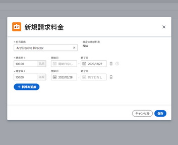

# 会社レベルでの担当業務請求率の上書き

{{preview-fast-release-general}}

担当業務を作成する際に、その役割の時間単位の請求率を選択するオプションがあります。 1 つの会社に固有の複数の時間単位の請求レートを作成できます。 各請求レートは、特定の日付範囲に対して有効です。

プロジェクトレベルでは、会社レベルの請求率でプロジェクトレベルの請求率を上書きするオプションを有効にできます。 詳しくは、[プロジェクトレベルの請求率を会社レベルの請求率で上書きする](../../../manage-work/projects/project-finances/override-project-level-with-company-level-billing-rates.md)を参照してください。

## アクセス要件

+++ 展開すると、この記事の機能のアクセス要件が表示されます。

<table style="table-layout:auto"> 
 <col> 
 <col> 
 <tbody> 
  <tr> 
   <td>[!DNL Adobe Workfront] パッケージ</td> 
   <td>
会社レベルの請求レートにレート属性を追加するには：Workflow Ultimate

       
会社レベルの請求レートを作成し、その他のすべてのレート設定を編集するには、次の手順を実行します。任意のWorkfrontまたはワークフローパッケージ
</td> 
  </tr> 
  <tr> 
   <td>[!DNL Adobe Workfront] ライセンス</td> 
   <td>
[!UICONTROL Standard]

       
[!UICONTROL Plan]
</td>
  </tr> 
  <tr> 
   <td>アクセスレベル設定</td> 
   <td> 
システム管理者でない場合の会社への管理者アクセス

   
財務データへのアクセスの編集
 </td>
  </tr> 
 </tbody> 
</table>

詳しくは、[Workfront ドキュメントのアクセス要件](/help/quicksilver/administration-and-setup/add-users/access-levels-and-object-permissions/access-level-requirements-in-documentation.md)を参照してください。

+++

## 特定の担当業務に使用される確定済みの請求率を上書きまたは変更する

{{step-1-to-setup}}

1. 「**[!UICONTROL 会社]**」をクリックします。
1. 担当業務が割り当てられている会社を見つけます。
1. リストで会社名をクリックします。
1. 左側のパネルで「**[!UICONTROL 請求料金]**」をクリックします。
1. 「**[!UICONTROL 請求レートを追加] > [!UICONTROL 新しい請求レート]**」または「**請求レートを追加**」をクリックします。
1. [!UICONTROL 新規請求料金]ダイアログで、請求レートを定義する&#x200B;[!UICONTROL **担当業務**]&#x200B;を選択します。

### 実稼動環境では、次の操作を行います。

[!UICONTROL **既定の請求レート**]&#x200B;には、この担当業務のシステムレベルのレートが表示されます。

1. 「[!DNL **請求レート 1**]」フィールドに請求レートを入力します。 次に、「[!UICONTROL **保存**]」をクリックして、請求レートを 1 回だけ上書きします。

   または

   「[!UICONTROL **レートを追加**]」をクリックして、有効な日付と請求レートをさらに追加します。

1. （条件付き）複数の請求レートを追加する場合は、次の情報を入力します。

   * **[!UICONTROL 請求レート 1]、2、など**：期間の請求レートの値。
   * **[!UICONTROL 開始日]**：レートが有効になる日付。
   * **[!UICONTROL 終了日]**：レートが終了する日付。

     請求レート 1 には開始日が設定されず、最後の請求レートには終了日が設定されません。 一部の日付は自動的に追加されます。 例えば、請求レート 1 に終了日がなく、開始日が 2023年5月1日の請求レート 2 を追加すると、ギャップが生じないように、請求レート 1 の終了日に 2023年4月30日が追加されます。

1. 「[!UICONTROL **保存**]」をクリックします。

   >[!NOTE]
   >
   >プロジェクトで変更された担当業務の請求率は、そのプロジェクトにのみ影響します。 会社レベルで変更された請求率は、すべてのプロジェクトに影響を与えます。 詳しくは、[ プロジェクトでの請求レートの上書きと収益の計算の概要](/help/quicksilver/manage-work/projects/project-finances/override-role-billing-rates-and-calculate-project-revenue.md)を参照してください。

### プレビュー環境では、次の操作を行います。

1. 代理店、場所、コストセンターなどのレートの属性を選択します。

   これらの属性は個別に定義され、収益とコストの計算に影響を与える可能性があります。 詳しくは、[ レート属性の定義](/help/quicksilver/administration-and-setup/manage-enterprise-operations/define-rate-attributes.md)を参照してください。

   

1. レートの&#x200B;**通貨**&#x200B;を選択します。 Workfront管理者は、設定領域に基本通貨を追加します。 選択範囲を別の使用可能な通貨に変更したり、有効な日付範囲で通貨を変更したりできます。

   >[!TIP]
   >
   >このフィールドでは、システムの「為替レート」領域で使用可能な通貨のみが使用できます。 通貨が1つしか設定されていない場合は、その通貨のみが使用可能です。

   Workfrontでの基本通貨の設定について詳しくは、[為替レートの設定](/help/quicksilver/administration-and-setup/manage-workfront/exchange-rates/set-up-exchange-rates.md)を参照してください。

   プロジェクトの通貨の変更について詳しくは、[ プロジェクトの通貨の変更](/help/quicksilver/manage-work/projects/project-finances/change-project-currency.md)を参照してください。

1. 「[!DNL **請求レート**]」フィールドに、担当業務の請求レートを入力します。

   これは、担当業務の1時間当たりの請求率です。 この値は、役割に関連するタスクの予定収益と実収益、最終的にはプロジェクトの予定収益と実収益を計算します。 選択した通貨を使用してレートを入力します。

   属性を使用する場合、属性と担当業務が組み合わされて一意のレートが定義されます。 例えば、エージェンシーAのニューヨークでのDesignerの役割は、エージェンシーBのパリでのDesignerの役割とは別の料金を設定できます。

   日付の有効請求レートについては、**日付の有効請求レートを追加**&#x200B;をクリックします。 期間の時間別請求レートを入力し、必要に応じて開始日と終了日を割り当てます。 最初の請求レートには開始日が設定されず、最後の請求レートには終了日が設定されません。

   Workfrontでは、日付範囲の間にギャップを残すことができますが、意図的であることを確認する警告が表示されます。

   Workfrontによる売上の計算方法について詳しくは、[請求と売上の概要](/help/quicksilver/manage-work/projects/project-finances/billing-and-revenue-overview.md)を参照してください。

   >[!TIP]
   >
   >既存のレートを編集する場合、最新の開始日をレートリストの上部に表示するようにリストを並べ替えることができます。

1. 「[!UICONTROL **保存**]」をクリックします。

   >[!NOTE]
   >
   >プロジェクトで変更された担当業務の請求率は、そのプロジェクトにのみ影響します。 会社レベルで変更されたレートは、会社が割り当てられたすべてのプロジェクトに影響します。 詳しくは、[ プロジェクトでの請求レートの上書きと収益の計算の概要](/help/quicksilver/manage-work/projects/project-finances/override-role-billing-rates-and-calculate-project-revenue.md)を参照してください。

