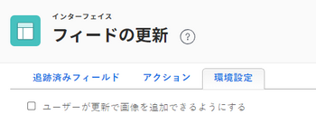

# ユーザーの更新の環境設定を構成

ユーザーがオブジェクトの [!UICONTROL 更新] 領域

## アクセス要件

この記事の手順を実行するには、次のアクセス権が必要です。

<table style="table-layout:auto"> 
 <col> 
 <col> 
 <tbody> 
  <tr> 
   <td role="rowheader">[!DNL Adobe Workfront] 計画</td> 
   <td>任意</td> 
  </tr> 
  <tr> 
   <td role="rowheader">[!DNL Adobe Workfront] ライセンス</td> 
   <td>[!UICONTROL プラン ]</td> 
  </tr> 
  <tr> 
   <td role="rowheader">アクセスレベル設定</td> 
   <td> 
これらの手順をシステムレベルで実行するには、[!UICONTROL システム管理者 ] のアクセスレベルが必要です。

グループに対して実行するには、そのグループの管理者である必要があります。
 
<b>注意</b>:まだアクセス権がない場合は、 [!DNL Workfront] 管理者（アクセスレベルに追加の制限を設定している場合） を参照してください。 [!DNL Workfront] 管理者はアクセスレベルを変更できます。詳しくは、 <a href="../../../administration-and-setup/add-users/configure-and-grant-access/create-modify-access-levels.md" class="MCXref xref">カスタムアクセスレベルの作成または変更</a>.
 </td> 
  </tr> 
 </tbody> 
</table>

## 更新内の画像の追加をユーザーに許可

デフォルトでは、ユーザーは更新に画像を追加できません。 この環境設定を有効にすると、ユーザは更新に画像を添付できます。 環境設定は、 [!DNL Workfront] インスタンス。

>[!NOTE]
>
>* 更新で保存された画像は、ドキュメントの保存制限にカウントされます。 詳しくは、 [ドキュメントのストレージ制限の確認](../../../documents/managing-documents/check-document-storage.md).
>* 画像は、 [!UICONTROL 更新] タブを使用している必要があり、 [!UICONTROL ドキュメント] タブをクリックします。
>

1. 次をクリック： **[!UICONTROL メインメニュー]** アイコン  右上隅に [!DNL Adobe Workfront]を選択し、「 **[!UICONTROL 設定]** .
1. 左のパネルで、「 」を選択します。 **[!UICONTROL インターフェイス]** > **[!UICONTROL フィードを更新]**.
1. を選択します。 **[!UICONTROL 環境設定]** タブをクリックします。

   

1. を選択します。 **[!UICONTROL 更新内の画像の追加をユーザーに許可]** チェックボックスをオンにします。
1. 選択 **[!UICONTROL 保存]**.

   この環境設定が有効な場合、いつでも無効にできます。 更新で既に投稿された画像は、 [!UICONTROL 更新] 領域を選択します。
